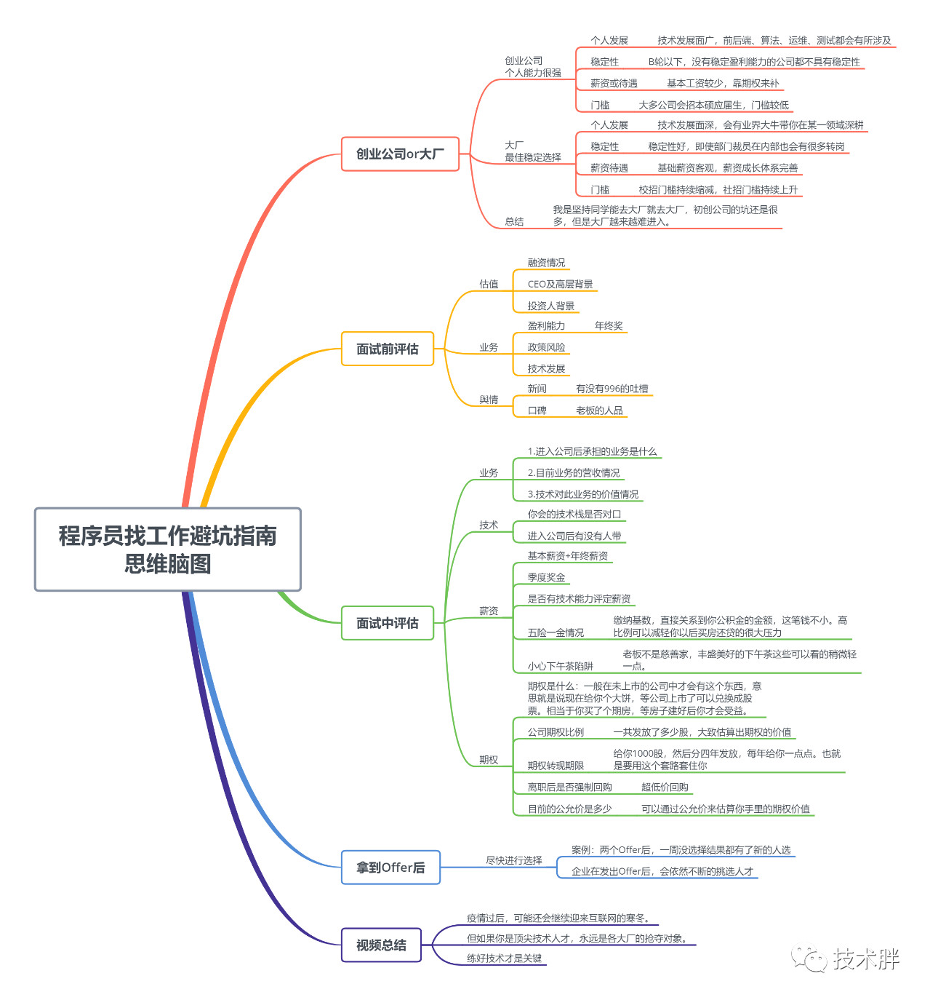

# 关于入职靠谱IT公司 (B站up```技术胖```) <!- omit in toc -->

- [关于入职靠谱IT公司 (B站up```技术胖```) <!- omit in toc -->](#关于入职靠谱it公司-b站up技术胖---omit-in-toc---)
  - [创业公司或者选择大厂](#创业公司或者选择大厂)
    - [个人发展](#个人发展)
    - [稳定性](#稳定性)
    - [薪资待遇](#薪资待遇)
    - [门槛](#门槛)
  - [如何评估一个创业公司](#如何评估一个创业公司)
    - [面试前](#面试前)
      - [估值](#估值)
        - [融资情况](#融资情况)
        - [CEO 老板的背景](#ceo-老板的背景)
        - [投资人](#投资人)
      - [业务](#业务)
        - [盈利能力](#盈利能力)
        - [政策风险](#政策风险)
        - [技术发展](#技术发展)
      - [舆情](#舆情)
        - [新闻](#新闻)
        - [口碑](#口碑)
  - [剩下的看脑图就好](#剩下的看脑图就好)



## 创业公司或者选择大厂

主要有四个维度的比较

### 个人发展

创业公司技术面广，可能需要一个人同时干很多岗位的活

大厂相对技术面窄一些，但是会很深，成为某一领域的的专家

### 稳定性

创业公司最好找程序员人数在100人以上的，在B轮之后的，A轮或者天使轮都不是很稳定，说倒就倒了

大厂就相对稳定很多，就算部门被裁，还会有转岗的机会

### 薪资待遇

创业公司一般基本工资都比较少，但是会给很多期权，期权相对基本工资更重要一些

大厂基本薪资很丰厚客观，也有非常好的薪资成长，比如评级，每年都评上了的话薪资就会长

### 门槛

创业工资相对门槛低

大厂门槛就会高一些，一般社招，阿里会找p7以上，全国领域的专家，3、4、5年的经验

## 如何评估一个创业公司

### 面试前

#### 估值

##### 融资情况

也就是融资情况，如果大家都抢着融资就说明公司状况比较好

##### CEO 老板的背景

像是业界大牛，或者有红色资本背景可能都会好一些

##### 投资人

然后看投资人有没有背景
* 红色资本
* 国内国际著名投资企业

#### 业务

##### 盈利能力

比如社区部落和王者荣耀，最终的年终奖就不一样

##### 政策风险

##### 技术发展

外包公司技术发展比较局限

现在比较主流的像是，人工智能，区块链，大数据

#### 舆情

##### 新闻

负面新闻等是否符合价值观等

##### 口碑

要看公司的口碑

老板的口碑，跟对人可能比做对事更重要

## 剩下的看脑图就好