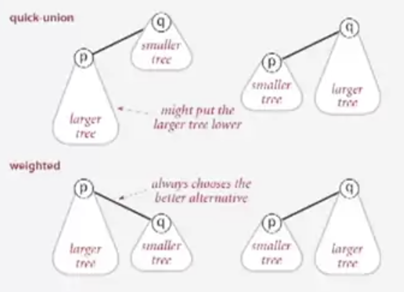
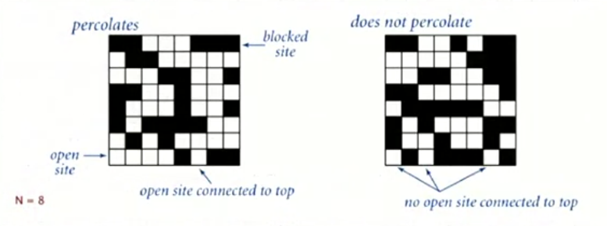

# Week 1 <!-- omit in toc -->

- [Overview](#overview)
- [Union-find 并查集](#union-find-并查集)
  - [Step to develop a useful algorithm](#step-to-develop-a-useful-algorithm)
  - [Dynamic connectivity 动态连通性问题](#dynamic-connectivity-动态连通性问题)
    - [Modeling the connections](#modeling-the-connections)
  - [Implementing the operations](#implementing-the-operations)
    - [Union-find data type (API)](#union-find-data-type-api)
  - [Dynamic-connectivity client](#dynamic-connectivity-client)
- [Quick-find eager approach 快速查找](#quick-find-eager-approach-快速查找)
  - [Data structure to support Quick-find](#data-structure-to-support-quick-find)
  - [Quick-find implementation](#quick-find-implementation)
  - [Quick-find is too slow](#quick-find-is-too-slow)
- [Quick-union lazy approach 快速合并](#quick-union-lazy-approach-快速合并)
  - [Data structure to support the quick-union](#data-structure-to-support-the-quick-union)
  - [Quick-union Implementation](#quick-union-implementation)
  - [Quick-union is also too slow](#quick-union-is-also-too-slow)
- [Quick-find vs quick-union](#quick-find-vs-quick-union)
- [Quick-union improvement](#quick-union-improvement)
  - [Weighting](#weighting)
  - [Weighted quick-union data structure](#weighted-quick-union-data-structure)
  - [Weighted quick-union Implementation](#weighted-quick-union-implementation)
  - [理解 Weighted 提升性能](#理解-weighted-提升性能)
  - [Weighted quick-union is quick](#weighted-quick-union-is-quick)
- [Improve further - path compression](#improve-further---path-compression)
  - [Quick-union with path compression implementation](#quick-union-with-path-compression-implementation)
- [Summary - Union-find](#summary---union-find)
- [Union-find application - percolation 渗滤](#union-find-application---percolation-渗滤)
  - [Likelihood of percolation](#likelihood-of-percolation)
  - [Monte Carlo simulation](#monte-carlo-simulation)
- [Analysis of Algorithm Introduction](#analysis-of-algorithm-introduction)
  - [Scientific method applied to analysis of algorithms](#scientific-method-applied-to-analysis-of-algorithms)
  - [Observations](#observations)
    - [Example 3-Sum](#example-3-sum)
      - [Brute-force algorithm](#brute-force-algorithm)
    - [Stopwatch to measure the time cost](#stopwatch-to-measure-the-time-cost)
    - [Power-law 幂定律](#power-law-幂定律)
      - [Doubling hypothesis](#doubling-hypothesis)
      - [Experimental algorithmics](#experimental-algorithmics)
  - [Mathematical models](#mathematical-models)
    - [Sum of cost](#sum-of-cost)
    - [Frequency](#frequency)
      - [Example 1-Sum](#example-1-sum)
      - [Example 2-Sum](#example-2-sum)
      - [Simplification 1: cost model](#simplification-1-cost-model)
      - [Simplification 2: tilde notation](#simplification-2-tilde-notation)
      - [Simplified 2-Sum](#simplified-2-sum)
      - [Simplified 3-Sum](#simplified-3-sum)
    - [Estimating a discrete sum](#estimating-a-discrete-sum)
  - [Order-of-growth classifications](#order-of-growth-classifications)
- [Binary search demo](#binary-search-demo)
  - [Binary search Java implementation](#binary-search-java-implementation)
  - [Binary search mathematical analysis](#binary-search-mathematical-analysis)
  - [3-Sum based on binary search](#3-sum-based-on-binary-search)
- [Theory of algorithm](#theory-of-algorithm)
  - [Commnly-used notations](#commnly-used-notations)
  - [Summary for notations](#summary-for-notations)
- [Memory](#memory)
  - [Basics](#basics)
  - [Typical memory usage for primitive types and arrays](#typical-memory-usage-for-primitive-types-and-arrays)
  - [Typical memory usage for object in Java](#typical-memory-usage-for-object-in-java)

## Overview

We begin our study of algorithms with a motivating example and an overview of the use of the scientific method for studying algorithm performance.

**Lecture: Union−Find. 并查集** We illustrate our basic approach to developing and analyzing algorithms by considering the dynamic connectivity problem 动态连通性. We introduce the union–find data type and consider several implementations (quick find, quick union, weighted quick union, and weighted quick union with path compression). Finally, we apply the union–find data type to the percolation problem from physical chemistry.

**Lecture: Analysis of Algorithms.** The basis of our approach for analyzing the performance of algorithms is the scientific method. We begin by performing computational experiments to measure the running times of our programs. We use these measurements to develop hypotheses about performance. Next, we create mathematical models to explain their behavior. Finally, we consider analyzing the memory usage of our Java programs.

**Programming Assignment: Percolation.** Your programming assignment will give you an opportunity to apply these concepts to a fundamental problem in physical chemistry. It is the first of many examples where a good algorithm—in this case, weighted quick union—makes the difference between being able to efficiently solve a problem and not being able to address it at all.

**Job Interview Questions.** Algorithmic interview questions based on the lecture material.

Suggested Readings. Section 1.4 and 1.5 in Algorithms, 4th edition.

## Union-find 并查集

### Step to develop a useful algorithm

* Model the problem
* Find an algorithm to solve it
* Fast enough? Fit in memory?
* If not, figure out why
* Find a way to address the problem
* Iterate until satisfied

### Dynamic connectivity 动态连通性问题

Given a set of N objects
* **Union command**: connect two objects
* **Find/connected query**: is there a path connecting the two objects?

Example:


动态连通性可以应用在很多场景上
* 对于图像，对象就是像素
* 对于计算机网络，对象就是计算机
* 对于社交网络，对象就是人
* 对于计算机芯片，对象就是电路元件

在编程实现的时候，可以用```array```取存储对象
* Use integers as array index
* Suppress details not relevant to union-find

#### Modeling the connections

We assume its connection is an equivalence relation

* Reflexive: $p$ is connected to $p$
* Symmetric: if $p$ is connected to $q$, then $q$ is connected to $p$
* Transitive: if $p$ -> $q$ and $q$ -> $s$, then $p$ -> $s$

**Connected components**: Maximal set of objects that are mutually connected.


### Implementing the operations

**Find query**: Check if two objects are in the same component

**Union command**: Replace components containing two objects with their union.


#### Union-find data type (API)

**Goal** Design efficient data structure for union-find
* Number of objects $N$ can be huge.
* Number of operations $M$ can be huge.
* Find queries and union commands may be intermixed.

```java

public class UF{
    public UF(int N){
        // initialize union-find data structure with N objects
    }

    public void union(int p,int q){
        // add connection between p and q
    }

    public boolean connected(int p,int q){
        // are p and q in the same component?
    }
}
```

### Dynamic-connectivity client

We can design this client to test our union-find API

* Read in number of objects $N$ from standard input
* Repeat:
  * read in pair of integers from standard input
  * if they are not yet connected, connect them and print our pair


## Quick-find eager approach 快速查找

第一种用来解决dynamic-connectivity动态连通性问题的算法

### Data structure to support Quick-find

Data structure
* Integer array ```id[]``` of size $N$
* Interpretation: $p$ and $q$ are connnected if they have the same ```id```.


Union-find API implementation
* Find: Check if $p$ and $q$ have the same ```id```
* Union: To merge components containing $p$ and $q$, change all entries whose ```id``` equals ```id[p]``` to ```id[q]```


### Quick-find implementation

```java
public class QuickFind{
    private int[] id;

    public QuickFind(int N){
        // set id of each objects to itself
        id = new int[N];
        for(int i = 0;i < N;i++){
            id[i] = i;
        }
    }

    public boolean connected(int p, int q){
        // check if p and q are in the same component
        return id[p] == id[q]

    }

    public void union(int p, int q){
        // union components containing p and q
        pid = id[p]
        qid = id[q]
        for(int i = 0;i < id.length;i++){
            if(id[i] == pid){
                id[i] = qid
            }
        }
    }
}
```

### Quick-find is too slow

对于这个算法，在计算时间复杂度的时候只用考虑算法访问数组的次数即可


|algorithm|initialize|union|find
|--|--|--|--|
quick find|N|N|1|

* 为什么不够快？
> Union cost too much, 每一次```union```操作都需要便利一遍数组, 如果有$N$次```union```操作, 算法需要访问$N^2$次数组, quadratic数量级是不行的

## Quick-union lazy approach 快速合并

lazy approach 指的是只有当我们避免不了计算的时候才会去计算

### Data structure to support the quick-union

* Integer array: ```id[]``` of size $N$
* Interpretation: ```id[i]``` is the parent of i
* **Root** of ```i``` is ```id[id[id[...id[i]...]]]```


Union-find API implementation

* Find: Check if $p$ and $q$ have the same root
* Union: To merge components containing $p$ and $q$, set the id of $p$'s root to the id of $q$'s root


### Quick-union Implementation

```java
public class QuickUnion{
    private int[] id

    public QuickUnion(int N){
        // set id of each objects to itself
        id = new int[N]
        for(int =0;i<N;i++){
            id[i] = i
        }
    }

    public int root(int i){
        // return the root of p

        while(id[i]!=i){
            i = id[i]
        }

        return i
    }

    public boolean find(int p, int q){
        // check if p and q are in the same component
        return root(p) == root(q)
    }

    public void connected(int p, int q){
        // merge p and q component
        int rootP = root(p)
        int rootQ = root(q)

        id[rootP] = rootQ
    }
}
```

### Quick-union is also too slow

快速合并在一些情况下可以很快，但是它在一些情况下是另一种慢

|algorithm|initialize|union|find
|--|--|--|--|
quick find|N|N|1|
quick union|N|N(最坏情况)|N(最坏情况)

用来支撑quick-union的树形结构可能会很高，所以为了寻找root会照成很大的开销

## Quick-find vs quick-union

Quick-find

* Union too expensive ($N$ array accesses)
* Trees are flat, but too expensive to keep them flat

Quick-union

* Tree can grow too tall
* Find is to expensive (in order to get the root)

## Quick-union improvement

### Weighting

**Weighted quick-union**
* Modify quick-union to avoid tall trees.
* Keep track of size of each tree(number of objects).
* Balance by linking root of smaller tree to root of larger tree.



And here is an example that compares weighted tree and not weighted tree


### Weighted quick-union data structure

The data structure is same as quick-union, but maintain extra array ```sz[i]``` to count number of objects in the tree rooted at ```i```

* Find: Same as quick-union
* Union: Modify quick-union to :
  * Link root of smaller tree to the larger tree
  * Update the ```sz[]``` array.

### Weighted quick-union Implementation


```java
public class WeightedQU{
    private int[] id;
    private int[] sz;

    public WeightedQU(int N){
        // set each of id to itself
        id = new int[N];
        sz = new int[N];

        for(int i=0;i<N;i++){
            id[i] = i;
            z[i] = 1;
        }
    }

    public root(int i){
        // return the root of i
        while(id[i]!=i){
            i = id[i]
        }
        return i;
    }

    public boolean find(int p, int q){
        // check if the p and q have the same root
        return root(p) == root(q);
    }

    public void union(int p, int q){
        // merge p and q into same component
        rootP = root(p);
        rootQ = root(q);

        if(rootP == rootQ){
            return;
        }

        if(sz[rootP] > sz[rootQ]){
            id[rootQ] = rootP;
            sz[rootP] += sz[rootQ]
        }
        else{
            id[rootP] = rootQ;
            sz[rootQ] += sz[rootP]
        }
        
    }
}
```

### 理解 Weighted 提升性能

理解这个方法的关键就是明白，在给定object总数$N$的前提下，任意节点的深度最长是$\lg N$ (均以2为底)


如何证明？

我们可以从 “何时树的深度才会增加” 这个角度入手

假设要合并 $T_1$ 和 $T_2$ 两棵树 $x$ 为 $T_1$ 中的一个节点。有且仅有 $T_1$ 的大小于 $T_2$ 的时候，$x$ 的深度会加一


在合并之后，我们可以发现，树的整体容量大小至少会翻倍

假设我们的 $T_1$ 的大小从1开始，那么在合并了很多次之后，整体容量大小至少是 $2\times2\times2...\times2$。而我们的算法是会记录整体容量大小的，也就是$N$，那之前 $T_1$ 合并的次数就可以由 $\lg N$ 计算得出。这个结果也正是深度。

由于每次合并容量至少翻倍，也就是$\lg N$的这个底最小是 2，所以也就因此得来，$x$的深度最大是 $\lg N$

这个最大深度很关键，因为当 $N$ 很大的时候，比如从一百万变成十亿，运算规模也就只是从20变成了30

### Weighted quick-union is quick

|algorithm|initialize|union|find
|--|--|--|--|
quick find|N|N|1|
quick union|N|N(最坏情况)|N(最坏情况)
weighted QU|N|$\lg N$(最坏情况)|$\lg N$(最坏情况)


## Improve further - path compression

**Qucik-union with path compression**
* Just after computing the root of $p$, set the $id$ of each examined node to point to that root.

Let's say if we want to find the node $p$


What we are going to do is set the $id$ of each passed node to point to that root


### Quick-union with path compression implementation


```java
public class WeightedQU{
    private int[] id;
    private int[] sz;

    public WeightedQU(int N){
        // set each of id to itself
        id = new int[N];
        sz = new int[N];

        for(int i=0;i<N;i++){
            id[i] = i;
            z[i] = 1;
        }
    }

    public root(int i){
        // return the root of i
        while(id[i]!=i){
            id[i] = id[id[i]] // Just add this one line!!! And the performance improve a lot!
            i = id[i]
        }
        return i;
    }

    public boolean find(int p, int q){
        // check if the p and q have the same root
        return root(p) == root(q);
    }

    public void union(int p, int q){
        // merge p and q into same component
        rootP = root(p);
        rootQ = root(q);

        if(rootP == rootQ){
            return;
        }

        if(sz[rootP] > sz[rootQ]){
            id[rootQ] = rootP;
            sz[rootP] += sz[rootQ]
        }
        else{
            id[rootP] = rootQ;
            sz[rootQ] += sz[rootP]
        }
        
    }
}
```

## Summary - Union-find

|algorithm|worst-case time|
|--|--|
quick find|MN|
quick union|MN|
weighted QU|M+N$\lg N$|
path compression QU|M+N$\lg N$|
weighted + path compression QU|M+N$\lg^* N$(almost close to linear)|

## Union-find application - percolation 渗滤

Percolation is a model for many physical systems.
* $N$-by-$N$ grid of sites
* Each site is open with probability $p$ (or blocked with probility $1-p$)
* System percolates if top and bottom are connected by open sites.



### Likelihood of percolation

When $N$ is large, theory guarantees a sharp threshold $p^*$

* $p>p^*$: almost certainly percolate
* $p<p^*$: almost certainly does not percolate


### Monte Carlo simulation

How to estimate the $p^*$?
* Initialize $N$-by-$N$ whole grid to be blocked
* Declare random sites open until top connected to bottom
* Vacancy percentage estimates $p^*$
* Repeate this process billion times

The $p^*$ is about 0.592746


## Analysis of Algorithm Introduction

Reasons to analyze algorithm
* Predict performance.
* Compare algorithms.
* Provide guarantees
* Understand theoretical basis.
* **Primary** practical reason: avoid performance bugs.

### Scientific method applied to analysis of algorithms

A framework for predicting performance and comparing algorithms.

* **Observe** some feature of the natural world.
* **Hypothesize** a model that is consistemt with the observations.
* **Predict** events using the hypothesis.
* **Verify** the predictions by making further observations.
* **Validate** by repeating until the hypothesis and observations agree.

Principles
* Experiments must be **reproducible**
* Hypotheses must be **falsifiable**

### Observations

Observe the running time

#### Example 3-Sum

Given $N$ distinct integers, how many triples sum to exactly zero?

##### Brute-force algorithm

```java

public class ThreeSum{
    public static int count(int[] a){
        int N = a.length;
        int count = 0;
        for(int i=0;i<N;i++){
            for(int j=i+1;j<N;j++){
                for(int k=j+1;k<N;k++){
                    if(a[i]+a[j]+a[k]==0){
                        count++;
                    }
                }
            }
        }
    }
}
```

#### Stopwatch to measure the time cost

```java
public static void main(String[] args){
    Stopwatch stopwatch = new Stopwatch();
    ...
    double timeCost = stopwatch.dlapsedTimer();
}
```

**Empirical analysis** run the porgram for various input sizes and measure running time.

**Standard plot** plot running time $T(N)$ vs. input size $N$.


#### Power-law 幂定律

**Log-Log plot** plot running time $T(N)$ vs. input size $N$


If we fit the running time data and get following formula

$\lg(T(N))=b\times\lg N+c$

$b=2.99$

$c=-33.21$

Then we can get this. And this is called 'power law 幂定律'

$T(N)=a\times N^b where a=2^c$

##### Doubling hypothesis

Quick way to estimate $b$ in a power-law relationship

Run program, doubling the size of the input.


And then we can run the program and sovle for $a$


##### Experimental algorithmics

**System independent effects**
* Algorithm
* Input data

Determines exponent $b$ in power law

**System dependent effects**
* Hardware: CPU, memory, cache,...
* Software: compiler, interpreter,...
* System: operating system, network,...

Determines constant $a$ in power law.

### Mathematical models

Total running time: sum of cost $\times$ frequency for all operations

#### Sum of cost


#### Frequency

##### Example 1-Sum

How many instructions as a function of input size $N$?

```java
int count = 0;
for (int i=0;i<N;i++){
    if(a[i]==0)
        count++;
}
```

|Operation|Frequency|
|--|--|
variable declaration|2
assignment statement|2
less than compare| $N$+1
equal to compare|$N$
array access|$N$
increment|$N$ to $2N$

##### Example 2-Sum

How many instructions as a function of input size $N$?

```java
int count = 0;
for (int i=0;i<N;i++){
    for (int j=i+1;j<N;j++){
        if(a[i]+a[j]==0)
            count++;
    }
}
```

|Operation|Frequency|
|--|--|
variable declaration|N + 2
assignment statement|N + 2
less than compare| $1/2 (N+1) (N+2)$
equal to compare|$1/2 N(N-1)$
array access|$N(N-1)$
increment|$1/2 N (N-1)$ to $N (N-1)$

##### Simplification 1: cost model

We don't need to consider every detail in the program. We can just consider some basic operation as a proxy for running time

##### Simplification 2: tilde notation

* Estimate running time as a function of input size $N$
* Ignore lower order terms.
  * When $N$ is large, terms are negligible
  * When $N$ is small, we don't care


##### Simplified 2-Sum

* Cost model is **array accesses**

So there are ~ $N^2$ array accesses

##### Simplified 3-Sum


#### Estimating a discrete sum


### Order-of-growth classifications

We can use the small set of functions to describe the order-of-growth of typical algorithms.


## Binary search demo

Goal: Given a sorted array and a key, find index of the key in the array?

Binary search: Compare key against middle entry
* Too small, go left
* Too big, go right
* Equal, found

### Binary search Java implementation

```java
public static int binarySearch(int[] a,int key){
    int lo=0,hi=a.length-1;
    while(lo <= hi){
        int mid = lo + (hi - lo) / 2;
        if (key < a[mid]) hi = mid -1;
        else if (key > a[mid]) lo = mid +1;
        else return mid;
    }
    return -1;
}
```

### Binary search mathematical analysis


### 3-Sum based on binary search

Sorting-based algorithm.
* Sort the $N$ numbers
* For each pair of numbers ```a[i]``` and ```a[j]```, binary search for ```-(a[i]+a[j])```

The sorting-based $N^2\lg N$ algorithm for 3-sum is faster than the brute-force algorithm


## Theory of algorithm

**Types of analyses**

* Best case. Lower bound on cost
  * Determined by "easiest" input
  * Provides a goal for all inputs
* Worst case. Upper bound on cost
  * Determined by "most difficult" input
  * Provides a guarantee for all inputs.
* Average case. Expected cost for random input
  * Need a model for "random" input
  * Provides a way to predict performance

**Goals**
* Establish "difficulty" of a problem.
* Develop "optimal" algorithms

**Approach**
* Supress details in analysis: analyze "to within a constant factor"
* Eliminate variability in input modle by focusing on the worst case.

**Optimal algorithm**
* Performance guarantee for any input
* No algorithm can provide a better performance guarantee.


### Commnly-used notations


### Summary for notations


## Memory

### Basics

* Bit 0 or 1
* Byte 8 bits
* Megabyte MB 1 million or $2^20$ bytes
* Gigabyte GB 1 billion or $2^30$ bytes

64-bit machine with 8 byte pointers
* Can address more memory
* Pointers use more space


### Typical memory usage for primitive types and arrays

|Type|bytes|
|--|--|
boolean|1
byte|1
char|2
int|4
float|4
long|8
double|8
char[]|2N+24
int[]|4N+24
double[]|8N+24

### Typical memory usage for object in Java

* Object overhead: 16 bytes
* Reference: 8 bytes
* Padding: Each object uses a multiple of 8 bytes
