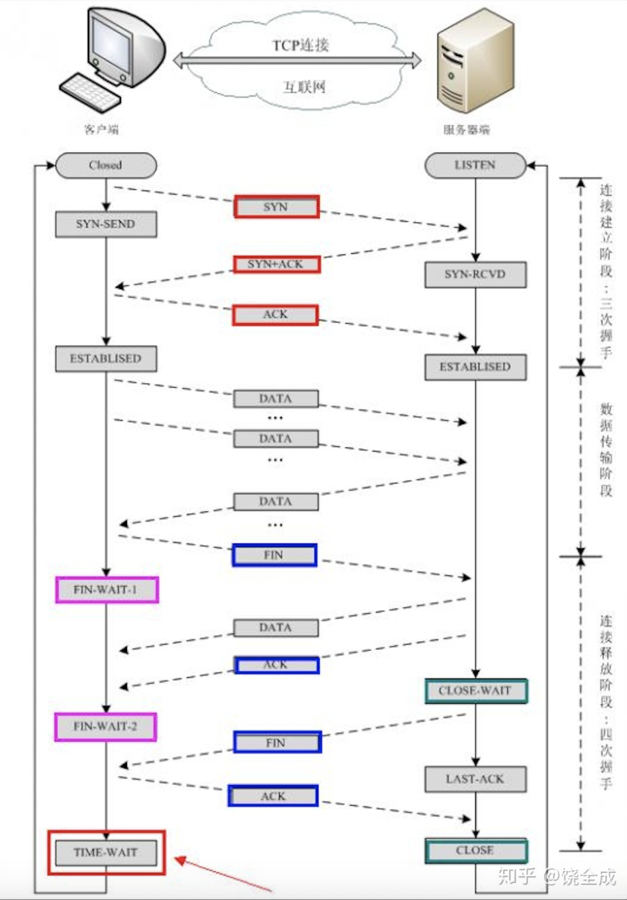
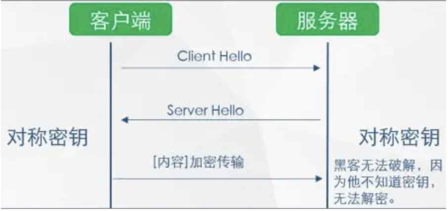
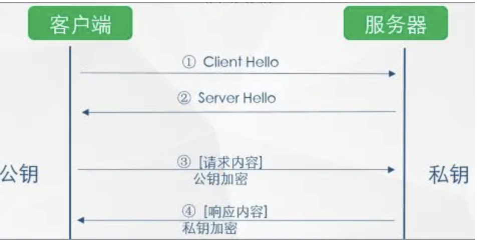
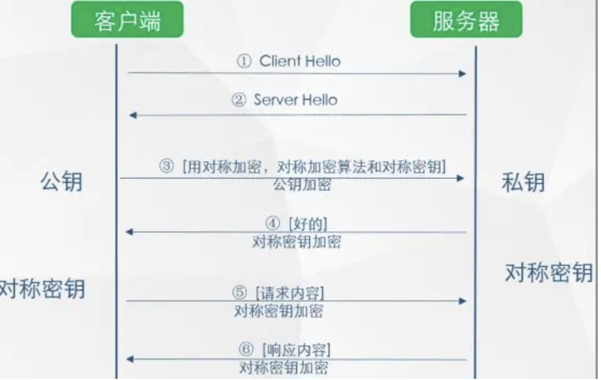
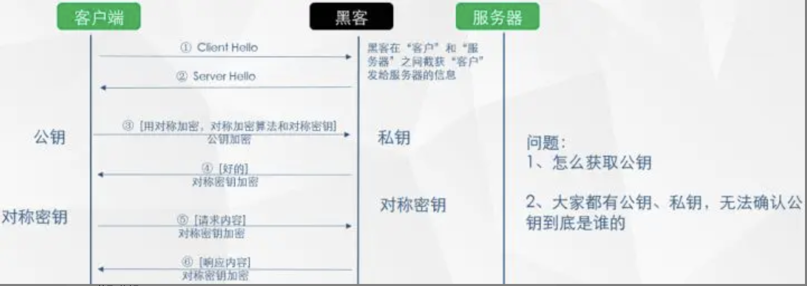
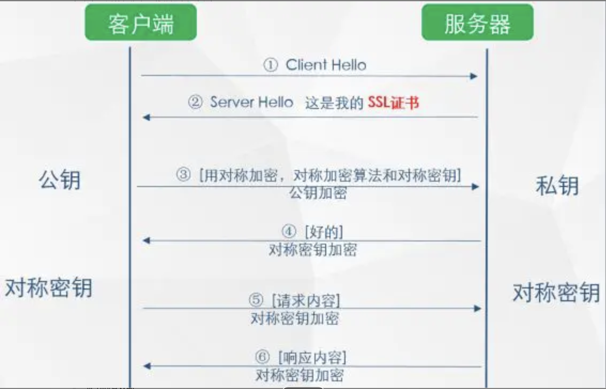
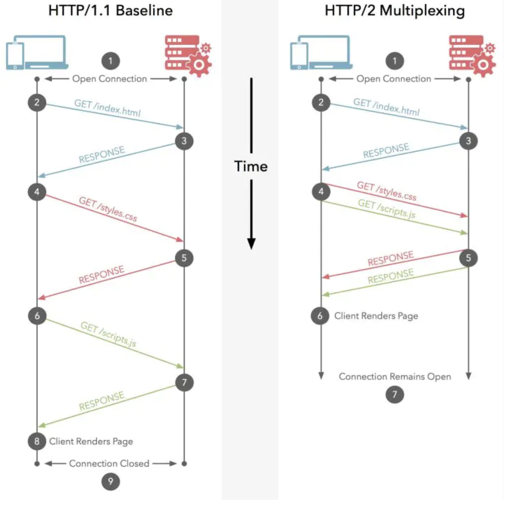

# HTTP 协议 <!-- omit in toc -->

、- [web始祖HTTP](#web始祖http)
  - [TCP 三次握手和四次挥手](#tcp-三次握手和四次挥手)
- [web始祖HTTP](#web始祖http)
  - [TCP 三次握手和四次挥手](#tcp-三次握手和四次挥手)
    - [三次握手](#三次握手)
    - [四次挥手](#四次挥手)
    - [进阶流程解释](#进阶流程解释)
      - [三次握手](#三次握手-1)
      - [为什么TCP客户端最后还要发送一次确认呢？](#为什么tcp客户端最后还要发送一次确认呢)
      - [四次挥手](#四次挥手-1)
- [HTTP与现代化浏览器](#http与现代化浏览器)
- [HTTP的基本优化](#http的基本优化)
  - [带宽](#带宽)
  - [延迟](#延迟)
- [HTTP1.0和HTTP1.1的一些区别](#http10和http11的一些区别)
- [HTTP1.0和1.1现存的一些问题](#http10和11现存的一些问题)
- [HTTPS应声而出](#https应声而出)
  - [HTTPS 的基础](#https-的基础)
  - [HTTP 向 HTTPS 演化的过程](#http-向-https-演化的过程)
- [HTTPS与HTTP的一些区别](#https与http的一些区别)
- [HTTPS改造](#https改造)
- [使用SPDY加快你的网站速度](#使用spdy加快你的网站速度)
- [HTTP2.0的前世今生](#http20的前世今生)
- [HTTP2.0的新特性](#http20的新特性)
- [HTTP2.0的升级改造](#http20的升级改造)
- [Reference](#reference)

## web始祖HTTP
全称：超文本传输协议(HyperText Transfer Protocol) 伴随着计算机网络和浏览器的诞生，HTTP1.0也随之而来，处于计算机网络中的应用层，HTTP是建立在TCP协议之上，所以HTTP协议的瓶颈及其优化技巧都是基于TCP协议本身的特性，例如tcp建立连接的3次握手和断开连接的4次挥手以及每次建立连接带来的RTT延迟时间。

### TCP 三次握手和四次挥手



其实3次握手的目的并不只是让通信双方都了解到一个连接正在建立，还在于利用数据包的选项来传输特殊的信息，交换初始序列号ISN。

3次握手是指发送了3个报文段，4次挥手是指发送了4个报文段。注意，SYN和FIN段都是会利用重传进行可靠传输的。

#### 三次握手

换个易于理解的视角来看为什么要3次握手。

客户端和服务端通信前要进行连接，“3次握手”的作用就是双方都能明确自己和对方的收、发能力是正常的。

第一次握手：客户端发送网络包，服务端收到了。这样服务端就能得出结论：客户端的发送能力、服务端的接收能力是正常的。

第二次握手：服务端发包，客户端收到了。这样客户端就能得出结论：服务端的接收、发送能力，客户端的接收、发送能力是正常的。 从客户端的视角来看，我接到了服务端发送过来的响应数据包，说明服务端接收到了我在第一次握手时发送的网络包，并且成功发送了响应数据包，这就说明，服务端的接收、发送能力正常。而另一方面，我收到了服务端的响应数据包，说明我第一次发送的网络包成功到达服务端，这样，我自己的发送和接收能力也是正常的。

第三次握手：客户端发包，服务端收到了。这样服务端就能得出结论：客户端的接收、发送能力，服务端的发送、接收能力是正常的。 第一、二次握手后，服务端并不知道客户端的接收能力以及自己的发送能力是否正常。而在第三次握手时，服务端收到了客户端对第二次握手作的回应。从服务端的角度，我在第二次握手时的响应数据发送出去了，客户端接收到了。所以，我的发送能力是正常的。而客户端的接收能力也是正常的。

经历了上面的三次握手过程，客户端和服务端都确认了自己的接收、发送能力是正常的。之后就可以正常通信了。

每次都是接收到数据包的一方可以得到一些结论，发送的一方其实没有任何头绪。我虽然有发包的动作，但是我怎么知道我有没有发出去，而对方有没有接收到呢？

而从上面的过程可以看到，最少是需要三次握手过程的。两次达不到让双方都得出自己、对方的接收、发送能力都正常的结论。其实每次收到网络包的一方至少是可以得到：对方的发送、我方的接收是正常的。而每一步都是有关联的，下一次的“响应”是由于第一次的“请求”触发，因此每次握手其实是可以得到额外的结论的。比如第三次握手时，服务端收到数据包，表明看服务端只能得到客户端的发送能力、服务端的接收能力是正常的，但是结合第二次，说明服务端在第二次发送的响应包，客户端接收到了，并且作出了响应，从而得到额外的结论：客户端的接收、服务端的发送是正常的。

#### 四次挥手

TCP连接是双向传输的对等的模式，就是说双方都可以同时向对方发送或接收数据。当有一方要关闭连接时，会发送指令告知对方，我要关闭连接了。这时对方会回一个ACK，此时一个方向的连接关闭。但是另一个方向仍然可以继续传输数据，等到发送完了所有的数据后，会发送一个FIN段来关闭此方向上的连接。接收方发送ACK确认关闭连接。注意，接收到FIN报文的一方只能回复一个ACK, 它是无法马上返回对方一个FIN报文段的，因为结束数据传输的“指令”是上层应用层给出的，我只是一个“搬运工”，我无法了解“上层的意志”。

这是因为服务端在LISTEN状态下，收到建立连接请求的SYN报文后，把ACK和SYN放在一个报文里发送给客户端。而关闭连接时，当收到对方的FIN报文时，仅仅表示对方不再发送数据了但是还能接收数据，己方是否现在关闭发送数据通道，需要上层应用来决定，因此，己方ACK和FIN一般都会分开发送。

#### 进阶流程解释

##### 三次握手


1. TCP服务器进程先创建传输控制块TCB，时刻准备接受客户进程的连接请求，此时服务器就进入了LISTEN（监听）状态；
1. TCP客户进程也是先创建传输控制块TCB，然后向服务器发出连接请求报文，这是报文首部中的同部位SYN=1，同时选择一个初始序列号 seq=x ，此时，TCP客户端进程进入了 SYN-SENT（同步已发送状态）状态。TCP规定，SYN报文段（SYN=1的报文段）不能携带数据，但需要消耗掉一个序号。
1. TCP服务器收到请求报文后，如果同意连接，则发出确认报文。确认报文中应该 ACK=1，SYN=1，确认号是ack=x+1，同时也要为自己初始化一个序列号 seq=y，此时，TCP服务器进程进入了SYN-RCVD（同步收到）状态。这个报文也不能携带数据，但是同样要消耗一个序号。
1. TCP客户进程收到确认后，还要向服务器给出确认。确认报文的ACK=1，ack=y+1，自己的序列号seq=x+1，此时，TCP连接建立，客户端进入ESTABLISHED（已建立连接）状态。TCP规定，ACK报文段可以携带数据，但是如果不携带数据则不消耗序号。
1. 当服务器收到客户端的确认后也进入ESTABLISHED状态，此后双方就可以开始通信了。

##### 为什么TCP客户端最后还要发送一次确认呢？

一句话，主要防止已经失效的连接请求报文突然又传送到了服务器，从而产生错误。

如果使用的是两次握手建立连接，假设有这样一种场景，**客户端发送了第一个请求连接并且没有丢失，只是因为在网络结点中滞留的时间太长了**，由于TCP的客户端迟迟没有收到确认报文，以为服务器没有收到，此时重新向服务器发送这条报文，此后客户端和服务器经过两次握手完成连接，传输数据，然后关闭连接。此时此前滞留的那一次请求连接，网络通畅了到达了服务器，这个报文本该是失效的，但是，两次握手的机制将会让客户端和服务器再次建立连接，这将导致不必要的错误和资源的浪费。

如果采用的是三次握手，就算是那一次失效的报文传送过来了，服务端接受到了那条失效报文并且回复了确认报文，但是客户端不会再次发出确认。由于服务器收不到确认，就知道客户端并没有请求连接。

##### 四次挥手


1. 客户端进程发出连接释放报文，并且停止发送数据。释放数据报文首部，FIN=1，其序列号为seq=u（等于前面已经传送过来的数据的最后一个字节的序号加1），此时，客户端进入FIN-WAIT-1（终止等待1）状态。 TCP规定，FIN报文段即使不携带数据，也要消耗一个序号。
1. 服务器收到连接释放报文，发出确认报文，ACK=1，ack=u+1，并且带上自己的序列号seq=v，此时，服务端就进入了CLOSE-WAIT（关闭等待）状态。TCP服务器通知高层的应用进程，客户端向服务器的方向就释放了，这时候处于半关闭状态，即客户端已经没有数据要发送了，但是服务器若发送数据，客户端依然要接受。这个状态还要持续一段时间，也就是整个CLOSE-WAIT状态持续的时间。
1. 客户端收到服务器的确认请求后，此时，客户端就进入FIN-WAIT-2（终止等待2）状态，等待服务器发送连接释放报文（在这之前还需要接受服务器发送的最后的数据）。
1. 服务器将最后的数据发送完毕后，就向客户端发送连接释放报文，FIN=1，ack=u+1，由于在半关闭状态，服务器很可能又发送了一些数据，假定此时的序列号为seq=w，此时，服务器就进入了LAST-ACK（最后确认）状态，等待客户端的确认。
1. 客户端收到服务器的连接释放报文后，必须发出确认，ACK=1，ack=w+1，而自己的序列号是seq=u+1，此时，客户端就进入了TIME-WAIT（时间等待）状态。注意此时TCP连接还没有释放，必须经过2∗*∗MSL（最长报文段寿命）的时间后，当客户端撤销相应的TCB后，才进入CLOSED状态。
1. 服务器只要收到了客户端发出的确认，立即进入CLOSED状态。同样，撤销TCB后，就结束了这次的TCP连接。可以看到，服务器结束TCP连接的时间要比客户端早一些。

## HTTP与现代化浏览器

早在HTTP建立之初，主要就是为了将超文本标记语言(HTML)文档从Web服务器传送到客户端的浏览器。也是说对于前端来说，我们所写的HTML页面将要放在我们的web服务器上，用户端通过浏览器访问url地址来获取网页的显示内容，但是到了WEB2.0以来，我们的页面变得复杂，不仅仅单纯的是一些简单的文字和图片，同时我们的HTML页面有了CSS，Javascript，来丰富我们的页面展示，当ajax的出现，我们又多了一种向服务器端获取数据的方法，这些其实都是基于HTTP协议的。同样到了移动互联网时代，我们页面可以跑在手机端浏览器里面，但是和PC相比，手机端的网络情况更加复杂，这使得我们开始了不得不对HTTP进行深入理解并不断优化过程中。

## HTTP的基本优化

影响一个HTTP网络请求的因素主要有两个：带宽和延迟。

### 带宽

如果说我们还停留在拨号上网的阶段，带宽可能会成为一个比较严重影响请求的问题，当时现在网络基础建设已经使得带宽得到极大的提升，我们不再会担心由带宽而影响网速，那么就只剩下延迟了。
### 延迟

1. **浏览器阻塞（HOL blocking）**：浏览器会因为一些原因阻塞请求。浏览器对于同一个域名，同时只能有 4 个连接（这个根据浏览器内核不同可能会有所差异），超过浏览器最大连接数限制，后续请求就会被阻塞。
2. **DNS 查询（DNS Lookup）**：浏览器需要知道目标服务器的 IP 才能建立连接。将域名解析为 IP 的这个系统就是 DNS。这个通常可以利用DNS缓存结果来达到减少这个时间的目的。
3. **建立连接（Initial connection）**：HTTP 是基于 TCP 协议的，浏览器最快也要在第三次握手时才能捎带 HTTP 请求报文，达到真正的建立连接，但是这些连接无法复用会导致每次请求都经历三次握手和慢启动。三次握手在高延迟的场景下影响较明显，**慢启动**则对文件类大请求影响较大。


## HTTP1.0和HTTP1.1的一些区别

HTTP1.0最早在网页中使用是在1996年，那个时候只是使用一些较为简单的网页上和网络请求上，而HTTP1.1则在1999年才开始广泛应用于现在的各大浏览器网络请求中，同时HTTP1.1也是当前使用最为广泛的HTTP协议。 **主要区别主要体现在**：

1. **缓存处理**，在HTTP1.0中主要使用header里的If-Modified-Since,Expires来做为缓存判断的标准，HTTP1.1则引入了更多的缓存控制策略例如Entity tag，If-Unmodified-Since, If-Match, If-None-Match等更多可供选择的缓存头来控制缓存策略。
2. **带宽优化及网络连接的使用**，HTTP1.0中，存在一些浪费带宽的现象，例如客户端只是需要某个对象的一部分，而服务器却将整个对象送过来了，并且不支持断点续传功能，HTTP1.1则在请求头引入了range头域，它允许只请求资源的某个部分，即返回码是206（Partial Content），这样就方便了开发者自由的选择以便于充分利用带宽和连接。
3. **错误通知的管理**，在HTTP1.1中新增了24个错误状态响应码，如409（Conflict）表示请求的资源与资源的当前状态发生冲突；410（Gone）表示服务器上的某个资源被永久性的删除。
4. **Host头处理**，在HTTP1.0中认为每台服务器都绑定一个唯一的IP地址，因此，请求消息中的URL并没有传递主机名（hostname）。但随着虚拟主机技术的发展，在一台物理服务器上可以存在多个虚拟主机（Multi-homed Web Servers），并且它们共享一个IP地址。HTTP1.1的请求消息和响应消息都应支持Host头域，且请求消息中如果没有Host头域会报告一个错误（400 Bad Request）。
5. **长连接**，HTTP 1.1支持长连接（PersistentConnection）和请求的流水线（Pipelining）处理，在一个TCP连接上可以传送多个HTTP请求和响应，减少了建立和关闭连接的消耗和延迟，在HTTP1.1中默认开启Connection： keep-alive，一定程度上弥补了HTTP1.0每次请求都要创建连接的缺点。以下是常见的HTTP1.0：

## HTTP1.0和1.1现存的一些问题

1. 上面提到过的，HTTP1.x在传输数据时，每次都需要重新建立连接，无疑增加了大量的延迟时间，特别是在移动端更为突出。
1. HTTP1.x在传输数据时，所有传输的内容都是明文，客户端和服务器端都无法验证对方的身份，这在一定程度上无法保证数据的安全性。
1. HTTP1.x在使用时，header里携带的内容过大，在一定程度上增加了传输的成本，并且每次请求header基本不怎么变化，尤其在移动端增加用户流量。
1. 虽然HTTP1.x支持了keep-alive，来弥补多次创建连接产生的延迟，但是keep-alive使用多了同样会给服务端带来大量的性能压力，并且对于单个文件被不断请求的服务(例如图片存放网站)，keep-alive可能会极大的影响性能，因为它在文件被请求之后还保持了不必要的连接很长时间。
 

## HTTPS应声而出

为了解决以上问题，网景在1994年创建了HTTPS，并应用在网景导航者浏览器中。 最初，HTTPS是与SSL一起使用的；在SSL逐渐演变到TLS时（其实两个是一个东西，只是名字不同而已），最新的HTTPS也由在2000年五月公布的RFC 2818正式确定下来。简单来说，HTTPS就是安全版的HTTP，并且由于当今时代对安全性要求更高，chrome和firefox都大力支持网站使用HTTPS，苹果也在ios 10系统中强制app使用HTTPS来传输数据，由此可见HTTPS势在必行。

### HTTPS 的基础

超文本传输安全协议（英语：Hypertext Transfer Protocol Secure，缩写：HTTPS，常称为HTTP over TLS，HTTP over SSL或HTTP Secure）是一种通过计算机网络进行安全通信的传输协议。HTTPS经由HTTP进行通信，但利用SSL/TLS来加密数据包。

### HTTP 向 HTTPS 演化的过程

第一步：为了防止上述现象的发生，人们想到一个办法：对传输的信息加密（即使黑客截获，也无法破解）



如上图所示，此种方式属于对称加密，双方拥有相同的密钥，信息得到安全传输，但此种方式的缺点是：
1. 不同的客户端、服务器数量庞大，所以双方都需要维护大量的密钥，维护成本很高
1. 因每个客户端、服务器的安全级别不同，密钥极易泄露

第二步：既然使用对称加密时，密钥维护这么繁琐，那我们就用非对称加密试试



如上图所示，客户端用公钥对请求内容加密，服务器使用私钥对内容解密，反之亦然，但上述过程也存在缺点：

1. 公钥是公开的（也就是黑客也会有公钥），所以第 ④ 步私钥加密的信息，如果被黑客截获，其可以使用公钥进行解密，获取其中的内容

第三步：非对称加密既然也有缺陷，那我们就将对称加密，非对称加密两者结合起来，取其精华、去其糟粕，发挥两者的各自的优势



如上图所示

2. 第 ③ 步时，客户端说：（咱们后续回话采用对称加密吧，这是对称加密的算法和对称密钥）这段话用公钥进行加密，然后传给服务器
2. 服务器收到信息后，用私钥解密，提取出对称加密算法和对称密钥后，服务器说：（好的）对称密钥加密
2. 后续两者之间信息的传输就可以使用对称加密的方式了

遇到的问题：

* 客户端如何获得公钥
* 如何确认服务器是真实的而不是黑客

第四步：获取公钥与确认服务器身份



1. 获取公钥

提供一个下载公钥的地址，回话前让客户端去下载。（缺点：下载地址有可能是假的；客户端每次在回话前都先去下载公钥也很麻烦）
回话开始时，服务器把公钥发给客户端（缺点：黑客冒充服务器，发送给客户端假的公钥）

2. 那有木有一种方式既可以安全的获取公钥，又能防止黑客冒充呢？ 那就需要用到终极武器了：

SSL 证书（申购)



如上图所示，在第 ② 步时服务器发送了一个SSL证书给客户端，SSL 证书中包含的具体内容有：
```
证书的发布机构CA
证书的有效期
公钥
证书所有者
签名
………
```

3. 客户端在接受到服务端发来的SSL证书时，会对证书的真伪进行校验，以浏览器为例说明如下：

   1. 首先浏览器读取证书中的证书所有者、有效期等信息进行一一校验
   2. 浏览器开始查找操作系统中已内置的受信任的证书发布机构CA，与服务器发来的证书中的颁发者CA比对，用于校验证书是否为合法机构颁发
   3. 如果找不到，浏览器就会报错，说明服务器发来的证书是不可信任的。
   4. 如果找到，那么浏览器就会从操作系统中取出 颁发者CA 的公钥，然后对服务器发来的证书里面的签名进行解密
   5. 浏览器使用相同的hash算法计算出服务器发来的证书的hash值，将这个计算的hash值与证书中签名做对比
   6. 对比结果一致，则证明服务器发来的证书合法，没有被冒充
   7. 此时浏览器就可以读取证书中的公钥，用于后续加密了
   8. 所以通过发送SSL证书的形式，既解决了公钥获取问题，又解决了黑客冒充问题，一箭双雕，HTTPS加密过程也就此形成


## HTTPS与HTTP的一些区别

1. HTTPS协议需要到ca申请证书，一般免费证书很少，需要交费。
1. HTTP是超文本传输协议，信息是明文传输，HTTPS 则是具有安全性的ssl加密传输协议。
1. HTTP和HTTPS使用的是完全不同的连接方式，用的端口也不一样，前者是80，后者是443。
1. HTTPS的连接很简单，HTTPS协议是由SSL+HTTP协议构建的可进行加密传输、身份认证的网络协议，比http协议安全。
 
## HTTPS改造

如果一个网站要全站由HTTP替换成HTTPS，可能需要关注以下几点：

1. 安装CA证书，一般的证书都是需要收费的，这边推荐一个比较好的购买证书网站：1）[Let’s Encrypt](https://www.google.com.hk/url?sa=t&rct=j&q=&esrc=s&source=web&cd=1&ved=0ahUKEwiR-aqIuonOAhVEJJQKHRUyB9kQFggcMAA&url=%68%74%74%70%73%3a%2f%2f%6c%65%74%73%65%6e%63%72%79%70%74%2e%6f%72%67%2f&usg=AFQjCNHLSK55fO3YLnyT_sYlhlFMyyILjg)，免费，快捷，支持多域名（不是通配符），三条命令即时签署+导出证书。缺点是暂时只有三个月有效期，到期需续签。2[Comodo PositiveSSL](http://www.googleadservices.com/pagead/aclk?sa=L&ai=DChcSEwiw__OzuonOAhWXl70KHckjAFwYABAA&ohost=www.google.cn&cid=CAASJORoai_i-_0j0yr7GaclkrgOrZjgeqXX5_EFZU_1oxVUunWc5A&sig=AOD64_2e98s_eLbDZ4LOE0bxIwoqy8RZ6g&q=&ved=0ahUKEwim1_GzuonOAhVLHZQKHf--BB4Q0QwIGg&adurl=)，收费，但是比较稳定。
1. 在购买证书之后，在证书提供的网站上配置自己的域名，将证书下载下来之后，配置自己的web服务器，同时进行代码改造。
1. HTTPS 降低用户访问速度。SSL握手，HTTPS 对速度会有一定程度的降低，但是只要经过合理优化和部署，HTTPS 对速度的影响完全可以接受。在很多场景下，HTTPS 速度完全不逊于 HTTP，如果使用 SPDY，HTTPS 的速度甚至还要比 HTTP 快。
1. 相对于HTTPS降低访问速度，其实更需要关心的是服务器端的CPU压力，HTTPS中大量的密钥算法计算，会消耗大量的CPU资源，只有足够的优化，HTTPS 的机器成本才不会明显增加。

推荐一则淘[宝网改造](http://velocity.oreilly.com.cn/2015/ppts/lizhenyu.pdf)HTTPS的文章。

## 使用SPDY加快你的网站速度

2012年google如一声惊雷提出了SPDY的方案，大家才开始从正面看待和解决老版本HTTP协议本身的问题，SPDY可以说是综合了HTTPS和HTTP两者有点于一体的传输协议，主要解决：

1. 降低延迟，针对HTTP高延迟的问题，SPDY优雅的采取了多路复用（multiplexing）。多路复用通过多个请求stream共享一个tcp连接的方式，解决了HOL blocking的问题，降低了延迟同时提高了带宽的利用率。
1. 请求优先级（request prioritization）。多路复用带来一个新的问题是，在连接共享的基础之上有可能会导致关键请求被阻塞。SPDY允许给每个request设置优先级，这样重要的请求就会优先得到响应。比如浏览器加载首页，首页的html内容应该优先展示，之后才是各种静态资源文件，脚本文件等加载，这样可以保证用户能第一时间看到网页内容。
1. header压缩。前面提到HTTP1.x的header很多时候都是重复多余的。选择合适的压缩算法可以减小包的大小和数量。
1. 基于HTTPS的加密协议传输，大大提高了传输数据的可靠性。
2. 服务端推送（server push），采用了SPDY的网页，例如我的网页有一个sytle.css的请求，在客户端收到sytle.css数据的同时，服务端会将sytle.js的文件推送给客户端，当客户端再次尝试获取sytle.js时就可以直接从缓存中获取到，不用再发请求了。

SPDY位于HTTP之下，TCP和SSL之上，这样可以轻松兼容老版本的HTTP协议(将HTTP1.x的内容封装成一种新的frame格式)，同时可以使用已有的SSL功能

## HTTP2.0的前世今生
S顾名思义有了HTTP1.x，那么HTTP2.0也就顺理成章的出现了。HTTP2.0可以说是SPDY的升级版（其实原本也是基于SPDY设计的），但是，HTTP2.0 跟 SPDY 仍有不同的地方，主要是以下两点：

1. HTTP2.0 支持明文 [HTTP](http://http2.github.io/http2-spec/compression.html) 传输，而 SPDY 强制使用 HTTPS
1. HTTP2.0 消息头的压缩算法采用 HPACK，而非 SPDY 采用的 [DEFLATE](http://zh.wikipedia.org/wiki/DEFLATE)
 

## HTTP2.0的新特性

1. **新的二进制格式（Binary Format）**，HTTP1.x的解析是基于文本。基于文本协议的格式解析存在天然缺陷，文本的表现形式有多样性，要做到健壮性考虑的场景必然很多，二进制则不同，只认0和1的组合。基于这种考虑HTTP2.0的协议解析决定采用二进制格式，实现方便且健壮。
2. **多路复用（MultiPlexing）**，即连接共享，即每一个request都是是用作连接共享机制的。一个request对应一个id，这样一个连接上可以有多个request，每个连接的request可以随机的混杂在一起，接收方可以根据request的 id将request再归属到各自不同的服务端请求里面。



1. **header压缩**，如上文中所言，对前面提到过HTTP1.x的header带有大量信息，而且每次都要重复发送，HTTP2.0使用encoder来减少需要传输的header大小，通讯双方各自cache一份header fields表，既避免了重复header的传输，又减小了需要传输的大小。
1. **服务端推送（server push）**，同SPDY一样，HTTP2.0也具有server push功能。目前，有大多数网站已经启用HTTP2.0，例如YouTuBe，淘宝网等网站，利用chrome控制台可以查看是否启用H2：

更多关于HTTP2的问题可以参考：[HTTP2奇妙日常](http://www.alloyteam.com/2015/03/http2-0-di-qi-miao-ri-chang/)，以及HTTP2.0的[官方网站](https://http2.akamai.com/)。

## HTTP2.0的升级改造

对比HTTPS的升级改造，HTTP2.0获取会稍微简单一些，你可能需要关注以下问题：

1. 前文说了HTTP2.0其实可以支持非HTTPS的，但是现在主流的浏览器像chrome，firefox表示还是只支持基于 TLS 部署的HTTP2.0协议，所以要想升级成HTTP2.0还是先生气HTTPS为好。
1. 当你的网站已经升级HTTPS之后，那么升级HTTP2.0就简单很多，如果你使用NGINX，只要在配置文件中启动相应的协议就可以了，可以参考[NGINX白皮书](https://www.nginx.com/wp-content/uploads/2015/09/NGINX_HTTP2_White_Paper_v4.pdf)，[NGINX配置HTTP2.0官方指南](https://www.nginx.com/blog/nginx-1-9-5/)。
1. 使用了HTTP2.0那么，原本的HTTP1.x怎么办，这个问题其实不用担心，HTTP2.0完全兼容HTTP1.x的语义，对于不支持HTTP2.0的浏览器，NGINX会自动向下兼容的。
 

后记
以上就是关于HTTP,HTTP2.0,SPDY,HTTPS的一些基本理论，有些内容没有深入讲解，大家可以跟进参考连接具体查看。
关于HTTP1.x的一些优化方式，例如文件合并压缩，资源cdn，js，css优化等等同样使用与HTTP2.0和HTTPS，所以web前端的优化，还是要继续进行。
其实WEB发展如此迅速的今天，有些技术是真的要与时俱进的，就像苹果宣布ios 10必须使用HTTPS开始，关于web协议革新就已经开始了，为了更好的性能，更优越的方式，现在就开始升级改造吧

## Reference

* [HTTP,HTTP2.0,SPDY,HTTPS看这篇就够了](https://www.nihaoshijie.com.cn/index.php/archives/630/)
* [两张动图-彻底明白TCP的三次握手与四次挥手](https://blog.csdn.net/qzcsu/article/details/72861891))
* [01_Http、Https、Http2.0 的基础知识总结（持续更新篇）
](https://www.jianshu.com/p/c4614464c3ef)
* [HTTP概述](https://developer.mozilla.org/zh-CN/docs/Web/HTTP/Overview)