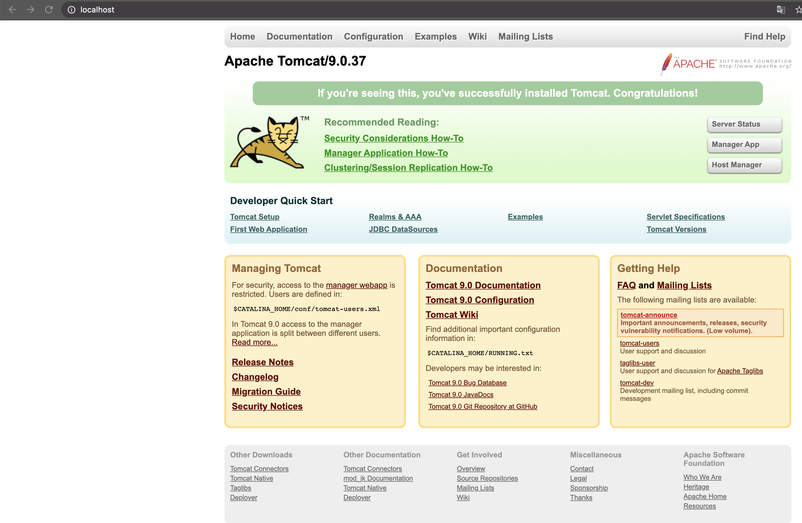
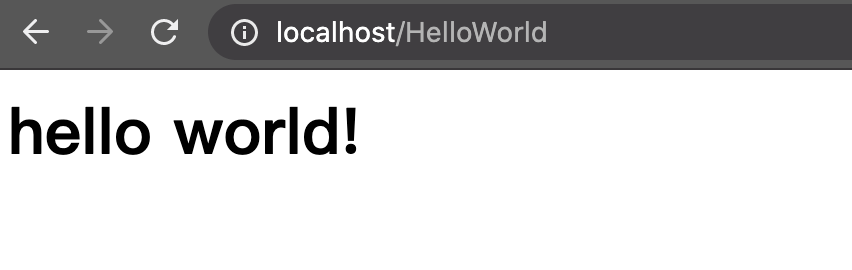
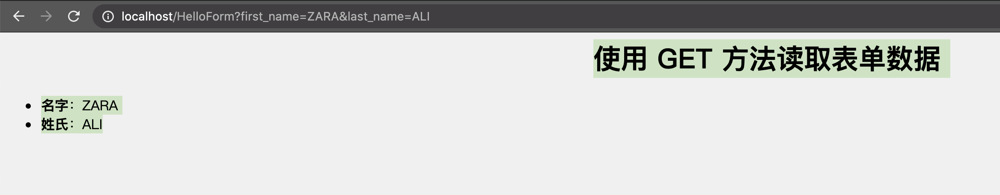
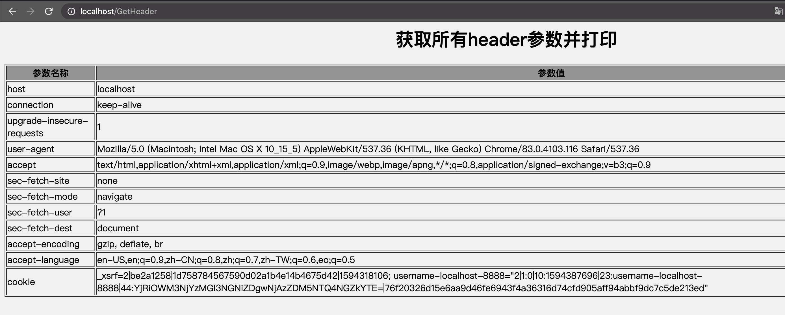
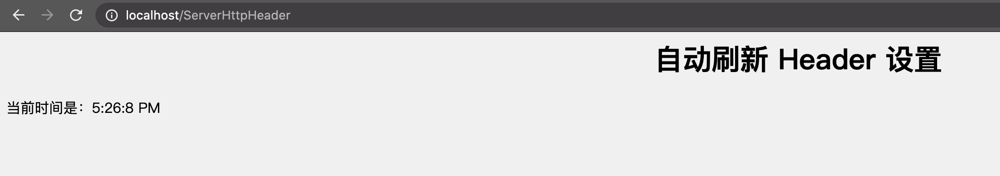

# Servlet <!-- omit in toc -->

[Reference](https://www.w3cschool.cn/servlet/servlet-intro.html)

- [基本介绍](#基本介绍)
  - [设置 Web 服务器：Tomcat](#设置-web-服务器tomcat)
  - [启动 Tomcat](#启动-tomcat)
    - [Tomcat Mac 下启动的相关问题](#tomcat-mac-下启动的相关问题)
      - [**启动不了**](#启动不了)
      - [**端口被占用**](#端口被占用)
- [Servlet 环境配置](#servlet-环境配置)
- [Servlet 生命周期](#servlet-生命周期)
  - [init() 方法](#init-方法)
  - [service() 方法](#service-方法)
  - [doGet() 方法](#doget-方法)
  - [doPost() 方法](#dopost-方法)
  - [destroy() 方法](#destroy-方法)
  - [架构图](#架构图)
- [使用 Servlet 响应 Hello World](#使用-servlet-响应-hello-world)
- [Servlet 表单数据](#servlet-表单数据)
  - [GET 方法](#get-方法)
  - [POST 方法](#post-方法)
  - [使用 Servlet 读取表单数据](#使用-servlet-读取表单数据)
  - [使用 URL 的 GET 方法实例](#使用-url-的-get-方法实例)
  - [遍历表单传递的参数](#遍历表单传递的参数)
- [Servlet 客户端 HTTP 请求](#servlet-客户端-http-请求)
  - [读取 HTTP 头的方法](#读取-http-头的方法)
  - [HTTP Header 请求实例](#http-header-请求实例)
- [Servlet 服务器 HTTP 响应](#servlet-服务器-http-响应)
  - [HTTP Header 响应实例](#http-header-响应实例)

## 基本介绍

Servlet 为创建基于 web 的应用程序提供了基于组件、独立于平台的方法，可以不受 CGI 程序的性能限制。Servlet 有权限访问所有的 Java API，包括访问企业级数据库的 JDBC API。

Java Servlet 是运行在 Web 服务器或应用服务器上的程序，它是作为来自 Web 浏览器或其他 HTTP 客户端的请求和 HTTP 服务器上的数据库或应用程序之间的中间层。

使用 Servlet，您可以收集来自网页表单的用户输入，呈现来自数据库或者其他源的记录，还可以动态创建网页。

Servlet在Web应用中的位置


### 设置 Web 服务器：Tomcat

在市场上有许多 Web 服务器支持 Servlet。有些 Web 服务器是免费下载的，Tomcat 就是其中的一个。

Apache Tomcat 是一款 Java Servlet 和 JavaServer Pages 技术的开源软件实现，可以作为测试 Servlet 的独立服务器，而且可以集成到 Apache Web 服务器。下面是在电脑上安装 Tomcat 的步骤：

从 http://tomcat.apache.org/ 上下载最新版本的 Tomcat。

### 启动 Tomcat

直接去下载好的Tomcat文件夹下

```
$ pwd
apache-tomcat-practice/bin
```

执行
```
$ ./startup.sh
Using CATALINA_BASE:   apache-tomcat-practice
Using CATALINA_HOME:   apache-tomcat-practice
Using CATALINA_TMPDIR: apache-tomcat-practice/temp
Using JRE_HOME:        /Library/Java/JavaVirtualMachines/jdk1.8.0_231.jdk/Contents/Home
Using CLASSPATH:       apache-tomcat-practice/bin/bootstrap.jar:apache-tomcat-practice/bin/tomcat-juli.jar
Tomcat started.
```

一般默认端口是80，但也可以去

```
$ pwd
apache-tomcat-practice/conf
```

下的 ```server.xml``` 搜索关键字```Connector``` 查看端口 ```port```信息

确认了端口后可以直接在浏览器浏览```localhost:80```

出现以下即可



#### Tomcat Mac 下启动的相关问题

##### **启动不了**

如果在执行```./startup.sh```的时候失败了，有可能是因为没有给当前这些文件授予执行权限

在bin上一层目录执行

```chmod +x bin/*.sh```

##### **端口被占用**

查看进程占用

```
lsof -i tcp:8080 
```

该命令会显示占用8080端口的进程，有其 pid ,可以通过pid关掉该进程

杀死进程 

```
kill pid
```

## Servlet 环境配置

Servlet 不是 Java 标准库里面的jar包，所以需要另外下载并且加到 CLASSPATH 里面

也可以在IDE里面直接添加 library 

Servlet [下载最新版本](https://mvnrepository.com/artifact/javax.servlet/servlet-api

## Servlet 生命周期

Servlet 生命周期可被定义为从创建直到毁灭的整个过程。以下是 Servlet 遵循的过程：

* Servlet 通过调用 init () 方法进行初始化。
* Servlet 调用 service() 方法来处理客户端的请求。
* Servlet 通过调用 destroy() 方法终止（结束）。

最后，Servlet 是由 JVM 的垃圾回收器进行垃圾回收的。

现在让我们详细讨论生命周期的方法。

### init() 方法

init 方法被设计成只调用一次。它在第一次创建 Servlet 时被调用，在后续每次用户请求时不再调用。因此，它是用于一次性初始化，就像 Applet 的 init 方法一样。

Servlet 创建于用户第一次调用对应于该 Servlet 的 URL 时，但是您也可以指定 Servlet 在服务器第一次启动时被加载。

当用户调用一个 Servlet 时，就会创建一个 Servlet 实例，每一个用户请求都会产生一个新的线程，适当的时候移交给 doGet 或 doPost 方法。init() 方法简单地创建或加载一些数据，这些数据将被用于 Servlet 的整个生命周期。

init 方法的定义如下：

```java
public void init() throws ServletException {
  // 初始化代码...
}
```

### service() 方法

service() 方法是执行实际任务的主要方法。Servlet 容器（即 Web 服务器）调用 service() 方法来处理来自客户端（浏览器）的请求，并把格式化的响应写回给客户端。

每次服务器接收到一个 Servlet 请求时，服务器会产生一个新的线程并调用服务。service() 方法检查 HTTP 请求类型（GET、POST、PUT、DELETE 等），并在适当的时候调用 doGet、doPost、doPut，doDelete 等方法。

下面是该方法的特征：
```java
public void service(ServletRequest request, 
                    ServletResponse response) 
      throws ServletException, IOException{
}
```
service() 方法由容器调用，service 方法在适当的时候调用 doGet、doPost、doPut、doDelete 等方法。所以，您不用对 service() 方法做任何动作，您只需要根据来自客户端的请求类型来重载 doGet() 或 doPost() 即可。

doGet() 和 doPost() 方法是每次服务请求中最常用的方法。下面是这两种方法的特征。

### doGet() 方法
GET 请求来自于一个 URL 的正常请求，或者来自于一个未指定 METHOD 的 HTML 表单，它由 doGet() 方法处理。
```java
public void doGet(HttpServletRequest request,
                  HttpServletResponse response)
    throws ServletException, IOException {
    // Servlet 代码
}
```

### doPost() 方法
POST 请求来自于一个特别指定了 METHOD 为 POST 的 HTML 表单，它由 doPost() 方法处理。
```java
public void doPost(HttpServletRequest request,
                   HttpServletResponse response)
    throws ServletException, IOException {
    // Servlet 代码
}
```

### destroy() 方法
destroy() 方法只会被调用一次，在 Servlet 生命周期结束时被调用。destroy() 方法可以让您的 Servlet 关闭数据库连接、停止后台线程、把 Cookie 列表或点击计数器写入到磁盘，并执行其他类似的清理活动。

在调用 destroy() 方法之后，servlet 对象被标记为垃圾回收。destroy 方法定义如下所示：
```java
  public void destroy() {
    // 终止化代码...
  }
```

### 架构图

下图显示了一个典型的 Servlet 生命周期方案。

* 第一个到达服务器的 HTTP 请求被委派到 Servlet 容器。
* Servlet 容器在调用 service() 方法之前加载 Servlet。
* 然后 Servlet 容器处理由多个线程产生的多个请求，每个线程执行一个单一的 Servlet 实例的 service() 方法。


## 使用 Servlet 响应 Hello World

Servlet 是服务 HTTP 请求并实现 javax.servlet.Servlet 接口的 Java 类。Web 应用程序开发人员通常编写 Servlet 来扩展 javax.servlet.http.HttpServlet，并实现 Servlet 接口的抽象类专门用来处理 HTTP 请求。

下面是 Servlet 输出 Hello World 的示例源代码：

```java
import javax.servlet.ServletException;
import javax.servlet.http.HttpServlet;
import javax.servlet.http.HttpServletRequest;
import javax.servlet.http.HttpServletResponse;
import java.io.IOException;
import java.io.PrintWriter;

/*************************************************************************
 *  Project: JavaEEPractice
 *  Dependencies: none
 *  Author: Zixiao Wang
 *  Create: 7/19/20
 *  Description: 练习部署Servlet到tomcat中
 *************************************************************************/
public class HelloWorld extends HttpServlet {

    private String message;

    @Override
    public void init() throws ServletException {
        this.message = "hello world!";
    }

    @Override
    protected void doGet(HttpServletRequest req, HttpServletResponse resp) throws ServletException, IOException {
        // 设置响应内容类型
        resp.setContentType("text/html");

        // 实际响应逻辑
        PrintWriter printWriter = resp.getWriter();
        printWriter.println("<h1>"+this.message+"</h1>");
    }

    @Override
    public void destroy() {
        super.destroy();
    }
}
```

之后编译此文件得到```.class```文件

默认情况下，Servlet 应用程序位于路径 ```<Tomcat-installation-directory>/webapps/ROOT``` 下，且类文件放在 ```<Tomcat-installation-directory>/webapps/ROOT/WEB-INF/classes``` 中。

如果您有一个完全合格的类名称 ```com.myorg.MyServlet```，那么这个 Servlet 类必须位于 ```WEB-INF/classes/com/myorg/MyServlet.class``` 中。

现在，让我们把 ```HelloWorld.class``` 复制到 ```<Tomcat-installation-directory>/webapps/ROOT/WEB-INF/classes``` 中，并在位于 ```<Tomcat-installation-directory>/webapps/ROOT/WEB-INF/``` 的 ```web.xml``` 文件中创建以下条目：

```xml
    <servlet>
        <servlet-name>HelloWorld</servlet-name>
        <servlet-class>HelloWorld</servlet-class>
    </servlet>

    <servlet-mapping>
        <servlet-name>HelloWorld</servlet-name>
        <url-pattern>/HelloWorld</url-pattern>
    </servlet-mapping>
```

上面的条目要被创建在 web.xml 文件中的 <web-app>...</web-app> 标签内。在该文件中可能已经有各种可用的条目，但不要在意。

启动tomcat 进入 ```localhost:80/HelloWorld```就可以访问响应返回的内容了



## Servlet 表单数据

很多情况下，需要传递一些信息，从浏览器到 Web 服务器，最终到后台程序。浏览器使用两种方法可将这些信息传递到 Web 服务器，分别为 GET 方法和 POST 方法。

### GET 方法
GET 方法向页面请求发送已编码的用户信息。页面和已编码的信息中间用 ? 字符分隔，如下所示：
```
http://www.test.com/hello?key1=value1&key2=value2
```
GET 方法是默认的从浏览器向 Web 服务器传递信息的方法，它会产生一个很长的字符串，出现在浏览器的地址栏中。如果您要向服务器传递的是密码或其他的敏感信息，请不要使用 GET 方法。GET 方法有大小限制：请求字符串中最多只能有 1024 个字符。

这些信息使用 QUERY_STRING 头传递，并可以通过 QUERY_STRING 环境变量访问，Servlet 使用 doGet() 方法处理这种类型的请求。

### POST 方法
另一个向后台程序传递信息的比较可靠的方法是 POST 方法。POST 方法打包信息的方式与 GET 方法基本相同，但是 POST 方法不是把信息作为 URL 中 ? 字符后的文本字符串进行发送，而是把这些信息作为一个单独的消息。消息以标准输出的形式传到后台程序，您可以解析和使用这些标准输出。Servlet 使用 doPost() 方法处理这种类型的请求。

### 使用 Servlet 读取表单数据

Servlet 处理表单数据，这些数据会根据不同的情况使用不同的方法自动解析：

* getParameter()：您可以调用 request.getParameter() 方法来获取表单参数的值。
* getParameterValues()：如果参数出现一次以上，则调用该方法，并返回多个值，例如复选框。
* getParameterNames()：如果您想要得到当前请求中的所有参数的完整列表，则调用该方法。

### 使用 URL 的 GET 方法实例
下面是一个简单的 URL，将使用 GET 方法向 HelloForm 程序传递两个值。
```
http://localhost:8080/HelloForm?first_name=ZARA&last_name=ALI
```
下面是处理 Web 浏览器输入的 HelloForm.java Servlet 程序。我们将使用 getParameter() 方法，可以很容易地访问传递的信息：

```java
import javax.servlet.ServletException;
import javax.servlet.http.HttpServlet;
import javax.servlet.http.HttpServletRequest;
import javax.servlet.http.HttpServletResponse;
import java.io.IOException;
import java.io.PrintWriter;

/*************************************************************************
 *  Project: JavaEEPractice
 *  Dependencies: none
 *  Author: Zixiao Wang
 *  Create: 7/19/20
 *  Description:
 *************************************************************************/
public class HelloForm extends HttpServlet {
    // 处理Get请求


    @Override
    protected void doGet(HttpServletRequest req, HttpServletResponse resp) throws ServletException, IOException {
        // 设置响应内容
        // 目的是为了控制浏览器的行为，即控制浏览器用UTF-8进行解码；
        resp.setContentType("text/html;charset=UTF-8");
        // 的目的是用于response.getWriter()输出的字符流的乱码问题，如果是response.getOutputStream()是不需要此种解决方案的；因为这句话的意思是为了将response对象中的数据以UTF-8解码后发向浏览器；
        resp.setCharacterEncoding("UTF-8"); //

        // 实际响应逻辑
        PrintWriter printWriter = resp.getWriter();
        String title = "使用 GET 方法读取表单数据";
        String docType =
                "<!doctype html public \"-//w3c//dtd html 4.0 " +       "transitional//en\">\n";
        printWriter.println(docType +
                "<html>\n" +
                "<head><title>" + title + "</title></head>\n" +
                "<body bgcolor=\"#f0f0f0\">\n" +
                "<h1 align=\"center\">" + title + "</h1>\n" +
                "<ul>\n" +
                "  <li><b>名字</b>："
                + req.getParameter("first_name") + "\n" +
                "  <li><b>姓氏</b>："
                + req.getParameter("last_name") + "\n" +
                "</ul>\n" +
                "</body></html>");
    }

    @Override
    protected void doPost(HttpServletRequest req, HttpServletResponse resp) throws ServletException, IOException {
        this.doGet(req,resp);
    }
}
```

同样编译后将类文件部署到tomcat上并求改web.xml

运行结果如下



此处注意编码的问题，否则中文会乱码

```java
// 目的是为了控制浏览器的行为，即控制浏览器用UTF-8进行解码；
resp.setContentType("text/html;charset=UTF-8");
// 的目的是用于response.getWriter()输出的字符流的乱码问题，如果是response.getOutputStream()是不需要此种解决方案的；因为这句话的意思是为了将response对象中的数据以UTF-8解码后发向浏览器；
resp.setCharacterEncoding("UTF-8"); //
```

### 遍历表单传递的参数

首先将复选框html部署到tomcat中，位置为```<Tomcat-installation-directory>/webapps/ROOT```下

```html
<html>

<head>
    <meta http-equiv="Content-Type" content="text/html;charset=UTF-8">
    <title>CheckBox</title>
</head>

<body>
    <form action="/CheckBox" method="POST">
        <input type="checkbox" name="maths" checked="checked" /> 数学
        <input type="checkbox" name="physics" /> 物理
        <input type="checkbox" name="chemistry" checked="checked" /> 化学
        <input type="submit" value="选择学科" />
    </form>
    </form>
</body>

</html>
```

以下是通用的实例，使用 HttpServletRequest 的 getParameterNames() 方法读取所有可用的表单参数。该方法返回一个枚举，其中包含未指定顺序的参数名。

一旦我们有一个枚举，我们可以以标准方式循环枚举，使用 hasMoreElements() 方法来确定何时停止，使用 nextElement() 方法来获取每个参数的名称。

```java
import javax.servlet.ServletException;
import javax.servlet.http.HttpServlet;
import javax.servlet.http.HttpServletRequest;
import javax.servlet.http.HttpServletResponse;
import java.io.IOException;
import java.io.PrintWriter;
import java.util.Enumeration;

/*************************************************************************
 *  Project: JavaEEPractice
 *  Dependencies: none
 *  Author: Zixiao Wang
 *  Create: 7/19/20
 *  Description:
 *************************************************************************/
public class CheckBox extends HttpServlet {
    // 使用hasparameter获取所有参数


    @Override
    protected void doGet(HttpServletRequest req, HttpServletResponse resp) throws ServletException, IOException {
        // 设置响应类型
        resp.setContentType("text/html;charset=UTF-8");
        resp.setCharacterEncoding("UTF-8");

        // 实际响应逻辑
        String title="获取所有参数并打印";
        PrintWriter printWriter = resp.getWriter();
        String docType =
                "<!doctype html public \"-//w3c//dtd html 4.0 " + "transitional//en\">\n";
        printWriter.println(docType +
                "<html>\n" +
                "<head><title>" + title + "</title></head>\n" +
                "<body bgcolor=\"#f0f0f0\">\n" +
                "<h1 align=\"center\">" + title + "</h1>\n" +
                "<table width=\"100%\" border=\"1\" align=\"center\">\n" +
                "<tr bgcolor=\"#949494\">\n" +
                "<th>参数名称</th><th>参数值</th>\n" +
                "</tr>\n");

        // 使用枚举遍历参数列表
        Enumeration paramNames = req.getParameterNames();
        while (paramNames.hasMoreElements()) {
            String paramName = (String) paramNames.nextElement();
            printWriter.print("<tr><td>" + paramName + "</td>\n<td>");
            String[] paramValues =
                    req.getParameterValues(paramName);
            // 读取单个值的数据
            if (paramValues.length == 1) {
                String paramValue = paramValues[0];
                if (paramValue.length() == 0)
                    printWriter.println("<i>No Value</i>");
                else
                    printWriter.println(paramValue);
            } else {
                // 读取多个值的数据
                printWriter.println("<ul>");
                for (int i = 0; i < paramValues.length; i++) {
                    printWriter.println("<li>" + paramValues[i]);
                }
                printWriter.println("</ul>");
            }
        }
        printWriter.println("</tr>\n</table>\n</body></html>");

    }

    @Override
    protected void doPost(HttpServletRequest req, HttpServletResponse resp) throws ServletException, IOException {
        this.doGet(req,resp);
    }
}
```

## Servlet 客户端 HTTP 请求

当浏览器请求网页时，它会向 Web 服务器发送特定信息，这些信息不能被直接读取，因为这些信息是作为 HTTP 请求的头的一部分进行传输的。

[这里](https://www.w3cschool.cn/servlet/servlet-client-request.html)有是来自于浏览器端的重要头信息，可以在 Web 编程中频繁使用：

### 读取 HTTP 头的方法

在 Servlet 程序中读取 HTTP 头。这些[方法](https://www.w3cschool.cn/servlet/servlet-client-request.html)通过 HttpServletRequest 对象可用。

### HTTP Header 请求实例

下面的实例使用 HttpServletRequest 的 getHeaderNames() 方法读取 HTTP 头信息。该方法返回一个枚举，包含与当前的 HTTP 请求相关的头信息。

一旦我们有一个枚举，我们可以以标准方式循环枚举，使用 hasMoreElements() 方法来确定何时停止，使用 nextElement() 方法来获取每个参数的名称。

```java
import javax.servlet.ServletException;
import javax.servlet.http.HttpServlet;
import javax.servlet.http.HttpServletRequest;
import javax.servlet.http.HttpServletResponse;
import java.io.IOException;
import java.io.PrintWriter;
import java.util.Enumeration;

/*************************************************************************
 *  Project: JavaEEPractice
 *  Dependencies: none
 *  Author: Zixiao Wang
 *  Create: 7/19/20
 *  Description:
 *************************************************************************/
public class GetHeader extends HttpServlet {
    // 获取 http请求 header的数据


    @Override
    protected void doGet(HttpServletRequest req, HttpServletResponse resp) throws ServletException, IOException {
        // 设置响应
        resp.setContentType("text/html;charset=UTF-8");
        resp.setCharacterEncoding("UTF-8");

        // 实际响应逻辑
        String title="获取所有header参数并打印";
        PrintWriter printWriter = resp.getWriter();
        String docType =
                "<!doctype html public \"-//w3c//dtd html 4.0 " + "transitional//en\">\n";
        printWriter.println(docType +
                "<html>\n" +
                "<head><title>" + title + "</title></head>\n" +
                "<body bgcolor=\"#f0f0f0\">\n" +
                "<h1 align=\"center\">" + title + "</h1>\n" +
                "<table width=\"100%\" border=\"1\" align=\"center\">\n" +
                "<tr bgcolor=\"#949494\">\n" +
                "<th>参数名称</th><th>参数值</th>\n" +
                "</tr>\n");

        Enumeration header = req.getHeaderNames();

        while(header.hasMoreElements()){
            String parameterName = (String) header.nextElement();
            printWriter.println("<tr><td>"+parameterName+"</td>");
            String paramValue = req.getHeader(parameterName);
            printWriter.println("<td> " + paramValue + "</td></tr>\n");
        }
    }

    @Override
    protected void doPost(HttpServletRequest req, HttpServletResponse resp) throws ServletException, IOException {
        this.doGet(req,resp);
    }
}
```

编译并部署到tomcat，并且修改web.xml

运行结果



## Servlet 服务器 HTTP 响应

正如前面的章节中讨论的那样，当一个 Web 服务器响应一个 HTTP 请求时，响应通常包括一个状态行、一些响应报头、一个空行和文档。一个典型的响应如下所示：

```
HTTP/1.1 200 OK
Content-Type: text/html
Header2: ...
...
HeaderN: ...
  (Blank Line)
<!doctype ...>
<html>
<head>...</head>
<body>
...
</body>
</html>
```

状态行包括 HTTP 版本（在本例中为 HTTP/1.1）、一个状态码（在本例中为 200）和一个对应于状态码的短消息（在本例中为 OK）。

[这里](https://www.w3cschool.cn/servlet/servlet-server-response.html)总结了从 Web 服务器端返回到浏览器的最有用的 HTTP 1.1 响应报头，会在 Web 编程中频繁地使用它们：

### HTTP Header 响应实例
您已经在前面的实例中看到 setContentType() 方法，下面的实例也使用了同样的方法，此外，我们会用 setIntHeader() 方法来设置 Refresh 头。

```java
import javax.servlet.ServletException;
import javax.servlet.http.HttpServlet;
import javax.servlet.http.HttpServletRequest;
import javax.servlet.http.HttpServletResponse;
import java.io.IOException;
import java.io.PrintWriter;
import java.util.Calendar;
import java.util.GregorianCalendar;

/*************************************************************************
 *  Project: JavaEEPractice
 *  Dependencies: none
 *  Author: Zixiao Wang
 *  Create: 7/19/20
 *  Description:
 *************************************************************************/
public class ServerHttpHeader extends HttpServlet {
    @Override
    protected void doGet(HttpServletRequest req, HttpServletResponse resp) throws ServletException, IOException {
        // 设置响应内容
        resp.setContentType("text/html;charset=UTF-8");
        resp.setCharacterEncoding("UTF-8");

        // 实际逻辑
        resp.setIntHeader("Refresh",5);// 设置自动刷新时间为5秒


        // Get current time
        Calendar calendar = new GregorianCalendar();
        String am_pm;
        int hour = calendar.get(Calendar.HOUR);
        int minute = calendar.get(Calendar.MINUTE);
        int second = calendar.get(Calendar.SECOND);
        if(calendar.get(Calendar.AM_PM) == 0)
            am_pm = "AM";
        else
            am_pm = "PM";

        String currentTime = hour+":"+ minute +":"+ second +" "+ am_pm;

        PrintWriter out = resp.getWriter();
        String title = "自动刷新 Header 设置";
        String docType =
                "<!doctype html public \"-//w3c//dtd html 4.0 " +       "transitional//en\">\n";
        out.println(docType +
                "<html>\n" +
                "<head><title>" + title + "</title></head>\n"+
                "<body bgcolor=\"#f0f0f0\">\n" +
                "<h1 align=\"center\">" + title + "</h1>\n" +
                "<p>当前时间是：" + currentTime + "</p>\n");
    }

    @Override
    protected void doPost(HttpServletRequest req, HttpServletResponse resp) throws ServletException, IOException {
        this.doGet(req,resp);
    }
}
```

部署到tomcat中并修改对应 web.xml

运行结果：

每5秒都会刷新新的当前时间

