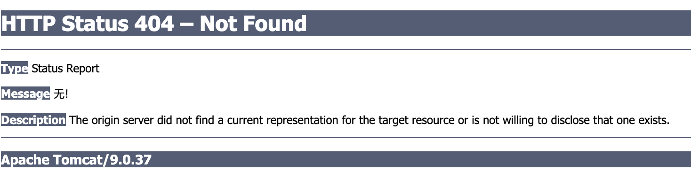
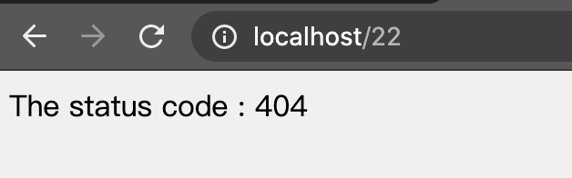
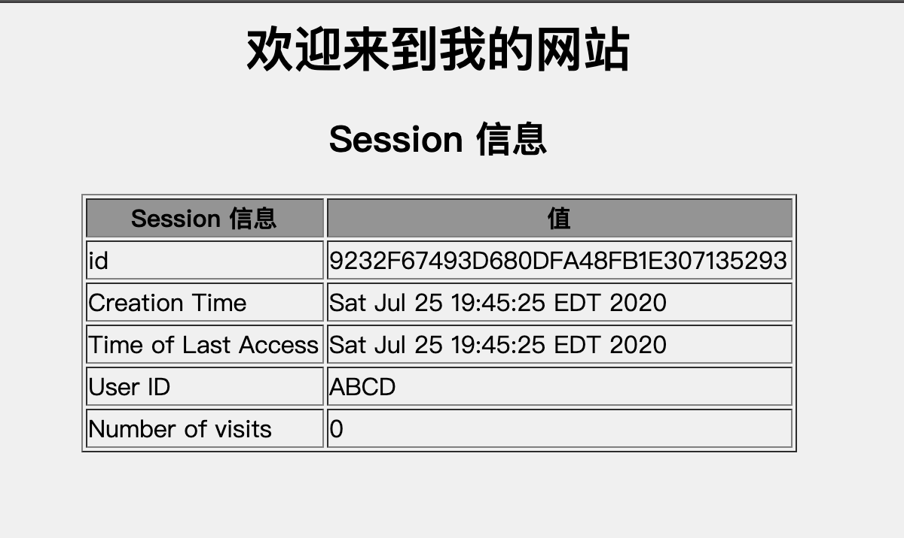
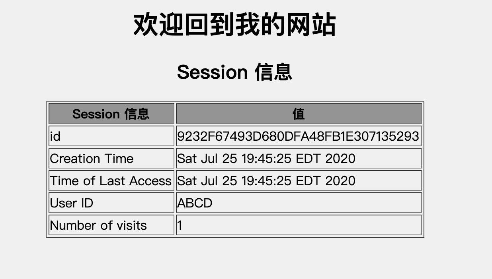
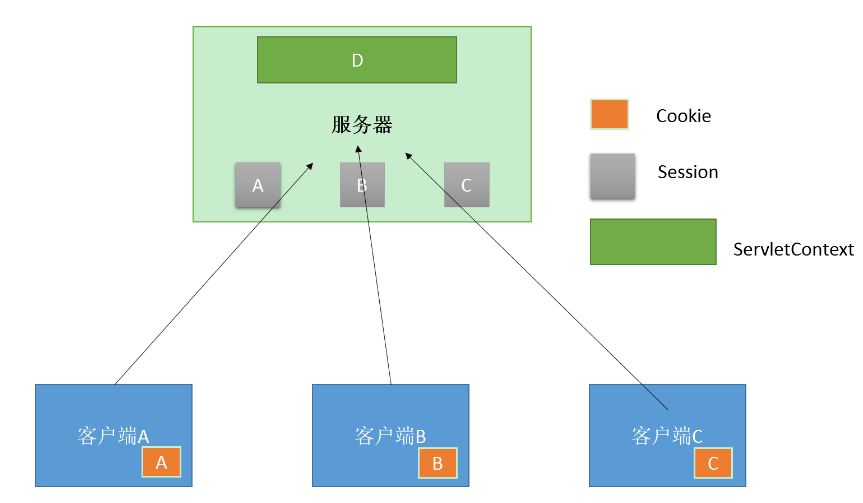

# Servlet <!-- omit in toc -->

[Reference](https://www.w3cschool.cn/servlet/servlet-intro.html)

- [基本介绍](#基本介绍)
  - [设置 Web 服务器：Tomcat](#设置-web-服务器tomcat)
  - [启动 Tomcat](#启动-tomcat)
    - [Tomcat Mac 下启动的相关问题](#tomcat-mac-下启动的相关问题)
      - [**启动不了**](#启动不了)
      - [**端口被占用**](#端口被占用)
- [Servlet 环境配置](#servlet-环境配置)
- [Servlet 生命周期](#servlet-生命周期)
  - [init() 方法](#init-方法)
  - [service() 方法](#service-方法)
  - [doGet() 方法](#doget-方法)
  - [doPost() 方法](#dopost-方法)
  - [destroy() 方法](#destroy-方法)
  - [架构图](#架构图)
- [使用 Servlet 响应 Hello World](#使用-servlet-响应-hello-world)
- [Servlet 表单数据](#servlet-表单数据)
  - [GET 方法](#get-方法)
  - [POST 方法](#post-方法)
  - [使用 Servlet 读取表单数据](#使用-servlet-读取表单数据)
  - [使用 URL 的 GET 方法实例](#使用-url-的-get-方法实例)
  - [遍历表单传递的参数](#遍历表单传递的参数)
- [Servlet 客户端 HTTP 请求](#servlet-客户端-http-请求)
  - [读取 HTTP 头的方法](#读取-http-头的方法)
  - [HTTP Header 请求实例](#http-header-请求实例)
- [Servlet 服务器 HTTP 响应](#servlet-服务器-http-响应)
  - [HTTP Header 响应实例](#http-header-响应实例)
- [Http 状态响应码](#http-状态响应码)
  - [设置 HTTP 状态代码的方法](#设置-http-状态代码的方法)
  - [HTTP 状态码实例](#http-状态码实例)
- [Servlet 编写过滤器](#servlet-编写过滤器)
  - [Servlet 过滤器方法](#servlet-过滤器方法)
  - [FilterConfig 使用](#filterconfig-使用)
  - [Servlet 过滤器实例](#servlet-过滤器实例)
  - [使用多个过滤器](#使用多个过滤器)
  - [过滤器的应用顺序](#过滤器的应用顺序)
  - [web.xml配置各节点说明](#webxml配置各节点说明)
- [Servlet 异常处理](#servlet-异常处理)
  - [如何使用](#如何使用)
  - [请求属性 - 错误/异常](#请求属性---错误异常)
  - [使用实例](#使用实例)
- [Servlet Cookies 处理](#servlet-cookies-处理)
  - [中文的处理](#中文的处理)
  - [Cookie 剖析](#cookie-剖析)
  - [通过 Servlet 设置 Cookies](#通过-servlet-设置-cookies)
  - [Cookies实例](#cookies实例)
- [Servlet Session 跟踪](#servlet-session-跟踪)
  - [Cookies](#cookies)
  - [隐藏的表单字段](#隐藏的表单字段)
  - [URL 重写](#url-重写)
  - [HttpSession 对象](#httpsession-对象)
  - [Session 跟踪实例](#session-跟踪实例)
  - [删除 Session 会话数据](#删除-session-会话数据)
- [Servlet context 对象](#servlet-context-对象)
  - [ServletContext使用方法](#servletcontext使用方法)
  - [使用实例](#使用实例-1)
- [Servlet 网页重定向](#servlet-网页重定向)

## 基本介绍

Servlet 为创建基于 web 的应用程序提供了基于组件、独立于平台的方法，可以不受 CGI 程序的性能限制。Servlet 有权限访问所有的 Java API，包括访问企业级数据库的 JDBC API。

Java Servlet 是运行在 Web 服务器或应用服务器上的程序，它是作为来自 Web 浏览器或其他 HTTP 客户端的请求和 HTTP 服务器上的数据库或应用程序之间的中间层。

使用 Servlet，您可以收集来自网页表单的用户输入，呈现来自数据库或者其他源的记录，还可以动态创建网页。

Servlet在Web应用中的位置


[进一步理解Servle在应用中的位置](https://zhuanlan.zhihu.com/p/93947462)

### 设置 Web 服务器：Tomcat

在市场上有许多 Web 服务器支持 Servlet。有些 Web 服务器是免费下载的，Tomcat 就是其中的一个。

Apache Tomcat 是一款 Java Servlet 和 JavaServer Pages 技术的开源软件实现，可以作为测试 Servlet 的独立服务器，而且可以集成到 Apache Web 服务器。下面是在电脑上安装 Tomcat 的步骤：

从 http://tomcat.apache.org/ 上下载最新版本的 Tomcat。

### 启动 Tomcat

直接去下载好的Tomcat文件夹下

```
$ pwd
apache-tomcat-practice/bin
```

执行
```
$ ./startup.sh
Using CATALINA_BASE:   apache-tomcat-practice
Using CATALINA_HOME:   apache-tomcat-practice
Using CATALINA_TMPDIR: apache-tomcat-practice/temp
Using JRE_HOME:        /Library/Java/JavaVirtualMachines/jdk1.8.0_231.jdk/Contents/Home
Using CLASSPATH:       apache-tomcat-practice/bin/bootstrap.jar:apache-tomcat-practice/bin/tomcat-juli.jar
Tomcat started.
```

一般默认端口是80，但也可以去

```
$ pwd
apache-tomcat-practice/conf
```

下的 ```server.xml``` 搜索关键字```Connector``` 查看端口 ```port```信息

确认了端口后可以直接在浏览器浏览```localhost:80```

出现以下即可


#### Tomcat Mac 下启动的相关问题

##### **启动不了**

如果在执行```./startup.sh```的时候失败了，有可能是因为没有给当前这些文件授予执行权限

在bin上一层目录执行

```chmod +x bin/*.sh```

##### **端口被占用**

查看进程占用

```
lsof -i tcp:8080 
```

该命令会显示占用8080端口的进程，有其 pid ,可以通过pid关掉该进程

杀死进程 

```
kill pid
```

## Servlet 环境配置

Servlet 不是 Java 标准库里面的jar包，所以需要另外下载并且加到 CLASSPATH 里面

也可以在IDE里面直接添加 library 

Servlet [下载最新版本](https://mvnrepository.com/artifact/javax.servlet/servlet-api)

## Servlet 生命周期

Servlet 生命周期可被定义为从创建直到毁灭的整个过程。以下是 Servlet 遵循的过程：

* Servlet 通过调用 init () 方法进行初始化。
* Servlet 调用 service() 方法来处理客户端的请求。
* Servlet 通过调用 destroy() 方法终止（结束）。

最后，Servlet 是由 JVM 的垃圾回收器进行垃圾回收的。

现在让我们详细讨论生命周期的方法。

### init() 方法

init 方法被设计成只调用一次。它在第一次创建 Servlet 时被调用，在后续每次用户请求时不再调用。因此，它是用于一次性初始化，就像 Applet 的 init 方法一样。

Servlet 创建于用户第一次调用对应于该 Servlet 的 URL 时，但是您也可以指定 Servlet 在服务器第一次启动时被加载。

当用户调用一个 Servlet 时，就会创建一个 Servlet 实例，每一个用户请求都会产生一个新的线程，适当的时候移交给 doGet 或 doPost 方法。init() 方法简单地创建或加载一些数据，这些数据将被用于 Servlet 的整个生命周期。

init 方法的定义如下：

```java
public void init() throws ServletException {
  // 初始化代码...
}
```

### service() 方法

service() 方法是执行实际任务的主要方法。Servlet 容器（即 Web 服务器）调用 service() 方法来处理来自客户端（浏览器）的请求，并把格式化的响应写回给客户端。

每次服务器接收到一个 Servlet 请求时，服务器会产生一个新的线程并调用服务。service() 方法检查 HTTP 请求类型（GET、POST、PUT、DELETE 等），并在适当的时候调用 doGet、doPost、doPut，doDelete 等方法。

下面是该方法的特征：
```java
public void service(ServletRequest request, 
                    ServletResponse response) 
      throws ServletException, IOException{
}
```
service() 方法由容器调用，service 方法在适当的时候调用 doGet、doPost、doPut、doDelete 等方法。所以，您不用对 service() 方法做任何动作，您只需要根据来自客户端的请求类型来重载 doGet() 或 doPost() 即可。

doGet() 和 doPost() 方法是每次服务请求中最常用的方法。下面是这两种方法的特征。

### doGet() 方法
GET 请求来自于一个 URL 的正常请求，或者来自于一个未指定 METHOD 的 HTML 表单，它由 doGet() 方法处理。
```java
public void doGet(HttpServletRequest request,
                  HttpServletResponse response)
    throws ServletException, IOException {
    // Servlet 代码
}
```

### doPost() 方法
POST 请求来自于一个特别指定了 METHOD 为 POST 的 HTML 表单，它由 doPost() 方法处理。
```java
public void doPost(HttpServletRequest request,
                   HttpServletResponse response)
    throws ServletException, IOException {
    // Servlet 代码
}
```

### destroy() 方法
destroy() 方法只会被调用一次，在 Servlet 生命周期结束时被调用。destroy() 方法可以让您的 Servlet 关闭数据库连接、停止后台线程、把 Cookie 列表或点击计数器写入到磁盘，并执行其他类似的清理活动。

在调用 destroy() 方法之后，servlet 对象被标记为垃圾回收。destroy 方法定义如下所示：
```java
  public void destroy() {
    // 终止化代码...
  }
```

### 架构图

下图显示了一个典型的 Servlet 生命周期方案。

* 第一个到达服务器的 HTTP 请求被委派到 Servlet 容器。
* Servlet 容器在调用 service() 方法之前加载 Servlet。
* 然后 Servlet 容器处理由多个线程产生的多个请求，每个线程执行一个单一的 Servlet 实例的 service() 方法。


## 使用 Servlet 响应 Hello World

Servlet 是服务 HTTP 请求并实现 javax.servlet.Servlet 接口的 Java 类。Web 应用程序开发人员通常编写 Servlet 来扩展 javax.servlet.http.HttpServlet，并实现 Servlet 接口的抽象类专门用来处理 HTTP 请求。

下面是 Servlet 输出 Hello World 的示例源代码：

```java
import javax.servlet.ServletException;
import javax.servlet.http.HttpServlet;
import javax.servlet.http.HttpServletRequest;
import javax.servlet.http.HttpServletResponse;
import java.io.IOException;
import java.io.PrintWriter;

/*************************************************************************
 *  Project: JavaEEPractice
 *  Dependencies: none
 *  Author: Zixiao Wang
 *  Create: 7/19/20
 *  Description: 练习部署Servlet到tomcat中
 *************************************************************************/
public class HelloWorld extends HttpServlet {

    private String message;

    @Override
    public void init() throws ServletException {
        this.message = "hello world!";
    }

    @Override
    protected void doGet(HttpServletRequest req, HttpServletResponse resp) throws ServletException, IOException {
        // 设置响应内容类型
        resp.setContentType("text/html");

        // 实际响应逻辑
        PrintWriter printWriter = resp.getWriter();
        printWriter.println("<h1>"+this.message+"</h1>");
    }

    @Override
    public void destroy() {
        super.destroy();
    }
}
```

之后编译此文件得到```.class```文件

默认情况下，Servlet 应用程序位于路径 ```<Tomcat-installation-directory>/webapps/ROOT``` 下，且类文件放在 ```<Tomcat-installation-directory>/webapps/ROOT/WEB-INF/classes``` 中。

如果您有一个完全合格的类名称 ```com.myorg.MyServlet```，那么这个 Servlet 类必须位于 ```WEB-INF/classes/com/myorg/MyServlet.class``` 中。

现在，让我们把 ```HelloWorld.class``` 复制到 ```<Tomcat-installation-directory>/webapps/ROOT/WEB-INF/classes``` 中，并在位于 ```<Tomcat-installation-directory>/webapps/ROOT/WEB-INF/``` 的 ```web.xml``` 文件中创建以下条目：

```xml
    <servlet>
        <servlet-name>HelloWorld</servlet-name>
        <servlet-class>HelloWorld</servlet-class>
    </servlet>

    <servlet-mapping>
        <servlet-name>HelloWorld</servlet-name>
        <url-pattern>/HelloWorld</url-pattern>
    </servlet-mapping>
```

上面的条目要被创建在 web.xml 文件中的 <web-app>...</web-app> 标签内。在该文件中可能已经有各种可用的条目，但不要在意。

启动tomcat 进入 ```localhost:80/HelloWorld```就可以访问响应返回的内容了


## Servlet 表单数据

很多情况下，需要传递一些信息，从浏览器到 Web 服务器，最终到后台程序。浏览器使用两种方法可将这些信息传递到 Web 服务器，分别为 GET 方法和 POST 方法。

### GET 方法
GET 方法向页面请求发送已编码的用户信息。页面和已编码的信息中间用 ? 字符分隔，如下所示：
```
http://www.test.com/hello?key1=value1&key2=value2
```
GET 方法是默认的从浏览器向 Web 服务器传递信息的方法，它会产生一个很长的字符串，出现在浏览器的地址栏中。如果您要向服务器传递的是密码或其他的敏感信息，请不要使用 GET 方法。GET 方法有大小限制：请求字符串中最多只能有 1024 个字符。

这些信息使用 QUERY_STRING 头传递，并可以通过 QUERY_STRING 环境变量访问，Servlet 使用 doGet() 方法处理这种类型的请求。

### POST 方法
另一个向后台程序传递信息的比较可靠的方法是 POST 方法。POST 方法打包信息的方式与 GET 方法基本相同，但是 POST 方法不是把信息作为 URL 中 ? 字符后的文本字符串进行发送，而是把这些信息作为一个单独的消息。消息以标准输出的形式传到后台程序，您可以解析和使用这些标准输出。Servlet 使用 doPost() 方法处理这种类型的请求。

### 使用 Servlet 读取表单数据

Servlet 处理表单数据，这些数据会根据不同的情况使用不同的方法自动解析：

* getParameter()：您可以调用 request.getParameter() 方法来获取表单参数的值。
* getParameterValues()：如果参数出现一次以上，则调用该方法，并返回多个值，例如复选框。
* getParameterNames()：如果您想要得到当前请求中的所有参数的完整列表，则调用该方法。

### 使用 URL 的 GET 方法实例
下面是一个简单的 URL，将使用 GET 方法向 HelloForm 程序传递两个值。
```
http://localhost:8080/HelloForm?first_name=ZARA&last_name=ALI
```
下面是处理 Web 浏览器输入的 HelloForm.java Servlet 程序。我们将使用 getParameter() 方法，可以很容易地访问传递的信息：

```java
import javax.servlet.ServletException;
import javax.servlet.http.HttpServlet;
import javax.servlet.http.HttpServletRequest;
import javax.servlet.http.HttpServletResponse;
import java.io.IOException;
import java.io.PrintWriter;

/*************************************************************************
 *  Project: JavaEEPractice
 *  Dependencies: none
 *  Author: Zixiao Wang
 *  Create: 7/19/20
 *  Description:
 *************************************************************************/
public class HelloForm extends HttpServlet {
    // 处理Get请求


    @Override
    protected void doGet(HttpServletRequest req, HttpServletResponse resp) throws ServletException, IOException {
        // 设置响应内容
        // 目的是为了控制浏览器的行为，即控制浏览器用UTF-8进行解码；
        resp.setContentType("text/html;charset=UTF-8");
        // 的目的是用于response.getWriter()输出的字符流的乱码问题，如果是response.getOutputStream()是不需要此种解决方案的；因为这句话的意思是为了将response对象中的数据以UTF-8解码后发向浏览器；
        resp.setCharacterEncoding("UTF-8"); //

        // 实际响应逻辑
        PrintWriter printWriter = resp.getWriter();
        String title = "使用 GET 方法读取表单数据";
        String docType =
                "<!doctype html public \"-//w3c//dtd html 4.0 " +       "transitional//en\">\n";
        printWriter.println(docType +
                "<html>\n" +
                "<head><title>" + title + "</title></head>\n" +
                "<body bgcolor=\"#f0f0f0\">\n" +
                "<h1 align=\"center\">" + title + "</h1>\n" +
                "<ul>\n" +
                "  <li><b>名字</b>："
                + req.getParameter("first_name") + "\n" +
                "  <li><b>姓氏</b>："
                + req.getParameter("last_name") + "\n" +
                "</ul>\n" +
                "</body></html>");
    }

    @Override
    protected void doPost(HttpServletRequest req, HttpServletResponse resp) throws ServletException, IOException {
        this.doGet(req,resp);
    }
}
```

同样编译后将类文件部署到tomcat上并求改web.xml

运行结果如下


此处注意编码的问题，否则中文会乱码

```java
// 目的是为了控制浏览器的行为，即控制浏览器用UTF-8进行解码；
resp.setContentType("text/html;charset=UTF-8");
// 的目的是用于response.getWriter()输出的字符流的乱码问题，如果是response.getOutputStream()是不需要此种解决方案的；因为这句话的意思是为了将response对象中的数据以UTF-8解码后发向浏览器；
resp.setCharacterEncoding("UTF-8"); //
```

### 遍历表单传递的参数

首先将复选框html部署到tomcat中，位置为```<Tomcat-installation-directory>/webapps/ROOT```下

```html
<html>

<head>
    <meta http-equiv="Content-Type" content="text/html;charset=UTF-8">
    <title>CheckBox</title>
</head>

<body>
    <form action="/CheckBox" method="POST">
        <input type="checkbox" name="maths" checked="checked" /> 数学
        <input type="checkbox" name="physics" /> 物理
        <input type="checkbox" name="chemistry" checked="checked" /> 化学
        <input type="submit" value="选择学科" />
    </form>
    </form>
</body>

</html>
```

以下是通用的实例，使用 HttpServletRequest 的 getParameterNames() 方法读取所有可用的表单参数。该方法返回一个枚举，其中包含未指定顺序的参数名。

一旦我们有一个枚举，我们可以以标准方式循环枚举，使用 hasMoreElements() 方法来确定何时停止，使用 nextElement() 方法来获取每个参数的名称。

```java
import javax.servlet.ServletException;
import javax.servlet.http.HttpServlet;
import javax.servlet.http.HttpServletRequest;
import javax.servlet.http.HttpServletResponse;
import java.io.IOException;
import java.io.PrintWriter;
import java.util.Enumeration;

/*************************************************************************
 *  Project: JavaEEPractice
 *  Dependencies: none
 *  Author: Zixiao Wang
 *  Create: 7/19/20
 *  Description:
 *************************************************************************/
public class CheckBox extends HttpServlet {
    // 使用hasparameter获取所有参数


    @Override
    protected void doGet(HttpServletRequest req, HttpServletResponse resp) throws ServletException, IOException {
        // 设置响应类型
        resp.setContentType("text/html;charset=UTF-8");
        resp.setCharacterEncoding("UTF-8");

        // 实际响应逻辑
        String title="获取所有参数并打印";
        PrintWriter printWriter = resp.getWriter();
        String docType =
                "<!doctype html public \"-//w3c//dtd html 4.0 " + "transitional//en\">\n";
        printWriter.println(docType +
                "<html>\n" +
                "<head><title>" + title + "</title></head>\n" +
                "<body bgcolor=\"#f0f0f0\">\n" +
                "<h1 align=\"center\">" + title + "</h1>\n" +
                "<table width=\"100%\" border=\"1\" align=\"center\">\n" +
                "<tr bgcolor=\"#949494\">\n" +
                "<th>参数名称</th><th>参数值</th>\n" +
                "</tr>\n");

        // 使用枚举遍历参数列表
        Enumeration paramNames = req.getParameterNames();
        while (paramNames.hasMoreElements()) {
            String paramName = (String) paramNames.nextElement();
            printWriter.print("<tr><td>" + paramName + "</td>\n<td>");
            String[] paramValues =
                    req.getParameterValues(paramName);
            // 读取单个值的数据
            if (paramValues.length == 1) {
                String paramValue = paramValues[0];
                if (paramValue.length() == 0)
                    printWriter.println("<i>No Value</i>");
                else
                    printWriter.println(paramValue);
            } else {
                // 读取多个值的数据
                printWriter.println("<ul>");
                for (int i = 0; i < paramValues.length; i++) {
                    printWriter.println("<li>" + paramValues[i]);
                }
                printWriter.println("</ul>");
            }
        }
        printWriter.println("</tr>\n</table>\n</body></html>");

    }

    @Override
    protected void doPost(HttpServletRequest req, HttpServletResponse resp) throws ServletException, IOException {
        this.doGet(req,resp);
    }
}
```

## Servlet 客户端 HTTP 请求

当浏览器请求网页时，它会向 Web 服务器发送特定信息，这些信息不能被直接读取，因为这些信息是作为 HTTP 请求的头的一部分进行传输的。

[这里](https://www.w3cschool.cn/servlet/servlet-client-request.html)有是来自于浏览器端的重要头信息，可以在 Web 编程中频繁使用：

### 读取 HTTP 头的方法

在 Servlet 程序中读取 HTTP 头。这些[方法](https://www.w3cschool.cn/servlet/servlet-client-request.html)通过 HttpServletRequest 对象可用。

### HTTP Header 请求实例

下面的实例使用 HttpServletRequest 的 getHeaderNames() 方法读取 HTTP 头信息。该方法返回一个枚举，包含与当前的 HTTP 请求相关的头信息。

一旦我们有一个枚举，我们可以以标准方式循环枚举，使用 hasMoreElements() 方法来确定何时停止，使用 nextElement() 方法来获取每个参数的名称。

```java
import javax.servlet.ServletException;
import javax.servlet.http.HttpServlet;
import javax.servlet.http.HttpServletRequest;
import javax.servlet.http.HttpServletResponse;
import java.io.IOException;
import java.io.PrintWriter;
import java.util.Enumeration;

/*************************************************************************
 *  Project: JavaEEPractice
 *  Dependencies: none
 *  Author: Zixiao Wang
 *  Create: 7/19/20
 *  Description:
 *************************************************************************/
public class GetHeader extends HttpServlet {
    // 获取 http请求 header的数据


    @Override
    protected void doGet(HttpServletRequest req, HttpServletResponse resp) throws ServletException, IOException {
        // 设置响应
        resp.setContentType("text/html;charset=UTF-8");
        resp.setCharacterEncoding("UTF-8");

        // 实际响应逻辑
        String title="获取所有header参数并打印";
        PrintWriter printWriter = resp.getWriter();
        String docType =
                "<!doctype html public \"-//w3c//dtd html 4.0 " + "transitional//en\">\n";
        printWriter.println(docType +
                "<html>\n" +
                "<head><title>" + title + "</title></head>\n" +
                "<body bgcolor=\"#f0f0f0\">\n" +
                "<h1 align=\"center\">" + title + "</h1>\n" +
                "<table width=\"100%\" border=\"1\" align=\"center\">\n" +
                "<tr bgcolor=\"#949494\">\n" +
                "<th>参数名称</th><th>参数值</th>\n" +
                "</tr>\n");

        Enumeration header = req.getHeaderNames();

        while(header.hasMoreElements()){
            String parameterName = (String) header.nextElement();
            printWriter.println("<tr><td>"+parameterName+"</td>");
            String paramValue = req.getHeader(parameterName);
            printWriter.println("<td> " + paramValue + "</td></tr>\n");
        }
    }

    @Override
    protected void doPost(HttpServletRequest req, HttpServletResponse resp) throws ServletException, IOException {
        this.doGet(req,resp);
    }
}
```

编译并部署到tomcat，并且修改web.xml

运行结果


## Servlet 服务器 HTTP 响应

正如前面的章节中讨论的那样，当一个 Web 服务器响应一个 HTTP 请求时，响应通常包括一个状态行、一些响应报头、一个空行和文档。一个典型的响应如下所示：

```
HTTP/1.1 200 OK
Content-Type: text/html
Header2: ...
...
HeaderN: ...
  (Blank Line)
<!doctype ...>
<html>
<head>...</head>
<body>
...
</body>
</html>
```

状态行包括 HTTP 版本（在本例中为 HTTP/1.1）、一个状态码（在本例中为 200）和一个对应于状态码的短消息（在本例中为 OK）。

[这里](https://www.w3cschool.cn/servlet/servlet-server-response.html)总结了从 Web 服务器端返回到浏览器的最有用的 HTTP 1.1 响应报头，会在 Web 编程中频繁地使用它们：

### HTTP Header 响应实例
您已经在前面的实例中看到 setContentType() 方法，下面的实例也使用了同样的方法，此外，我们会用 setIntHeader() 方法来设置 Refresh 头。

```java
import javax.servlet.ServletException;
import javax.servlet.http.HttpServlet;
import javax.servlet.http.HttpServletRequest;
import javax.servlet.http.HttpServletResponse;
import java.io.IOException;
import java.io.PrintWriter;
import java.util.Calendar;
import java.util.GregorianCalendar;

/*************************************************************************
 *  Project: JavaEEPractice
 *  Dependencies: none
 *  Author: Zixiao Wang
 *  Create: 7/19/20
 *  Description:
 *************************************************************************/
public class ServerHttpHeader extends HttpServlet {
    @Override
    protected void doGet(HttpServletRequest req, HttpServletResponse resp) throws ServletException, IOException {
        // 设置响应内容
        resp.setContentType("text/html;charset=UTF-8");
        resp.setCharacterEncoding("UTF-8");

        // 实际逻辑
        resp.setIntHeader("Refresh",5);// 设置自动刷新时间为5秒


        // Get current time
        Calendar calendar = new GregorianCalendar();
        String am_pm;
        int hour = calendar.get(Calendar.HOUR);
        int minute = calendar.get(Calendar.MINUTE);
        int second = calendar.get(Calendar.SECOND);
        if(calendar.get(Calendar.AM_PM) == 0)
            am_pm = "AM";
        else
            am_pm = "PM";

        String currentTime = hour+":"+ minute +":"+ second +" "+ am_pm;

        PrintWriter out = resp.getWriter();
        String title = "自动刷新 Header 设置";
        String docType =
                "<!doctype html public \"-//w3c//dtd html 4.0 " +       "transitional//en\">\n";
        out.println(docType +
                "<html>\n" +
                "<head><title>" + title + "</title></head>\n"+
                "<body bgcolor=\"#f0f0f0\">\n" +
                "<h1 align=\"center\">" + title + "</h1>\n" +
                "<p>当前时间是：" + currentTime + "</p>\n");
    }

    @Override
    protected void doPost(HttpServletRequest req, HttpServletResponse resp) throws ServletException, IOException {
        this.doGet(req,resp);
    }
}
```

部署到tomcat中并修改对应 web.xml

运行结果：

每5秒都会刷新新的当前时间


## Http 状态响应码

HTTP 请求和 HTTP 响应消息的格式是类似的，结构如下：

```
初始状态行 + 回车换行符（回车+换行）
零个或多个标题行+回车换行符
一个空白行，即回车换行符
一个可选的消息主体，比如文件、查询数据或查询输出
```

例如，服务器的响应头如下所示：

```http
HTTP/1.1 200 OK
Content-Type: text/html
Header2: ...
...
HeaderN: ...
  (Blank Line)
<!doctype ...>
<html>
<head>...</head>
<body>
...
</body>
</html>
```

状态行包括 HTTP 版本（在本例中为 HTTP/1.1）、一个状态码（在本例中为 200）和一个对应于状态码的短消息（在本例中为 OK）。

可能从 Web 服务器返回的 HTTP 状态码和相关的[信息列表](https://www.w3cschool.cn/servlet/servlet-http-status-codes.html)

### 设置 HTTP 状态代码的方法

下面的方法可用于在 Servlet 程序中设置 HTTP 状态码。这些方法通过 HttpServletResponse 对象可用。

```java
public void setStatus ( int statusCode )
// 该方法设置一个任意的状态码。setStatus 方法接受一个 int（状态码）作为参数。如果您的反应包含了一个特殊的状态码和文档，请确保在使用 PrintWriter 实际返回任何内容之前调用 setStatus。
public void sendRedirect(String url)
// 该方法生成一个 302 响应，连同一个带有新文档 URL 的 Location 头。
public void sendError(int code, String message)
// 该方法发送一个状态码（通常为 404），连同一个在 HTML 文档内部自动格式化并发送到客户端的短消息。
```

### HTTP 状态码实例

把 404 错误代码发送到客户端浏览器，浏览器会显示 "无！" 消息

```java
import javax.servlet.ServletException;
import javax.servlet.http.HttpServlet;
import javax.servlet.http.HttpServletRequest;
import javax.servlet.http.HttpServletResponse;
import java.io.IOException;

/*************************************************************************
 *  Project: JavaEEPractice
 *  Dependencies: none
 *  Author: Zixiao Wang
 *  Create: 7/25/20
 *  Description:
 *************************************************************************/
public class HttpStatusTest extends HttpServlet {

    @Override
    protected void doGet(HttpServletRequest req, HttpServletResponse resp) throws ServletException, IOException {
//        resp.setCharacterEncoding("UTF-8");
        resp.sendError(404,"无!");
    }

    @Override
    protected void doPost(HttpServletRequest req, HttpServletResponse resp) throws ServletException, IOException {
        this.doGet(req,resp);
    }
}

```



## Servlet 编写过滤器

Servlet 过滤器是可用于 Servlet 编程的 Java 类，有以下目的：

* 在客户端的请求访问后端资源之前，拦截这些请求。
* 在服务器的响应发送回客户端之前，处理这些响应。

根据规范建议的各种类型的过滤器：

* 身份验证过滤器（Authentication Filters）。
* 数据压缩过滤器（Data compression Filters）。
* 加密过滤器（Encryption Filters）。
* 触发资源访问事件过滤器。
* 图像转换过滤器（Image Conversion Filters）。
* 日志记录和审核过滤器（Logging and Auditing Filters）。
* MIME-TYPE 链过滤器（MIME-TYPE Chain Filters）。
* 标记化过滤器（Tokenizing Filters）。
* XSL/T 过滤器（XSL/T Filters），转换 XML 内容。

过滤器被部署在部署描述符文件 web.xml 中，然后映射到您的应用程序的部署描述符中的 Servlet 名称或 URL 模式。

当 Web 容器启动 Web 应用程序时，它会为您在部署描述符中声明的每一个过滤器创建一个实例。该过滤器执行的顺序是按它们在部署描述符中声明的顺序。

### Servlet 过滤器方法

过滤器是一个实现了 javax.servlet.Filter 接口的 Java 类。javax.servlet.Filter 接口定义了三个方法：

```java
public void doFilter (ServletRequest, ServletResponse, FilterChain)
// 该方法在每次一个请求/响应对因客户端在链的末端请求资源而通过链传递时由容器调用。
public void init(FilterConfig filterConfig)
// 该方法由 Web 容器调用，指示一个过滤器被放入服务。
public void destroy()
// 该方法由 Web 容器调用，指示一个过滤器被取出服务。
```

### FilterConfig 使用

Filter 的 init 方法中提供了一个 FilterConfig 对象。

如 web.xml 文件配置如下：

```xml
<filter>
	<filter-name>LoginFilter</filter-name>
	<filter-class>com.w3cschool.test.LogFilter</filter-class>
	<init-param>
		<param-name>Site</param-name>
		<param-value>BrickeaIO</param-value>
	</init-param>
</filter>
```

在 init 方法使用 FilterConfig 对象获取参数：

```java
public void  init(FilterConfig config) throws ServletException {
	// 获取初始化参数
	String site = config.getInitParameter("Site"); 
	// 输出初始化参数
	System.out.println("网站名称: " + site); 
}
```

### Servlet 过滤器实例

书写一个登陆过滤器，输出客户端的 IP 地址和当前的日期时间

过滤器

```java
import javax.servlet.*;
import java.io.IOException;
import java.util.Date;

/*************************************************************************
 *  Project: JavaEEPractice
 *  Dependencies: none
 *  Author: Zixiao Wang
 *  Create: 7/25/20
 *  Description:
 *************************************************************************/
public class HelloWorldFilter implements Filter {
    private String parameter;
    private String userIP;
    private Date currentDate;


    @Override
    public void init(FilterConfig filterConfig) throws ServletException {
        // 获取初始化参数
        this.parameter = filterConfig.getInitParameter("test-para");
    }

    @Override
    public void doFilter(ServletRequest servletRequest, ServletResponse servletResponse, FilterChain filterChain) throws IOException, ServletException {
        // 获取客户端ip地址
        this.userIP =servletRequest.getRemoteAddr();

        // 获取当前访问的时间
        this.currentDate = new Date();

        // 记录 IP 地址和当前时间戳
        System.out.println("IP "+ this.userIP + ", Time "
                + this.currentDate.toString());

        // 把请求传回过滤链
        filterChain.doFilter(servletRequest,servletResponse);
    }

    @Override
    public void destroy() {

    }
}

```

web.xml配置

```xml
<!-- hello world filter 练习 -->
<filter>
    <filter-name>HelloWorldFilter</filter-name>
    <filter-class>HelloWorldFilter</filter-class>
    <init-param>
        <param-name>encoding</param-name>
        <param-value>UTF-8</param-value>
    </init-param>
</filter>

<filter-mapping>
    <filter-name>HelloWorldFilter</filter-name>
    <url-pattern>/HelloWorld</url-pattern>
</filter-mapping>
```

可以去tomcat logs目录下，使用```tail -f catalina.out```来实时查看日志

启动tomcat后，登陆```HelloWorld```后会有此输出

```

IP 0:0:0:0:0:0:0:1, Time Sat Jul 25 16:51:27 EDT 2020
```

### 使用多个过滤器

Web 应用程序可以根据特定的目的定义若干个不同的过滤器。假设您定义了两个过滤器 AuthenFilter 和 LogFilter。您需要创建一个如下所述的不同的映射，其余的处理与上述所讲解的大致相同：

```xml
<filter>
   <filter-name>LogFilter</filter-name>
   <filter-class>com.w3cschool.test.LogFilter</filter-class>
   <init-param>
	  <param-name>test-param</param-name>
	  <param-value>Initialization Paramter</param-value>
   </init-param>
</filter>

<filter>
   <filter-name>AuthenFilter</filter-name>
   <filter-class>com.w3cschool.test.AuthenFilter</filter-class>
   <init-param>
	  <param-name>test-param</param-name>
	  <param-value>Initialization Paramter</param-value>
   </init-param>
</filter>

<filter-mapping>
   <filter-name>LogFilter</filter-name>
   <url-pattern>/*</url-pattern>
</filter-mapping>

<filter-mapping>
   <filter-name>AuthenFilter</filter-name>
   <url-pattern>/*</url-pattern>
</filter-mapping>
```

### 过滤器的应用顺序

web.xml 中的 filter-mapping 元素的顺序决定了 Web 容器应用过滤器到 Servlet 的顺序。若要反转过滤器的顺序，您只需要在 web.xml 文件中反转 filter-mapping 元素即可。

例如，上面的实例将先应用 LogFilter，然后再应用 AuthenFilter，但是下面的实例将颠倒这个顺序：

```xml
<filter-mapping>
   <filter-name>AuthenFilter</filter-name>
   <url-pattern>/*</url-pattern>
</filter-mapping>

<filter-mapping>
   <filter-name>LogFilter</filter-name>
   <url-pattern>/*</url-pattern>
</filter-mapping>
```

### web.xml配置各节点说明

```xml
<filter>指定一个过滤器。
<filter-name>用于为过滤器指定一个名字，该元素的内容不能为空。
<filter-class>元素用于指定过滤器的完整的限定类名。
<init-param>元素用于为过滤器指定初始化参数，它的子元素<param-name>指定参数的名字，<param-value>指定参数的值。
在过滤器中，可以使用FilterConfig接口对象来访问初始化参数。
<filter-mapping>元素用于设置一个 Filter 所负责拦截的资源。一个Filter拦截的资源可通过两种方式来指定：Servlet 名称和资源访问的请求路径
<filter-name>子元素用于设置filter的注册名称。该值必须是在<filter>元素中声明过的过滤器的名字
<url-pattern>设置 filter 所拦截的请求路径(过滤器关联的URL样式)
<servlet-name>指定过滤器所拦截的Servlet名称。

<dispatcher>指定过滤器所拦截的资源被 Servlet 容器调用的方式，可以是REQUEST,INCLUDE,FORWARD和ERROR之一，默认REQUEST。用户可以设置多个<dispatcher>子元素用来指定 Filter 对资源的多种调用方式进行拦截。
<dispatcher>子元素可以设置的值及其意义
REQUEST：当用户直接访问页面时，Web容器将会调用过滤器。如果目标资源是通过RequestDispatcher的include()或forward()方法访问时，那么该过滤器就不会被调用。
INCLUDE：如果目标资源是通过RequestDispatcher的include()方法访问时，那么该过滤器将被调用。除此之外，该过滤器不会被调用。
FORWARD：如果目标资源是通过RequestDispatcher的forward()方法访问时，那么该过滤器将被调用，除此之外，该过滤器不会被调用。
ERROR：如果目标资源是通过声明式异常处理机制调用时，那么该过滤器将被调用。除此之外，过滤器不会被调用。
```

## Servlet 异常处理

当一个 Servlet 抛出一个异常时，Web 容器在使用了 exception-type 元素的 web.xml 中搜索与抛出异常类型相匹配的配置。

您必须在 web.xml 中使用 error-page 元素来指定对特定异常 或 HTTP 状态码 作出相应的 Servlet 调用。

### 如何使用

假设，有一个 ErrorHandler 的 Servlet 在任何已定义的异常或错误出现时被调用。以下将是在 web.xml 中创建的项。

```xml
<!-- servlet 定义 -->
<servlet>
        <servlet-name>ErrorHandler</servlet-name>
        <servlet-class>ErrorHandler</servlet-class>
</servlet>
<!-- servlet 映射 -->
<servlet-mapping>
        <servlet-name>ErrorHandler</servlet-name>
        <url-pattern>/ErrorHandler</url-pattern>
</servlet-mapping>

<!-- error-code 相关的错误页面 -->
<error-page>
    <error-code>404</error-code>
    <location>/ErrorHandler</location>
</error-page>
<error-page>
    <error-code>403</error-code>
    <location>/ErrorHandler</location>
</error-page>

<!-- exception-type 相关的错误页面 -->
<error-page>
    <exception-type>
          javax.servlet.ServletException
    </exception-type >
    <location>/ErrorHandler</location>
</error-page>

<error-page>
    <exception-type>
        java.io.IOException
    </exception-type >
    <location>/ErrorHandler</location>
</error-page>
```

如果您想对所有的异常有一个通用的错误处理程序，那么应该定义下面的 error-page，而不是为每个异常定义单独的 error-page 元素：

```xml
<error-page>
    <exception-type>java.lang.Throwable</exception-type >
    <location>/ErrorHandler</location>
</error-page>
```

### 请求属性 - 错误/异常

以下是错误处理的 Servlet 可以访问的请求属性列表，用来分析错误/异常的性质。

```java
javax.servlet.error.status_code
// 该属性给出状态码，状态码可被存储，并在存储为 java.lang.Integer 数据类型后可被分析。
javax.servlet.error.exception_type
// 该属性给出异常类型的信息，异常类型可被存储，并在存储为 java.lang.Class 数据类型后可被分析。
javax.servlet.error.message
// 该属性给出确切错误消息的信息，信息可被存储，并在存储为 java.lang.String 数据类型后可被分析。
javax.servlet.error.request_uri
// 该属性给出有关 URL 调用 Servlet 的信息，信息可被存储，并在存储为 java.lang.String 数据类型后可被分析。
javax.servlet.error.exception
// 该属性给出异常产生的信息，信息可被存储，并在存储为 java.lang.Throwable 数据类型后可被分析。
javax.servlet.error.servlet_name
// 该属性给出 Servlet 的名称，名称可被存储，并在存储为 java.lang.String 数据类型后可被分析。
```

### 使用实例

ErrorHandler 类

```java
import javax.servlet.ServletException;
import javax.servlet.http.HttpServlet;
import javax.servlet.http.HttpServletRequest;
import javax.servlet.http.HttpServletResponse;
import java.io.IOException;
import java.io.PrintWriter;

/*************************************************************************
 *  Project: JavaEEPractice
 *  Dependencies: none
 *  Author: Zixiao Wang
 *  Create: 7/25/20
 *  Description:
 *************************************************************************/
public class ErrorHandler extends HttpServlet {

    @Override
    protected void doGet(HttpServletRequest req, HttpServletResponse resp) throws ServletException, IOException {
        // 分析 Servlet 异常
        Throwable throwable = (Throwable)
                req.getAttribute("javax.servlet.error.exception");
        Integer statusCode = (Integer)
                req.getAttribute("javax.servlet.error.status_code");
        String servletName = (String)
                req.getAttribute("javax.servlet.error.servlet_name");
        if (servletName == null) {
            servletName = "Unknown";
        }
        String reqUri = (String)
                req.getAttribute("javax.servlet.error.req_uri");
        if (reqUri == null) {
            reqUri = "Unknown";
        }

        // 设置响应内容类型
        resp.setContentType("text/html");

        PrintWriter out = resp.getWriter();
        String title = "Error/Exception Information";
        String docType =
                "<!doctype html public \"-//w3c//dtd html 4.0 " + "transitional//en\">\n";
        out.println(docType +
                "<html>\n" +
                "<head><title>" + title + "</title></head>\n" +
                "<body bgcolor=\"#f0f0f0\">\n");

        if (throwable == null && statusCode == null) {
            out.println("<h2>Error information is missing</h2>");
            out.println("Please return to the <a href=\"" + resp.encodeURL("http://localhost:8080/") + "\">Home Page</a>.");
        } else if (statusCode != null) {
            out.println("The status code : " + statusCode);
        } else {
            out.println("<h2 class='tutheader'>Error information</h2>");
            out.println("Servlet Name : " + servletName +
                    "</br></br>");
            out.println("Exception Type : " +
                    throwable.getClass().getName() +
                    "</br></br>");
            out.println("The request URI: " + reqUri +
                    "<br><br>");
            out.println("The exception message: " +
                    throwable.getMessage());
        }
        out.println("</body>");
        out.println("</html>");
    }
}

```

web.xml 配置

```xml
<!-- ErrorHandler 练习 -->
<servlet>
    <servlet-name>ErrorHandler</servlet-name>
    <servlet-class>ErrorHandler</servlet-class>
</servlet>

<servlet-mapping>
    <servlet-name>ErrorHandler</servlet-name>
    <url-pattern>/ErrorHandler</url-pattern>
</servlet-mapping>

<error-page>
    <error-code>404</error-code>
    <location>/ErrorHandler</location>
</error-page>

<error-page>
    <exception-type>java.lang.Throwable</exception-type >
    <location>/ErrorHandler</location>
</error-page>
```



## Servlet Cookies 处理

Cookies 是存储在客户端计算机上的文本文件，并保留了各种跟踪信息。Java Servlet 显然支持 HTTP Cookies。

识别返回用户包括三个步骤：

* 务器脚本向浏览器发送一组 Cookies。例如：姓名、年龄或识别号码等。
* 浏览器将这些信息存储在本地计算机上，以备将来使用。
* 当下一次浏览器向 Web 服务器发送任何请求时，浏览器会把这些 Cookies 信息发送到服务器，服务器将使用这些信息来识别用户。

接下来整一下如何设置或重置 Cookies，如何访问它们，以及如何将它们删除。

### 中文的处理

Servlet Cookie 处理需要对中文进行编码与解码，方法如下：

```java
String   str   =   java.net.URLEncoder.encode("中文");            //编码
String   str   =   java.net.URLDecoder.decode("编码后的字符串");   // 解码
```

### Cookie 剖析

Cookies 通常设置在 HTTP 头信息中（虽然 JavaScript 也可以直接在浏览器上设置一个 Cookie）。设置 Cookie 的 Servlet 会发送如下的头信息：
```
HTTP/1.1 200 OK
Date: Fri, 04 Feb 2000 21:03:38 GMT
Server: Apache/1.3.9 (UNIX) PHP/4.0b3
Set-Cookie: name=xyz; expires=Friday, 04-Feb-07 22:03:38 GMT; 
                 path=/; domain=w3cschool.cn
Connection: close
Content-Type: text/html

```

正如所看到的，Set-Cookie 头包含了一个名称值对、一个 GMT 日期、一个路径和一个域。名称和值会被 URL 编码。expires 字段是一个指令，告诉浏览器在给定的时间和日期之后"忘记"该 Cookie。

如果浏览器被配置为存储 Cookies，它将会保留此信息直到到期日期。如果用户的浏览器指向任何匹配该 Cookie 的路径和域的页面，它会重新发送 Cookie 到服务器。浏览器的头信息可能如下所示：
```
GET / HTTP/1.0
Connection: Keep-Alive
User-Agent: Mozilla/4.6 (X11; I; Linux 2.2.6-15apmac ppc)
Host: zink.demon.co.uk:1126
Accept: image/gif, */*
Accept-Encoding: gzip
Accept-Language: en
Accept-Charset: iso-8859-1,*,utf-8
Cookie: name=xyz
```

Servlet 就能够通过请求方法 request.getCookies() 访问 Cookie，该方法将返回一个 Cookie 对象的数组。

[Servlet Cookies 方法](https://www.w3cschool.cn/servlet/servlet-cookies-handling.html)

### 通过 Servlet 设置 Cookies

通过 Servlet 设置 Cookies 包括三个步骤：

1. 创建一个 Cookie 对象：您可以调用带有 cookie 名称和 cookie 值的 Cookie 构造函数，cookie 名称和 cookie 值都是字符串。
    ```java
    Cookie cookie = new Cookie("key","value");
    ```

    请记住，无论是名字还是值，都不应该包含空格或以下任何字符：
    ```
    [ ] ( ) = , " / ? @ : ;
    ```
2. 设置最大生存周期：您可以使用 setMaxAge 方法来指定 cookie 能够保持有效的时间（以秒为单位）。下面将设置一个最长有效期为 24 小时的 cookie。
    ```java
    cookie.setMaxAge(60*60*24); 
    ```

3. 发送 Cookie 到 HTTP 响应头：您可以使用 response.addCookie 来添加 HTTP 响应头中的 Cookies，如下所示：
    ```java
    response.addCookie(cookie);
    ```

### Cookies实例

填写表单，将结果存入Cookie

```java
import javax.servlet.ServletException;
import javax.servlet.http.Cookie;
import javax.servlet.http.HttpServlet;
import javax.servlet.http.HttpServletRequest;
import javax.servlet.http.HttpServletResponse;
import java.io.IOException;
import java.io.PrintWriter;

/*************************************************************************
 *  Project: JavaEEPractice
 *  Dependencies: none
 *  Author: Zixiao Wang
 *  Create: 7/25/20
 *  Description:
 *************************************************************************/
public class CookieHelloForm extends HttpServlet {
    // 处理Get请求
    @Override
    protected void doGet(HttpServletRequest req, HttpServletResponse resp) throws ServletException, IOException {
        // 设置响应内容
        // 目的是为了控制浏览器的行为，即控制浏览器用UTF-8进行解码；
        resp.setContentType("text/html;charset=UTF-8");
        // 的目的是用于response.getWriter()输出的字符流的乱码问题，如果是response.getOutputStream()是不需要此种解决方案的；因为这句话的意思是为了将response对象中的数据以UTF-8解码后发向浏览器；
        resp.setCharacterEncoding("UTF-8"); //

        // 为名字和姓氏创建 Cookies
        Cookie firstName = new Cookie("first_name",
                req.getParameter("first_name"));
        Cookie lastName = new Cookie("last_name",
                req.getParameter("last_name"));

        // 为两个 Cookies 设置过期日期为 24 小时后
        firstName.setMaxAge(60*60*24);
        lastName.setMaxAge(60*60*24);

        // 在响应头中添加两个 Cookies
        resp.addCookie( firstName );
        resp.addCookie( lastName );

        // 实际响应逻辑
        PrintWriter printWriter = resp.getWriter();
        String title = "使用 GET 方法读取表单数据";
        String docType =
                "<!doctype html public \"-//w3c//dtd html 4.0 " +       "transitional//en\">\n";
        printWriter.println(docType +
                "<html>\n" +
                "<head><meta charset=\"UTF-8\">\n" +
                "<title>" + title + "</title></head>\n" +
                "<body bgcolor=\"#f0f0f0\">\n" +
                "<h1 align=\"center\">" + title + "</h1>\n" +
                "<ul>\n" +
                "  <li><b>名字</b>："
                + req.getParameter("first_name") + "\n" +
                "  <li><b>姓氏</b>："
                + req.getParameter("last_name") + "\n" +
                "</ul>\n" +
                "</body></html>");
    }

    @Override
    protected void doPost(HttpServletRequest req, HttpServletResponse resp) throws ServletException, IOException {
        this.doGet(req,resp);
    }
}

```

读取Cookie

```java
import javax.servlet.ServletException;
import javax.servlet.http.Cookie;
import javax.servlet.http.HttpServlet;
import javax.servlet.http.HttpServletRequest;
import javax.servlet.http.HttpServletResponse;
import java.io.IOException;
import java.io.PrintWriter;

/*************************************************************************
 *  Project: JavaEEPractice
 *  Dependencies: none
 *  Author: Zixiao Wang
 *  Create: 7/25/20
 *  Description:
 *************************************************************************/
public class ReadCookies extends HttpServlet {

    @Override
    protected void doGet(HttpServletRequest req, HttpServletResponse resp) throws ServletException, IOException {
        req.setCharacterEncoding("UTF-8");
        resp.setCharacterEncoding("UTF-8");

        // 创建读cookie的实例
        Cookie cookie = null;
        Cookie[] cookies = null;

        // 获取与该域相关的 Cookies 的数组
        cookies = req.getCookies();

        PrintWriter out = resp.getWriter();
        String title = "Reading Cookies Example";
        String docType =
                "<!doctype html public \"-//w3c//dtd html 4.0 " + "transitional//en\">\n";
        out.println(docType +
                "<html>\n" +
                "<head><title>" + title + "</title></head>\n" +
                "<body bgcolor=\"#f0f0f0\">\n");
        if (cookies != null) {
            out.println("<h2>查找 Cookies 名称和值</h2>");
            for (int i = 0; i < cookies.length; i++) {
                cookie = cookies[i];
                out.print("名称：" + cookie.getName() + "，");
                out.print("值：" + cookie.getValue() + " <br/>");
            }
        } else {
            out.println(
                    "<h2>未找到 Cookies</h2>");
        }
        out.println("</body>");
        out.println("</html>");
    }
}

```

## Servlet Session 跟踪

HTTP 是一种"无状态"协议，这意味着每次客户端检索网页时，客户端打开一个单独的连接到 Web 服务器，服务器会自动不保留之前客户端请求的任何记录。

但是仍然有以下三种方式来维持 Web 客户端和 Web 服务器之间的 session 会话：

### Cookies
一个 Web 服务器可以分配一个唯一的 session 会话 ID 作为每个 Web 客户端的 cookie，对于客户端的后续请求可以使用接收到的 cookie 来识别。

这可能不是一个有效的方法，因为很多浏览器不支持 cookie，所以我们建议不要使用这种方式来维持 session 会话。

### 隐藏的表单字段
一个 Web 服务器可以发送一个隐藏的 HTML 表单字段，以及一个唯一的 session 会话 ID，如下所示：
```html
<input type="hidden" name="sessionid" value="12345">
```
该条目意味着，当表单被提交时，指定的名称和值会被自动包含在 GET 或 POST 数据中。每次当 Web 浏览器发送回请求时，session_id 值可以用于保持不同的 Web 浏览器的跟踪。

这可能是一种保持 session 会话跟踪的有效方式，但是点击常规的超文本链接```（<A HREF...>）```不会导致表单提交，因此隐藏的表单字段也不支持常规的 session 会话跟踪。

### URL 重写
您可以在每个 URL 末尾追加一些额外的数据来标识 session 会话，服务器会把该 session 会话标识符与已存储的有关 session 会话的数据相关联。

例如， ```http://w3cschool.cn/file.htm;sessionid=12345``` ，session 会话标识符被附加为 sessionid=12345，标识符可被 Web 服务器访问以识别客户端。

URL 重写是一种更好的维持 session 会话的方式，它在浏览器不支持 cookie 时能够很好地工作，但是它的缺点是会动态生成每个 URL 来为页面分配一个 session 会话 ID，即使是在很简单的静态 HTML 页面中也会如此。

### HttpSession 对象

除了上述的三种方式，Servlet 还提供了 HttpSession 接口，该接口提供了一种跨多个页面请求或访问网站时识别用户以及存储有关用户信息的方式。

Servlet 容器使用这个接口来创建一个 HTTP 客户端和 HTTP 服务器之间的 session 会话。会话持续一个指定的时间段，跨多个连接或页面请求。

您会通过调用 HttpServletRequest 的公共方法 getSession() 来获取 HttpSession 对象，如下所示：
```java
HttpSession session = request.getSession();
```

你需要在向客户端发送任何文档内容之前调用 request.getSession()。

HttpSession 对象中可用的几个[重要的方法](https://www.w3cschool.cn/servlet/servlet-session-tracking.html)

### Session 跟踪实例

使用 HttpSession 对象获取 session 会话创建时间和最后访问时间。如果不存在 session 会话，我们将通过请求创建一个新的 session 会话。

```java
import javax.servlet.ServletException;
import javax.servlet.http.HttpServlet;
import javax.servlet.http.HttpServletRequest;
import javax.servlet.http.HttpServletResponse;
import javax.servlet.http.HttpSession;
import java.io.IOException;
import java.io.PrintWriter;
import java.util.Date;

/*************************************************************************
 *  Project: JavaEEPractice
 *  Dependencies: none
 *  Author: Zixiao Wang
 *  Create: 7/25/20
 *  Description:
 *************************************************************************/
public class SessionTest extends HttpServlet {
    @Override
    protected void doGet(HttpServletRequest req, HttpServletResponse resp) throws ServletException, IOException {

        // 获取当前session，如果没有就创建一个新的session
        HttpSession session = req.getSession(true);
        // 获取 session 创建时间
        Date createTime = new Date(session.getCreationTime());
        // 获取该网页的最后一次访问时间
        Date lastAccessTime = new Date(session.getLastAccessedTime());

        String title = "欢迎回到我的网站";
        Integer visitCount = new Integer(0);
        String visitCountKey = new String("visitCount");
        String userIDKey = new String("userID");
        String userID = new String("ABCD");

        // 检查网页上是否有新的访问者
        if (session.isNew()){
            title = "欢迎来到我的网站";
            session.setAttribute(userIDKey, userID);
        } else {
            visitCount = (Integer)session.getAttribute(visitCountKey);
            visitCount = visitCount + 1;
            userID = (String)session.getAttribute(userIDKey);
        }
        session.setAttribute(visitCountKey,  visitCount);

        // 设置响应内容类型
        resp.setContentType("text/html");
        resp.setCharacterEncoding("UTF-8");
        PrintWriter out = resp.getWriter();

        String docType =
                "<!doctype html public \"-//w3c//dtd html 4.0 " +       "transitional//en\">\n";
        out.println(docType +
                "<html>\n" +
                "<head><title>" + title + "</title></head>\n" +
                "<body bgcolor=\"#f0f0f0\">\n" +
                "<h1 align=\"center\">" + title + "</h1>\n" +
                "<h2 align=\"center\">Session 信息</h2>\n" +
                "<table border=\"1\" align=\"center\">\n" +
                "<tr bgcolor=\"#949494\">\n" +
                "  <th>Session 信息</th><th>值</th></tr>\n" +
                "<tr>\n" +
                "  <td>id</td>\n" +
                "  <td>" + session.getId() + "</td></tr>\n" +
                "<tr>\n" +
                "  <td>Creation Time</td>\n" +
                "  <td>" + createTime +
                "  </td></tr>\n" +
                "<tr>\n" +
                "  <td>Time of Last Access</td>\n" +
                "  <td>" + lastAccessTime +
                "  </td></tr>\n" +
                "<tr>\n" +
                "  <td>User ID</td>\n" +
                "  <td>" + userID +
                "  </td></tr>\n" +
                "<tr>\n" +
                "  <td>Number of visits</td>\n" +
                "  <td>" + visitCount + "</td></tr>\n" +
                "</table>\n" +
                "</body></html>");
    }
}

```

结果

第一次访问



后来反复访问



### 删除 Session 会话数据

当您完成了一个用户的 session 会话数据，您有以下几种选择：

* 移除一个特定的属性：您可以调用 public void removeAttribute(String name) 方法来删除与特定的键相关联的值。 to delete the value associated with a particular key.
* 删除整个 session 会话：您可以调用 public void invalidate() 方法来丢弃整个 session 会话。
* 设置 session 会话过期时间：您可以调用 public void setMaxInactiveInterval(int interval) 方法来单独设置 session 会话超时。
* 注销用户：如果使用的是支持 servlet 2.4 的服务器，您可以调用 logout 来注销 Web 服务器的客户端，并把属于所有用户的所有 session 会话设置为无效。

web.xml 配置：如果您使用的是 Tomcat，除了上述方法，您还可以在 web.xml 文件中配置 session 会话超时，如下所示：

```xml
  <session-config>
    <session-timeout>15</session-timeout>
  </session-config>
```

上面实例中的超时时间是以分钟为单位，将覆盖 Tomcat 中默认的 30 分钟超时时间。

在一个 Servlet 中的 getMaxInactiveInterval() 方法会返回 session 会话的超时时间，以秒为单位。所以，如果在 web.xml 中配置 session 会话超时时间为 15 分钟，那么 getMaxInactiveInterval() 会返回 900。

## Servlet context 对象

ServletContext是一个全局的储存信息的空间，服务器开始就存在，服务器关闭才释放。为了方便大家理解，我们将ServletContext和Cookie、Session做一个简单对比，如下图：



我们可以把ServletContext当成一个公用的空间，可以被所有的客户访问，如上图，A、B、C三个客户端都可以访问。

WEB容器在启动时，它会为每个Web应用程序都创建一个对应的ServletContext，它代表当前Web应用，并且它被所有客户端共享。


由于一个WEB应用中的所有Servlet共享同一个ServletContext对象，因此Servlet对象之间可以通过ServletContext对象来实现通讯。ServletContext对象通常也被称之为context域对象。公共聊天室就会用到它。

当web应用关闭、Tomcat关闭或者Web应用reload的时候，ServletContext对象会被销毁

### ServletContext使用方法

1. ServletContext对象如何得到
    ```java
    this.getServletContext(); 
    this.getServletConfig().getServletContext();
    ```
2. 你可以把它想象成一张表，这个和Session非常相似：每一行就是一个属性，

    ```
    添加属性：setAttribute(String name, Object obj);

    得到值：getAttribute(String name)，这个方法返回Object

    删除属性：removeAttribute(String name)
    ```

3. 生命周期 

    ServletContext中的属性的生命周期从创建开始，到服务器关闭结束。

### 使用实例

设置context的java

```java
import javax.servlet.ServletContext;
import javax.servlet.ServletException;
import javax.servlet.http.HttpServlet;
import javax.servlet.http.HttpServletRequest;
import javax.servlet.http.HttpServletResponse;
import java.io.IOException;
import java.io.PrintWriter;

/*************************************************************************
 *  Project: JavaEEPractice
 *  Dependencies: none
 *  Author: Zixiao Wang
 *  Create: 7/25/20
 *  Description:
 *************************************************************************/
public class ContextTest extends HttpServlet {
    @Override
    protected void doGet(HttpServletRequest req, HttpServletResponse resp) throws ServletException, IOException {

        // 获取当前context对象
        ServletContext servletContext = this.getServletContext();
        // 设置属性
        servletContext.setAttribute("name","Brickea");

        // 设置响应
        resp.setCharacterEncoding("UTF-8");
        resp.setContentType("text/html;charset=utf-8");

        PrintWriter printWriter =  resp.getWriter();

        printWriter.println("name is "+servletContext.getAttribute("name"));

    }
}

```

获取context的java

```java
import javax.servlet.ServletContext;
import javax.servlet.ServletException;
import javax.servlet.http.HttpServlet;
import javax.servlet.http.HttpServletRequest;
import javax.servlet.http.HttpServletResponse;
import java.io.IOException;
import java.io.PrintWriter;

/*************************************************************************
 *  Project: JavaEEPractice
 *  Dependencies: none
 *  Author: Zixiao Wang
 *  Create: 7/25/20
 *  Description:
 *************************************************************************/
public class ReadContextTest extends HttpServlet {
    @Override
    protected void doGet(HttpServletRequest req, HttpServletResponse resp) throws ServletException, IOException {
        // 获取context对象
        ServletContext servletContext = this.getServletContext();

        // 设置响应
        resp.setContentType("text/html;charset=utf-8");
        resp.setCharacterEncoding("UTF-8");

        PrintWriter printWriter = resp.getWriter();

        printWriter.println("name is "+servletContext.getAttribute("name"));
    }
}

```

在设置了context后，在任意地方可以通过访问得到context中name字段的数值

重启服务器，直接访问context中的name字段会得到null

## Servlet 网页重定向

当文档移动到新的位置，我们需要向客户端发送这个新位置时，我们需要用到网页重定向。当然，也可能是为了负载均衡，或者只是为了简单的随机，这些情况都有可能用到网页重定向。

重定向请求到另一个网页的最简单的方式是使用 response 对象的 sendRedirect() 方法。下面是该方法的定义： 将请求重定向到另一页的最简单的方法是，用方法的sendRedirect()的响应对象。以下是这种方法的定义：
```java
public void HttpServletResponse.sendRedirect(String location)
throws IOException 
```

该方法把响应连同状态码和新的网页位置发送回浏览器。您也可以通过把 setStatus() 和 setHeader() 方法一起使用来达到同样的效果：

```java
String site = "http://www.newpage.com" ;
response.setStatus(response.SC_MOVED_TEMPORARILY);
response.setHeader("Location", site); 
```
实例
本实例显示了 Servlet 如何进行页面重定向到另一个位置：
```
import java.io.*;
import java.sql.Date;
import java.util.*;
import javax.servlet.*;
import javax.servlet.http.*;

public class PageRedirect extends HttpServlet{
    
  public void doGet(HttpServletRequest request,
                    HttpServletResponse response)
            throws ServletException, IOException
  {
      // 设置响应内容类型
      response.setContentType("text/html");

      // 要重定向的新位置
      String site = new String("http://github.com");

      response.setStatus(response.SC_MOVED_TEMPORARILY);
      response.setHeader("Location", site);    
    }
} 
```

现在让我们来编译上面的 Servlet，并在 web.xml 文件中创建以下条目：

```xml
 <servlet>
     <servlet-name>PageRedirect</servlet-name>
     <servlet-class>PageRedirect</servlet-class>
 </servlet>

 <servlet-mapping>
     <servlet-name>PageRedirect</servlet-name>
     <url-pattern>/PageRedirect</url-pattern>
 </servlet-mapping>
```
现在通过访问 URL http://localhost:8080/PageRedirect 来调用这个 Servlet。这将把您转到给定的 URL github.com。