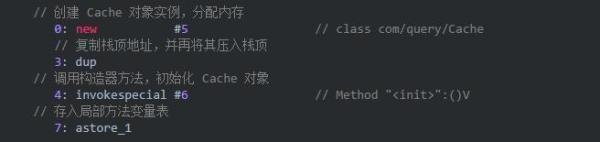
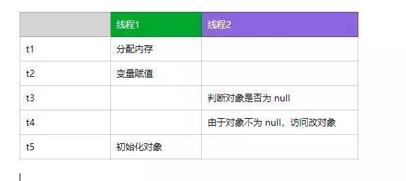

# Java 单例模式延申的各种知识点<!-- omit in toc -->

- [双重检查锁单例模式为什么要用volatile关键字](#双重检查锁单例模式为什么要用volatile关键字)
	- [并发编程的3个条件](#并发编程的3个条件)
	- [双重检查锁定模式](#双重检查锁定模式)
	- [错误的延迟初始化例子](#错误的延迟初始化例子)
	- [new 实例背后的指令](#new-实例背后的指令)
	- [volatile 作用](#volatile-作用)
- [怎么不使用synchronized和lock实现一个线程安全的单例](#怎么不使用synchronized和lock实现一个线程安全的单例)
	- [静态内部类实现](#静态内部类实现)
	- [饿汉模式](#饿汉模式)
	- [饿汉模式变种](#饿汉模式变种)
	- [延申 - 类加载过程的线程安全性保证](#延申---类加载过程的线程安全性保证)
	- [延申 - 类中的加载顺序](#延申---类中的加载顺序)
		- [所有的变量初始化完，才会执行构造方法](#所有的变量初始化完才会执行构造方法)
		- [静态成员与普通成员类的加载区别](#静态成员与普通成员类的加载区别)
		- [构造函数](#构造函数)
	- [枚举实现](#枚举实现)
	- [CAS 实现单例](#cas-实现单例)
- [破坏单例模式](#破坏单例模式)
	- [反射破坏单例](#反射破坏单例)
	- [防止反射破坏单例](#防止反射破坏单例)
	- [序列化和反序列化](#序列化和反序列化)
	- [防止序列化破坏单例模式](#防止序列化破坏单例模式)

## 双重检查锁单例模式为什么要用volatile关键字

### 并发编程的3个条件

1. 原子性：要实现原子性方式较多，可用synchronized、lock加锁，AtomicInteger等，但volatile关键字是无法保证原子性的；
2. 可见性：要实现可见性，也可用synchronized、lock，volatile关键字可用来保证可见性；
3. 有序性：要避免指令重排序，synchronized、lock作用的代码块自然是有序执行的，volatile关键字有效的禁止了指令重排序，实现了程序执行的有序性；

### 双重检查锁定模式

双重检查锁定（Double check locked）模式经常会出现在一些框架源码中，目的是为了延迟初始化变量。这个模式还可以用来创建单例

### 错误的延迟初始化例子

想到延迟初始化一个变量，最简单的例子就是取出变量进行判断。

```java

private Cache cache;

public Cache getCache(){
	if(cache==null){
		cache = new Cache();
	}
	return cache;
}
```

这个例子在单线程环境可以正常运行，但是在多线程环境就有可能会抛出空指针异常。为了防止这种情况，我们需要在该方法上使用 synchronized。这样该方法在多线程环境就是安全的，但是这么做就会导致每次方法调用都需要获取与释放锁，开销很大。
深入分析可以得知只有在初始化的变量的需要真正加锁，一旦初始化之后，直接返回对象即可。

所以我们可以将该方法改造以下的样子。

```java
private Cache cache;

public Cache getCache(){
	if(cache==null){
		synchronized(this){
			if(cache==null){
				cache = new Cache();
			}
		}
	}
	return cache;
}
```

这个方法首先判断变量是否被初始化，没有被初始化，再去获取锁。获取锁之后，再次判断变量是否被初始化。第二次判断目的在于有可能其他线程获取过锁，已经初始化改变量。第二次检查还未通过，才会真正初始化变量。

这个方法检查判定两次，并使用锁，所以形象称为双重检查锁定模式。

这个方案缩小锁的范围，减少锁的开销，看起来很完美。然而这个方案有一些问题却很容易被忽略。

### new 实例背后的指令

这个被忽略的问题在于 Cache cache=new Cache()这行代码并不是一个原子指令。使用 javap -c指令，可以快速查看字节码。



从字节码可以看到创建一个对象实例，可以分为三步：
1. 分配对象内存
1. 调用构造器方法，执行初始化
1. 将对象引用赋值给变量。

虚拟机实际运行时，以上指令可能发生重排序。以上代码 2,3 可能发生重排序，但是并不会重排序 1 的顺序。也就是说 1 这个指令都需要先执行，因为 2,3 指令需要依托 1 指令执行结果。

Java 语言规规定了线程执行程序时需要遵守 intra-thread semantics。intra-thread semantics 保证重排序不会改变单线程内的程序执行结果。这个重排序在没有改变单线程程序的执行结果的前提下，可以提高程序的执行性能。

虽然重排序并不影响单线程内的执行结果，但是在多线程的环境就带来一些问题。



上面错误双重检查锁定的示例代码中，如果线程 1 获取到锁进入创建对象实例，这个时候发生了指令重排序。当线程1 执行到 t3 时刻，线程 2 刚好进入，由于此时对象已经不为 Null，所以线程 2 可以自由访问该对象。然后该对象还未初始化，所以线程 2 访问时将会发生异常。

### volatile 作用

正确的双重检查锁定模式需要需要使用 volatile。volatile主要包含两个功能。

保证可见性。使用 volatile定义的变量，将会保证对所有线程的可见性。

禁止指令重排序优化。

由于 volatile禁止对象创建时指令之间重排序，所以其他线程不会访问到一个未初始化的对象，从而保证安全性。

注意，volatile禁止指令重排序在 JDK 5 之后才被修复

总之一句话就是对象的创建可能发生指令的重排序，使用 volatile可以禁止指令的重排序，保证多线程环境内的系统安全。

## 怎么不使用synchronized和lock实现一个线程安全的单例

### 静态内部类实现

```java
public class Singleton{
    private static class SingletonHolder {
        private static final Singleton INSTANCE = new Singleton();
    }  
    private Singleton (){};
    public static final Singleton getInstance() {
            return SingletonHolder.INSTANCE;
    }  
}
```

### 饿汉模式

```java
public class SingleTon{
    private static SingleTon INSTANCE = new SingleTon();

    private SingleTon(){};
    public static SingleTon getInstance(){
        return INSTANCE;
    }
}
```

### 饿汉模式变种

```java
public class SingleTon(){
    private static SingleTon INSTANCE = null;

    static{
        INSTANCE = new SingleTon();
    }

    private SingleTon(){};
    public static getInstance(){
        return INSTANCE;
    }
}
```

以上几种虽然没有直接使用synchronized，但是也是间接用到了。

### 延申 - 类加载过程的线程安全性保证

以上的静态内部类、饿汉等模式均是通过定义静态的成员变量，以保证单例对象可以在类初始化的过程中被实例化。

这其实是利用了ClassLoader的线程安全机制。ClassLoader的loadClass方法在加载类的时候使用了synchronized关键字。

所以， 除非被重写，这个方法默认在整个装载过程中都是线程安全的。所以在类加载过程中对象的创建也是线程安全的。

### 延申 - 类中的加载顺序

1. 所有的类都会优先加载基类
2. 静态成员的初始化优先
3. 成员初始化后，才会执行构造方法
   1. 首先会调用基类的构造方法
   2. 其次，调用成员的构造方法
   3. 最后，调用自己的构造方法
4. 静态成员的初始化与静态块的执行，发生在类加载的时候。
5. 类对象的创建以及静态块的访问，都会触发类的加载。

#### 所有的变量初始化完，才会执行构造方法

```java
package xing.test.thinking.chap7;
class A2{
	B2 b2 = new B2();
	static{
		System.out.println("A static");
	}
	public A2() {
		System.out.println("A2()");
	}
}
class B2{
	C2 c2 = new C2();
	D2 d2 = new D2();
	static{
		System.out.println("B static");
	}
	public B2() {
		System.out.println("B2()");
	}
}
class C2{
	static{
		System.out.println("C static");
	}
	public C2() {
		System.out.println("C2()");
	}
}
class D2{
	static{
		System.out.println("D static");
	}
	public D2() {
		System.out.println("D2()");
	}
}
public class VarTest {
	public static void main(String[] args) {
		A2 a2 = new A2();
	}
}
```

```
A static
B static
C static
C2()
D static
D2()
B2()
A2()
```

#### 静态成员与普通成员类的加载区别
在类的加载过程中，静态成员类的对象，会优先加载；而普通成员类的对象则是使用的时候才回去加载。

```java
package xing.test.thinking.chap7;
class A3{
	B3 b3 = new B3();
	static C3 c4 = new C3();
	static{
		System.out.println("A3");
	}
}
class B3{
	static{
		System.out.println("B3");
	}
}
class C3{
	static{
		System.out.println("C3");
	}
}
public class StaticTest {
	public static void main(String[] args) {
		A3 a3 = new A3();
	}
}
```

输出:

```
C3
A3
B3
```

#### 构造函数
```java
package xing.test.thinking.chap8;
class A{
	public A() {
		System.out.println("A");
	}
}
class B extends A{
	public B() {
		System.out.println("B");
	}
}
class C extends B {
	private D d1 = new D("d1");
	private D d2 = new D("d2");
	public C() {
		System.out.println("C");
	}
}
class D {
	public D(String str) {
		System.out.println("D "+str);
	}
}
public class ExtendTest {
	public static void main(String[] args) {
		C c = new C();
	}
}
```
执行结果：
```
A
B
D d1
D d2
C
```

### 枚举实现

枚举其实底层是依赖Enum类实现的，这个类的成员变量都是static类型的，并且在静态代码块中实例化的，和饿汉有点像， 所以他天然是线程安全的。

```java

public enum Singleton {  
    INSTANCE;  
    public void whateverMethod() {  
    }  
}
```

### CAS 实现单例

CAS是一项乐观锁技术，当多个线程尝试使用CAS同时更新一个变量时，只有其中一个线程能更新成功。

借助CAS（AtomicReference）实现单例模式：

```java
package JavaDayDayUp.casTest;

import java.util.concurrent.atomic.AtomicReference;

public class SingleTon {
    private static final AtomicReference<SingleTon> INSTANCE = new AtomicReference<>();

    private  SingleTon(){}

    public static SingleTon getInstance(){
        while(true){
            SingleTon singleTon = INSTANCE.get();
            if(singleTon!=null){
                return singleTon;
            }

            singleTon = new SingleTon();
            if(INSTANCE.compareAndSet(null,singleTon)){
                return singleTon;
            }
        }
    }

    public static void main(String[] args) {
        SingleTon s1 = SingleTon.getInstance();
        SingleTon s2 = SingleTon.getInstance();

        System.out.println(s1==s2);

    }
}

```

用CAS的好处在于不需要使用传统的锁机制来保证线程安全，CAS是一种基于忙等待的算法，依赖底层硬件的实现，相对于锁它没有线程切换和阻塞的额外消耗，可以支持较大的并行度。

CAS的一个重要缺点在于如果忙等待一直执行不成功(一直在死循环中)，会对CPU造成较大的执行开销。

另外，代码中，如果N个线程同时执行到 singleton = new Singleton();的时候，会有大量对象被创建，可能导致内存溢出。

## 破坏单例模式

### 反射破坏单例

静态内部类

```java
public class LazyInnerClassSingleton {
    // 私有的构造方法
    private LazyInnerClassSingleton(){}
    // 公有的获取实例方法
    public static final LazyInnerClassSingleton getInstance(){
        return LazyHolder.LAZY;
    }
    // 静态内部类
    private static class LazyHolder{
        private static final LazyInnerClassSingleton LAZY = new LazyInnerClassSingleton();
    }
}
```

破坏

```java
public static void main(String[] args) {
        try {
            //很无聊的情况下，进行破坏
            Class<?> clazz = LazyInnerClassSingleton.class;
            //通过反射拿到私有的构造方法
            Constructor c = clazz.getDeclaredConstructor(null);
            //因为要访问私有的构造方法，这里要设为true，相当于让你有权限去操作
            c.setAccessible(true);
            //暴力初始化
            Object o1 = c.newInstance();
            //调用了两次构造方法，相当于 new 了两次
            Object o2 = c.newInstance();
            //这里输出结果为false
            System.out.println(o1 == o2);
        } catch (Exception e) {
            e.printStackTrace();
        }
    }
```

### 防止反射破坏单例

通过上面反射破坏单例模式的代码，我们可以知道，反射也是通过调用构造方法来实例化对象，那么我们可以在构造函数里面做点事情来防止反射，我们把静态内部类单例的代码改造一下，看代码

```java
public class LazyInnerClassSingleton {
    // 私有的构造方法
    private LazyInnerClassSingleton(){
        // 防止反射创建多个对象
        if(LazyHolder.LAZY != null){
			throw new RuntimeException("不允许创建多个实例");
		}
    }
    // 公有的获取实例方法
    public static final LazyInnerClassSingleton getInstance(){
        return LazyHolder.LAZY;
    }
    // 静态内部类
    private static class LazyHolder{
        private static final LazyInnerClassSingleton LAZY = new LazyInnerClassSingleton();
    }
}
```

### 序列化和反序列化

用序列化的方式,需要在静态内部类(LazyInnerClassSingleton) 实现 Serializable 接口，代码在下面的防止序列化破坏单例模式里面

这里我们先来看下序列和反序列的代码

```java
//序列化创建单例类
public static void main(String[] args) {
	LazyInnerClassSingleton s1 = null;
	//通过类本身获得实例对象
	LazyInnerClassSingleton s2 = LazyInnerClassSingleton.getInstance();
	FileOutputStream fos = null;
	try {
		//序列化到文件中
		fos = new FileOutputStream("SeriableSingleton.obj");
		ObjectOutputStream oos = new ObjectOutputStream(fos);
		oos.writeObject(s2);
		oos.flush();
		oos.close();
		//从文件中反序列化为对象
		FileInputStream fis = new FileInputStream("SeriableSingleton.obj");
		ObjectInputStream ois = new ObjectInputStream(fis);
		s1 = (LazyInnerClassSingleton) ois.readObject();
		ois.close();
		//对比结果,这里输出的结果为false
		System.out.println(s1 == s2);
	} catch (Exception e) {
		e.printStackTrace();
	}
}
```

结果为false

### 防止序列化破坏单例模式

```java
public class LazyInnerClassSingleton implements Serializable {

    private static final long serialVersionUID = -4264591697494981165L;

    // 私有的构造方法
    private LazyInnerClassSingleton(){
        // 防止反射创建多个对象
        if(LazyHolder.LAZY != null){
            throw new RuntimeException("只能实例化1个对象");
        }
    }
    // 公有的获取实例方法
    public static final LazyInnerClassSingleton getInstance(){
        return LazyHolder.LAZY;
    }
    // 静态内部类
    private static class LazyHolder{
        private static final LazyInnerClassSingleton LAZY = new LazyInnerClassSingleton();
    }
    // 防止序列化创建多个对象,这个方法是关键
    private  Object readResolve(){
        return  LazyHolder.LAZY;
    }

}
```

在执行上面序列和反序列化代码，输出true，是不是一脸懵逼，为什么加了一个readResolve方法，就能防止序列化破坏单例模式，下面就带着大家来看下序列化的源码：

```java
public final Object readObject()throws IOException, ClassNotFoundException{
	if (enableOverride) {
		return readObjectOverride();
	}
	// if nested read, passHandle contains handle of enclosing object
	int outerHandle = passHandle;
	try {
        //看这里,看这里,就是我readObject0
		Object obj = readObject0(false);
		handles.markDependency(outerHandle, passHandle);
		ClassNotFoundException ex = handles.lookupException(passHandle);
		if (ex != null) {
			throw ex;
		}
		if (depth == 0) {
			vlist.doCallbacks();
		}
		return obj;
	} finally {
		passHandle = outerHandle;
		if (closed && depth == 0) {
			clear();
		}
	}
}
```

然后我们看下 readObject0 这个方法\

```java
private Object readObject0(boolean unshared) throws IOException {
	...
    //主要是这个判断
	case TC_OBJECT:
    	//然后进入readOrdinaryObject这个方法
		return checkResolve(readOrdinaryObject(unshared));
	...
}
```

然后我们看下readOrdinaryObject 这个方法

```java
	private Object readOrdinaryObject(boolean unshared)throws IOException{
        ...
        Object obj;
        try {
            //这里判断是否有无参的构造函数,有的话就调用newInstance()实例化对象
            obj = desc.isInstantiable() ? desc.newInstance() : null; 
		...
        if (obj != null &&
            handles.lookupException(passHandle) == null &&
            desc.hasReadResolveMethod())
        {
            Object rep = desc.invokeReadResolve(obj);
          ...
    }
```

这里的关键是desc.hasReadResolveMethod() ，这段代码的意思是查看你的单例类里面有没有readResolve方法，有的话就利用反射的方式执行这个方法，具体是desc.invokeReadResolve(obj)这段代码，返回单例对象。这里其实是实例化了两次，只不过新创建的对象没有被返回而已。如果创建对象的动作发生频率增大，就意味着内存分配开销也就随之增大，这也算是一个缺点吧。