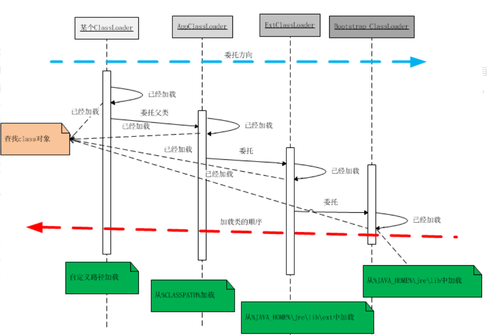
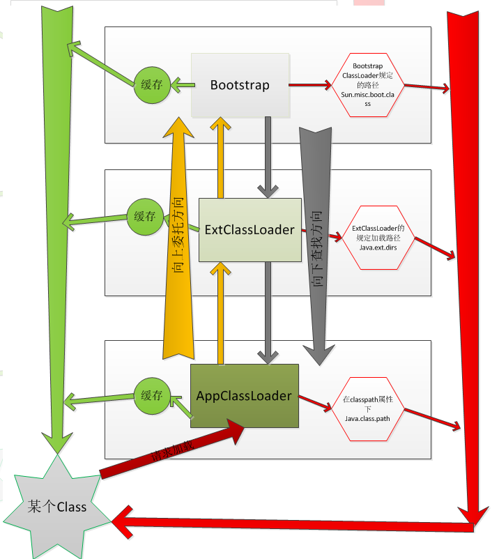

# Java 中 ClassLoader的作用<!-- omit in toc -->

- [JAVA类加载流程](#java类加载流程)
- [加载顺序？](#加载顺序)
- [双亲委托](#双亲委托)
- [Reference](#reference)

## JAVA类加载流程

Java语言系统自带有三个类加载器:

* Bootstrap ClassLoader 最顶层的加载类，主要加载核心类库，%JRE_HOME%\lib下的rt.jar、resources.jar、charsets.jar和class等。另外需要注意的是可以通过启动jvm时指定-Xbootclasspath和路径来改变Bootstrap ClassLoader的加载目录。比如java -Xbootclasspath/a:path被指定的文件追加到默认的bootstrap路径中。我们可以打开我的电脑，在上面的目录下查看，看看这些jar包是不是存在于这个目录。
* Extention ClassLoader 扩展的类加载器，加载目录%JRE_HOME%\lib\ext目录下的jar包和class文件。还可以加载-D java.ext.dirs选项指定的目录。
* Appclass Loader也称为SystemAppClass 加载当前应用的classpath的所有类。

我们上面简单介绍了3个ClassLoader。说明了它们加载的路径。并且还提到了-Xbootclasspath和-D java.ext.dirs这两个虚拟机参数选项。

## 加载顺序？

我们看到了系统的3个类加载器，但我们可能不知道具体哪个先行呢？

1. Bootstrap CLassloder
1. Extention ClassLoader
1. AppClassLoader

## 双亲委托

一个类加载器查找class和resource时，是通过“委托模式”进行的，它首先判断这个class是不是已经加载成功，如果没有的话它并不是自己进行查找，而是先通过父加载器，然后递归下去，直到Bootstrap ClassLoader，如果Bootstrap classloader找到了，直接返回，如果没有找到，则一级一级返回，最后到达自身去查找这些对象。这种机制就叫做双亲委托。

1. 一个AppClassLoader查找资源时，先看看缓存是否有，缓存有从缓存中获取，否则委托给父加载器。
1. 递归，重复第1部的操作。
1. 如果ExtClassLoader也没有加载过，则由Bootstrap ClassLoader出面，它首先查找缓存，如果没有找到的话，就去找自己的规定的路径下，也就是sun.mic.boot.class下面的路径。找到就返回，没有找到，让子加载器自己去找。
1. Bootstrap ClassLoader如果没有查找成功，则ExtClassLoader自己在java.ext.dirs路径中去查找，查找成功就返回，查找不成功，再向下让子加载器找。
1. ExtClassLoader查找不成功，AppClassLoader就自己查找，在java.class.path路径下查找。找到就返回。如果没有找到就让子类找，如果没有子类会怎么样？抛出各种异常。

上面的序列，详细说明了双亲委托的加载流程。我们可以发现委托是从下向上，然后具体查找过程却是自上至下。

## Reference

* [一看你就懂，超详细java中的ClassLoader详解](https://blog.csdn.net/briblue/article/details/54973413)