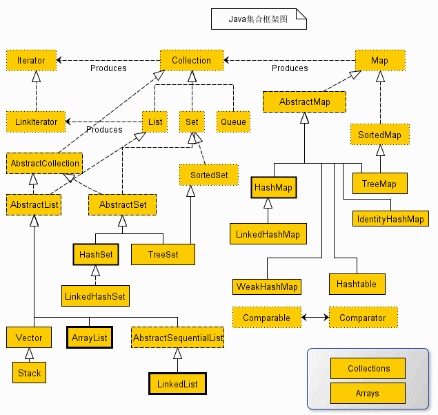
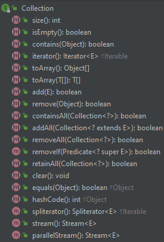
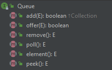
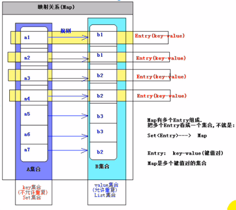
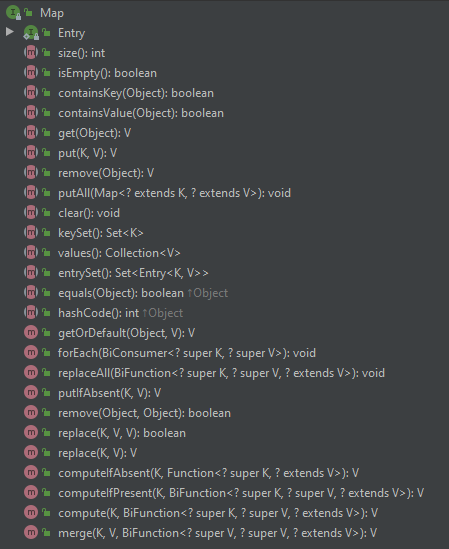

# Java三大集合框架<!-- omit in toc -->

- [Iterator 迭代器](#iterator-迭代器)
- [Collection 接口](#collection-接口)
  - [Collection常用方法](#collection常用方法)
  - [List](#list)
    - [```ArrayList```](#arraylist)
    - [```LinkedList```](#linkedlist)
    - [```Vector```](#vector)
  - [Set](#set)
    - [```HashSet```](#hashset)
    - [```LinkedHashSet```](#linkedhashset)
    - [```TreeSet```](#treeset)
    - [三个 Set 接口的实现类比较：](#三个-set-接口的实现类比较)
  - [Queue](#queue)
- [Map接口](#map接口)
  - [Map常用方法](#map常用方法)
  - [```HashMap```](#hashmap)
  - [```HashTable```](#hashtable)
  - [```LinkedHashMap```](#linkedhashmap)
  - [```TreeMap```](#treemap)
- [Map 和 Set结合的关系](#map-和-set结合的关系)
- [Reference](#reference)

首先放个框架图，上层接口分为两类，也就是```Collection```和```Map```

平常说得多的三大集合就是```List```,```Set```,```Map```,```List```和```Set```继承自```Collection```

在Java 2之前，Java是没有完整的集合框架的。它只有一些简单的可以自扩展的容器类，比如Vector，Stack，Hashtable等。这些容器类在使用的过程中由于效率问题饱受诟病，因此在Java 2中，Java设计者们进行了大刀阔斧的整改，重新设计，于是就有了现在的集合框架。需要注意的是，之前的那些容器类库并没有被弃用而是进行了保留，主要是为了向下兼容的目的，但我们在平时使用中还是应该尽量少用。



发现一个特点，上述所有的集合类，除了 map 系列的集合，即左边集合都实现了 Iterator 接口，这是一个用于遍历集合中元素的接口，主要hashNext(),next(),remove()三种方法。它的一个子接口 ListIterator 在它的基础上又添加了三种方法，分别是 add(),previous(),hasPrevious()。也就是说如果实现 Iterator 接口，那么在遍历集合中元素的时候，只能往后遍历，被遍历后的元素不会再被遍历到，通常无序集合实现的都是这个接口，比如HashSet；而那些元素有序的集合，实现的一般都是 LinkedIterator接口，实现这个接口的集合可以双向遍历，既可以通过next()访问下一个元素，又可以通过previous()访问前一个 元素，比如ArrayList。

　　还有一个特点就是抽象类的使用。如果要自己实现一个集合类，去实现那些抽象的接口会非常麻烦，工作量很大。这个时候就可以使用抽象类，这些抽象类中给我们提供了许多

现成的实现，我们只需要根据自己的需求重写一些方法或者添加一些方法就可以实现自己需要的集合类，工作量大大降低。

## Iterator 迭代器

它是Java集合的顶层接口（不包括 map 系列的集合，Map接口 是 map 系列集合的顶层接口）

* Object next()：返回迭代器刚越过的元素的引用，返回值是 Object，需要强制转换成自己需要的类型
* boolean hasNext()：判断容器内是否还有可供访问的元素
* void remove()：删除迭代器刚越过的元素

所以除了 map 系列的集合，我们都能通过迭代器来对集合中的元素进行遍历。

注意：我们可以在源码中追溯到集合的顶层接口，比如 Collection 接口，可以看到它继承的是类 Iterable

```java
public interface Collection<E> extends Iterable<E> {
    // Query Operations
```

那这就得说明一下 Iterator 和 Iterable 的区别：

Iterable ：存在于 java.lang 包中。

```java
public interface Iterable<T> {
    /**
     * Returns an iterator over elements of type {@code T}.
     *
     * @return an Iterator.
     */
    Iterator<T> iterator();

    /**
```

我们可以看到，里面封装了 Iterator 接口。所以只要实现了只要实现了Iterable接口的类，就可以使用Iterator迭代器了。

Iterator ：存在于 java.util 包中。核心的方法next(),hasnext(),remove()。

这里我们引用一个Iterator 的实现类 ArrayList 来看一下迭代器的使用：暂时先不管 List 集合是什么，只需要看看迭代器的用法就行了

```java
package JavaDayDayUp.CollectionPractice;

import java.util.*;

public class CollectionTest {
    public static void main(String[] args) {
        List<Integer> test = new LinkedList<>();

        for(int i=0;i<10;i++){
            test.add(i);
        }

        Iterator iter = test.iterator();
        while(iter.hasNext()){
            int item = (int) iter.next();
            System.out.println(item);
        }
    }

}

```

## Collection 接口

List 接口和 Set 接口的父接口



```Collection```接口是处理对象集合的根接口，其中定义了很多操作的方法

```AbstractCollection```是提供```Collection```部分实现的抽象类

### Collection常用方法

* ```add()```添加一个元素，
* ```removeAll()```将指定集合中的所有元素删除
* ```contains()```方法检测集合中是否包含指定的元素
* ```toArray()```方法返回一个表示集合的数组

```java
package JavaDayDayUp.CollectionPractice;

import java.util.*;

public class CollectionTest {
    public static void main(String[] args) {

        Collection<String> co = new ArrayList<>();

        // 添加元素
        co.add("brickea");
        co.add("Sandy");

        // 删除元素
        co.remove("Brickea");

        // 是否为空
        System.out.println(co.isEmpty());

        // 是否包换某元素
        System.out.println(co.contains("Sandy"));

        // 删除所有元素
        Collection temp = new ArrayList();
        temp.add("Sandy");
        co.removeAll(co);

        // 增强for循环遍历
        for(Object o : co){
            System.out.println((String)o);
        }
    }

}
```

```
false
true
```

```Collection```有三个重要的扩展接口，分别是```List```,```Set```和```Queue```

### List

有序，可以重复的集合

```List```扩展自```Collection```，是一个允许重复的有序集合，主要增加了面向位置的操作，允许在指定位置上操作元素，同时增加了一个能够双向遍历线性表的列表迭代器```ListIterator```。

* ```AbstractList```抽象类提供了```List```接口的部分实现
* ```AbstractSequentialList```扩展自```AbstractList```，主要提供了对链表的支持

```List```还有三个比较重要的具体实现类

#### ```ArrayList``` 

底层数据结构是数组，查询快，增删慢;线程不安全，效率高

#### ```LinkedList```

底层数据结构是链表，查询慢，增删快;线程不安全，效率高

#### ```Vector``` 

底层数据结构是数组，查询快，增删慢;线程安全，效率低,几乎已经淘汰了这个集合

```java
package JavaDayDayUp.CollectionPractice;

import java.util.*;

public class CollectionTest {
    public static void main(String[] args) {

        List<Integer> test = new LinkedList<>();

        for(int i=0;i<10;i++){
            test.add(i);
        }

        ListIterator iter = test.listIterator();

        while(iter.hasNext()){
            int temp = (int) iter.next();
            System.out.println(temp);

        }
        while(iter.hasPrevious()){
            int temp = (int) iter.previous();
            System.out.println(temp);

        }

        // 获得指定位置的索引
        System.out.println(test.indexOf(new Integer(2)));

        // 在指定位置添加元素
        test.add(6,100);

        for(int i : test){
            System.out.println(i);
        }
    }

}

```

### Set

典型实现 HashSet()是一个无序，不可重复的集合

```Set```接口扩展自```Collection```，它与```List```的不同之处在于，规定```Set```的实例不包含重复的元素。

* ```AbstractSet```是一个实现```Set```接口的抽象类

```Set```有三个具体实现类

#### ```HashSet``` 

散列集实际上基于```HashMap```

* HashSet:不能保证元素的顺序；不可重复；不是线程安全的；集合元素可以为 NULL;
* 其底层其实是一个数组，存在的意义是加快查询速度。我们知道在一般的数组中，元素在数组中的索引位置是随机的，元素的取值和元素的位置之间不存在确定的关系，因此，在数组中查找特定的值时，需要把查找值和一系列的元素进行比较，此时的查询效率依赖于查找过程中比较的次数。而 HashSet 集合底层数组的索引和值有一个确定的关系：```index=hash(value)```,那么只需要调用这个公式，就能快速的找到元素或者索引。
* 对于 HashSet: 如果两个对象通过 ```equals()``` 方法返回 true，这两个对象的 ```hashCode``` 值也应该相同
  * 当向HashSet集合中存入一个元素时，HashSet会先调用该对象的hashCode（）方法来得到该对象的hashCode值，然后根据hashCode值决定该对象在HashSet中的存储位置
  * 如果 hashCode 值不同，直接把该元素存储到 hashCode() 指定的位置
  * 如果 hashCode 值相同，那么会继续判断该元素和集合对象的 equals() 作比较
    * hashCode 相同，equals 为 true，则视为同一个对象，不保存在 hashSet（）中
    * hashCode 相同，equals 为 false，则存储在之前对象同槽位的链表上

**注意：每一个存储到 哈希 表中的对象，都得提供 hashCode() 和 equals() 方法的实现，用来判断是否是同一个对象。对于 HashSet 集合，我们要保证如果两个对象通过 equals() 方法返回 true，这两个对象的 hashCode 值也应该相同。**

```java
package JavaDayDayUp.CollectionPractice;

import java.util.*;

public class CollectionTest {
    public static void main(String[] args) {

        Set<Integer> s = new HashSet<>();
        for(int i=0;i<10;i++){
            s.add(i);
        }
        s.remove(new Integer(1));
        for(int i: s){
            System.out.println(i);
        }
    }

}

```

```
0
2
3
4
5
6
7
8
9
```

#### ```LinkedHashSet``` 

不可以重复，有序。因为底层采用 链表 和 哈希表的算法。链表保证元素的添加顺序，哈希表保证元素的唯一性

链式散列集 ```LinkedHashSet```是继承自```HashSet```的，支持对规则集内的元素排序。```HashSet```中的元素是没有被排序的，而```LinkedHashSet```中的元素可以按照它们插入规则集的顺序提取。

```java
package JavaDayDayUp.CollectionPractice;

import java.util.*;

public class CollectionTest {
    public static void main(String[] args) {

        Set<Integer> s = new LinkedHashSet<>();

        for(int i = 0;i<10;i++){
            s.add(i);
        }

        for (int i : s) {
            System.out.println(i);
        }
    }

}
```

```
0
1
2
3
4
5
6
7
8
9
```

#### ```TreeSet```

树形集 ```TreeSet```扩展自```AbstractSet```，并实现了```NavigableSet```，```AbstractSet```扩展自```AbstractCollection```，树形集是一个有序的```Set```，其底层是一颗树

TreeSet:有序；不可重复，底层使用 红黑树算法，擅长于范围查询。

*  如果使用 TreeSet() 无参数的构造器创建一个 TreeSet 对象, 则要求放入其中的元素的类必须实现 Comparable 接口所以, 在其中不能放入 null 元素
*  必须放入同样类的对象.(默认会进行排序) 否则可能会发生类型转换异常.我们可以使用泛型来进行限制

* 自动排序：添加自定义对象的时候，必须要实现 Comparable 接口，并要覆盖 compareTo(Object obj) 方法来自定义比较规则
  * 如果 this > obj,返回正数 1
  * 如果 this < obj,返回负数 -1
  * 如果 this = obj,返回 0 ，则认为这两个对象相等

* 定制排序: 创建 TreeSet 对象时, 传入 Comparator 接口的实现类. 要求: Comparator 接口的 compare 方法的返回值和 两个元素的 equals() 方法具有一致的返回值
  * 当需要把一个对象放入 TreeSet 中，重写该对象对应的 equals() 方法时，应保证该方法与 compareTo(Object obj) 方法有一致的结果

```java
package JavaDayDayUp.CollectionPractice;

import java.util.*;

public class CollectionTest {
    public static void main(String[] args) {

        Set<Integer> s = new TreeSet<>();

        Random test = new Random();
        for(int i=0;i<10;i++){
            s.add(test.nextInt(100));
        }

        for(int i:s){
            System.out.println(i);
        }
    }

}
```

```
0
26
27
34
51
58
69
82
84
88
```

#### 三个 Set 接口的实现类比较：

共同点：
* 都不允许元素重复
* 都不是线程安全的类
  * 解决办法：```Set set = Collections.synchronizedSet(set 对象)```

不同点：
* HashSet:不保证元素的添加顺序，底层采用 哈希表算法，查询效率高。判断两个元素是否相等，equals() 方法返回 true,hashCode() 值相等。即要求存入 HashSet 中的元素要覆盖 equals() 方法和 hashCode()方法
* LinkedHashSet:HashSet 的子类，底层采用了 哈希表算法以及 链表算法，既保证了元素的添加顺序，也保证了查询效率。但是整体性能要低于 HashSet
* TreeSet:不保证元素的添加顺序，但是会对集合中的元素进行排序。底层采用 红-黑 树算法（树结构比较适合范围查询）

### Queue



```Queue```接口中方法offer表示向队列添加一个元素，poll()与remove()方法都是移除队列头部的元素，两者的区别在于如果队列为空，那么poll()返回的是null，而remove()会抛出一个异常。方法element()与peek()主要是获取头部元素，不删除

* 接口```Deque``` 扩展自```Queue```的双端队列，支持两端插入和删除，```LinkedList```类实现了```Deque```接口，一般直接用```LinkedList```来创建一个队列

## Map接口

key-value 的键值对，key 不允许重复，value 可以

1. 严格来说 Map 并不是一个集合，而是两个集合之间 的映射关系。
2. 这两个集合没每一条数据通过映射关系，我们可以看成是一条数据。即 Entry(key,value）。Map 可以看成是由多个 Entry 组成。
3. 因为 Map 集合即没有实现于 Collection 接口，也没有实现 Iterable 接口，所以不能对 Map 集合进行 for-each 遍历。



在Map中键可以是任意类型的对象，但不能有重复的键，每个键都对应一个值，真正存储在图中的是键值构成的条目



### Map常用方法

```java
package JavaDayDayUp.CollectionPractice;

import java.util.*;

public class CollectionTest {
    public static void main(String[] args) {

        Map<String, Object> hashMap = new HashMap<>();
        //添加元素到 Map 中
        hashMap.put("key1", "value1");
        hashMap.put("key2", "value2");
        hashMap.put("key3", "value3");
        hashMap.put("key4", "value4");
        hashMap.put("key5", "value5");

        //删除 Map 中的元素,通过 key 的值
        hashMap.remove("key1");

        //通过 get(key) 得到 Map 中的value
        Object str1 = hashMap.get("key1");

        //可以通过 添加 方法来修改 Map 中的元素
        hashMap.put("key2", "修改 key2 的 Value");

        //通过 map.values() 方法得到 Map 中的 value 集合
        Collection<Object> value = hashMap.values();
        for (Object obj : value) {
            //System.out.println(obj);
        }

        //通过 map.keySet() 得到 Map 的key 的集合，然后 通过 get(key) 得到 Value
        Set<String> set = hashMap.keySet();
        for (String str : set) {
            Object obj = hashMap.get(str);
            //System.out.println(str+"="+obj);
        }

        //通过 Map.entrySet() 得到 Map 的 Entry集合，然后遍历
        Set<Map.Entry<String, Object>> entrys = hashMap.entrySet();
        for (Map.Entry<String, Object> entry : entrys) {
            String key = entry.getKey();
            Object value2 = entry.getValue();
            System.out.println(key + "=" + value2);
        }

        System.out.println(hashMap);
    }

}
```

Map下有四个具体实现类

### ```HashMap```

是基于哈希表的```Map```接口的非同步实现，此时Map中的key不会保证添加的先后顺序，key也不允许重复，key判断重复的标准是，key1和key2是否 equals 为 true，并且 hashcode相等

### ```HashTable```

采用哈希表算法，是HashMap的前身，（类似 Vector是ArrayList的前身）不建议使用，所有方法有```synchronized```，但是性能相对 HashMap较低

### ```LinkedHashMap```

继承自```HashMap```，但是它主要用链表来扩展```HashMap```.LinkedHashMap中元素既可以按照它们插入图的顺序排序，也可以按它们最后一次被访问的顺序排序

### ```TreeMap```

基于红黑树数据结构的实现，键值可以使用```Comparable```或```Comparator```接口来排序。```TreeMap```继承自```AbstractMap```，同时实现了接口```NavigableMap```，而接口```NavigableMap```则继承自```SortedMap```。```SortedMap```是Map的子接口，使用它可以确保图中的条目是排好序的。排序是依照key的顺序，可定制可按照自然。key的重复判断标准是```compareTo/compare 的返回值是否为0

在实际使用中，如果更新图时不需要保持图中元素的顺序，就使用```HashMap```，如果需要保持图中元素的插入顺序或者访问顺序，就使用```LinkedHashMap```，如果需要使图按照键值排序，就使用```TreeMap```。

一般的，定义Map，key都用不可变的类（String）来吧key作为value的唯一名称

```HashMap```，```TreeMap```，```LinkedHashMap```都是线程不安全的，但是性能较高
* ~~解决方案： ```Map m = Collections.synchronized(Map对象)```

## Map 和 Set结合的关系

Map 和 Set 集合的关系

1. 都有几个类型的集合。HashMap 和 HashSet ，都采 哈希表算法；TreeMap 和 TreeSet 都采用 红-黑树算法；LinkedHashMap 和 LinkedHashSet 都采用 哈希表算法和红-黑树算法。

2. 分析 Set 的底层源码，我们可以看到，Set 集合 就是 由 Map 集合的 Key 组成。

## Reference

* [Java-集合框架完全解析](https://www.jianshu.com/p/63e76826e852)
* [How 2 java](https://how2j.cn/k/collection/collection-arraylist-list/686.html#nowhere)
* [Java 集合详解](https://www.cnblogs.com/ysocean/p/6555373.html)