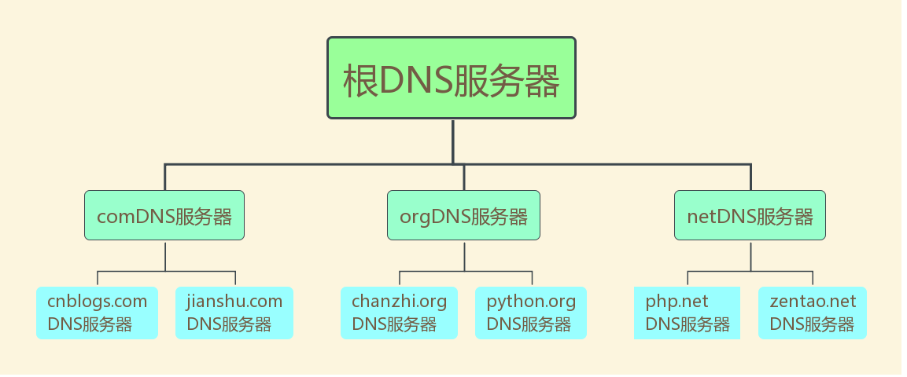
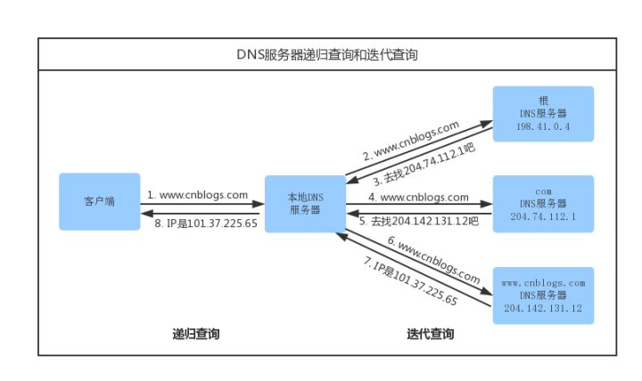
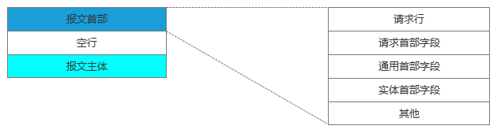
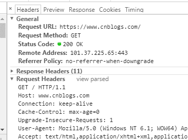
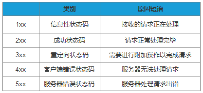

# 细说浏览器输入URL后发生了什么<!-- omit in toc -->

- [DNS域名解析](#dns域名解析)
- [建立TCP链接](#建立tcp链接)
- [发送HTTP请求](#发送http请求)
- [服务器处理请求](#服务器处理请求)
- [返回响应结果](#返回响应结果)
- [关闭TCP连接](#关闭tcp连接)
- [浏览器解析HTML](#浏览器解析html)
- [浏览器布局渲染](#浏览器布局渲染)

## DNS域名解析

我们在浏览器输入网址，其实就是要向服务器请求我们想要的页面内容，所有浏览器首先要确认的是域名所对应的服务器在哪里。将域名解析成对应的服务器IP地址这项工作，是由DNS服务器来完成的。

客户端收到你输入的域名地址后，它首先去找本地的hosts文件，检查在该文件中是否有相应的域名、IP对应关系，如果有，则向其IP地址发送请求，如果没有，再去找DNS服务器。一般用户很少去编辑修改hosts文件。

> DNS服务器层次结构

浏览器客户端向本地DNS服务器发送一个含有域名http://www.cnblogs.com的DNS查询报文。本地DNS服务器把查询报文转发到根DNS服务器，根DNS服务器注意到其com后缀，于是向本地DNS服务器返回comDNS服务器的IP地址。本地DNS服务器再次向comDNS服务器发送查询请求，comDNS服务器注意到其http://www.cnblogs.com后缀并用负责该域名的权威DNS服务器的IP地址作为回应。最后，本地DNS服务器将含有http://www.cnblogs.com的IP地址的响应报文发送给客户端。

从客户端到本地服务器属于递归查询，而DNS服务器之间的交互属于迭代查询。
正常情况下，本地DNS服务器的缓存中已有comDNS服务器的地址，因此请求根域名服务器这一步不是必需的。

## 建立TCP链接

对于客户端与服务器的TCP链接，必然要说的就是『三次握手』

## 发送HTTP请求

与服务器建立了连接后，就可以向服务器发起请求了。这里我们先看下请求报文的结构（如下图）：

>请求报文

在浏览器中查看报文首部（以google浏览器为例）：

请求行包括请求方法、URI、HTTP版本。首部字段传递重要信息，包括请求首部字段、通用首部字段和实体首部字段。我们可以从报文中看到发出的请求的具体信息。具体每个首部字段的作用，这里不做过多阐述。

## 服务器处理请求

服务器端收到请求后的由web服务器（准确说应该是http服务器）处理请求，诸如Apache、Ngnix、IIS等。web服务器解析用户请求，知道了需要调度哪些资源文件，再通过相应的这些资源文件处理用户请求和参数，并调用数据库信息，最后将结果通过web服务器返回给浏览器客户端。

## 返回响应结果

在HTTP里，有请求就会有响应，哪怕是错误信息。这里我们同样看下响应报文的组成结构：

在响应结果中都会有个一个HTTP状态码，比如我们熟知的200、301、404、500等。通过这个状态码我们可以知道服务器端的处理是否正常，并能了解具体的错误。

状态码由3位数字和原因短语组成。根据首位数字，状态码可以分为五类：

## 关闭TCP连接

为了避免服务器与客户端双方的资源占用和损耗，当双方没有请求或响应传递时，任意一方都可以发起关闭请求。与创建TCP连接的3次握手类似，关闭TCP连接，需要4次握手。

## 浏览器解析HTML

准确地说，浏览器需要加载解析的不仅仅是HTML，还包括CSS、JS。以及还要加载图片、视频等其他媒体资源。

## 浏览器布局渲染

根据渲染树布局，计算CSS样式，即每个节点在页面中的大小和位置等几何信息。