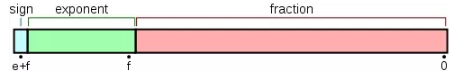
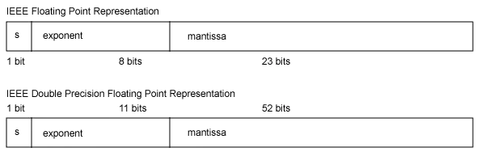

# 基础汇总<!-- omit in toc -->

- [浮点数的计算](#浮点数的计算)
  - [移码](#移码)
  - [浮点数的规格化](#浮点数的规格化)
  - [单精度浮点数真值计算](#单精度浮点数真值计算)
  - [双精度浮点数真值计算](#双精度浮点数真值计算)
  - [十进制到机器码](#十进制到机器码)
  - [浮点数的几种特殊情况](#浮点数的几种特殊情况)
    - [0 的表示](#0-的表示)
    - [$+\infty$和$-\infty$的表示方法](#math-xmlnshttpwwww3org1998mathmathmlsemanticsmrowmomomi-mathvariantnormalmimrowannotation-encodingapplicationx-texinftyannotationsemanticsmath和math-xmlnshttpwwww3org1998mathmathmlsemanticsmrowmomomi-mathvariantnormalmimrowannotation-encodingapplicationx-tex-inftyannotationsemanticsmath的表示方法)
    - [NaN 的表示](#nan-的表示)
  - [精度](#精度)
- [元注解与自定义注解](#元注解与自定义注解)

## 浮点数的计算

[参考](https://blog.csdn.net/k346k346/java/article/details/50487127)

Java 的浮点数采用的是 IEEE 754 标准

存储格式：符号位+指数位偏移+尾数位

IEEE 754常用的两种表示浮点数值的方式：单精确度（float 32位）、双精确度（double 64位）

IEEE754 规定浮点数阶码 E 采用"**指数ｅ的移码-1**"来表示。这是 IEEE754 对阶码的特殊要求，以满足特殊情况，比如对正无穷的表示。

### 移码

对真值补码的符号位取反

如果用一个字节来表示 -3， 则有
* $[-3]_原=10000011$
* $[-3]_反=11111100$
* $[-3]_补=11111101$
* $[-3]_移=01111101$

### 浮点数的规格化

为保证所有浮点数的表示格式都是唯一的($1.75_{10}$可表示成 ${1.11\times 2^0}_{2}$或者${0.111\times 2^1}_{2}$)，所以在此特定，当尾数不为零的时候，**尾数域的最高有效位为1**。对于不符合的应修改阶码同时左右移动小数点，使其成为规格化数的格式

### 单精度浮点数真值计算

$x=(-1)^S\times(1.M)\times2^e$

$e=E-127$

其中尾数域值是1.M。因为规格化的浮点数的尾数域最左位总是1，故这一位不予存储，而认为隐藏在小数点的左边。

在计算指数e时，对阶码E的计算采用原码的计算方式，因此32位浮点数的8bits的阶码E的取值范围是0到255。

### 双精度浮点数真值计算

$x=(-1)^S\times(1.M)\times2^e$

$e=E-1023$

### 十进制到机器码

比如$0.5$

$0.5=(0.1)_2$, 符号位为$0$，指数为$e=-1$，规格化后尾数为$1.0$

单精度浮点数尾数域共23位，右侧以$0$补全，尾数域为

$M=[000\quad 0000\quad 0000\quad 0000\quad 0000\quad 0000]_2$

阶码$E$为

$E=[-1]_移-1=[0111 \quad 1111]_2-1=[0111 \quad 1110]_2$

将尾数阶码还有符号位放到对应位置得到$0.5$的机器码

$0.5=[0011 \quad 1111 \quad 0000\quad 0000\quad 0000\quad 0000\quad 0000\quad 0000\quad]$

### 浮点数的几种特殊情况

#### 0 的表示

当阶码$E=0$并且尾数$M=0$的时候，这个数的真值为$\plusmn0$

* $+0$的机器码为$0 \quad 000 \quad 0000 \quad 0000 \quad 0000 \quad 0000 \quad 0000 \quad 0000 \quad 0000$
* $-0$的机器码为$1 \quad 000 \quad 0000 \quad 0000 \quad 0000 \quad 0000 \quad 0000 \quad 0000 \quad 0000$

此时$+0$对应的真值为$1.0\times2^{-127}$同理$-0$的真值为$-1.0\times2^{-127}$

#### $+\infty$和$-\infty$的表示方法

如果阶码 E=255 并且尾数 M 全是0，则这个数的真值为 $\plusmn\infty$（同样和符号位有关）。机器码为：
* $0 \quad 11111111 \quad 000 \quad 0000 \quad 0000 \quad 0000 \quad 0000 \quad 0000$ 
* $1 \quad 11111111 \quad 000 \quad 0000 \quad 0000 \quad 0000 \quad 0000 \quad 0000$

#### NaN 的表示

如果 E = 255 并且 M 不是0，则这不是一个数（NaN）

### 精度

说到浮点数的精度，先给精度下一个定义。浮点数的精度是指浮点数的小数位所能表达的位数。

阶码的二进制位数决定浮点数的表示范围，尾数的二进制位数表示浮点数的精度。以 32 位浮点数为例，尾数域有 23 位。那么浮点数以二进制表示的话精度是 23 位，23 位所能表示的最大数是223−1=83886072^{23}-1=83886072 
23
 −1=8388607，所以十进制的尾数部分最大数值是 8388607，也就是说尾数数值超过这个值，float 将无法精确表示，所以 float 最多能表示小数点后 7 位，但绝对能保证的为 6 位，即 float 的十进制的精度为 6~7 位。

64 位双精度浮点数的尾数域 52 位，因252−1=4,503,599,627,370,4952^{52}-1=4,503,599,627,370,4952 
52
 −1=4,503,599,627,370,495，所以双精度浮点数的十进制的精度最高为 16 位，绝对保证的为 15 位，所以 double 的十进制的精度为 15~16 位。

## 元注解与自定义注解

