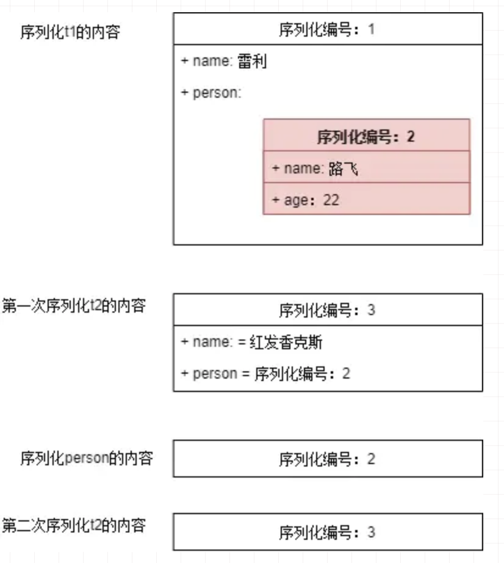

# 序列化和反序列化<!-- omit in toc -->

- [序列化的含义、意义及使用场景](#序列化的含义意义及使用场景)
- [序列化实现的方式](#序列化实现的方式)
  - [Serializable](#serializable)
    - [普通序列化](#普通序列化)
    - [反序列化步骤：](#反序列化步骤)
  - [成员是引用的序列化](#成员是引用的序列化)
  - [同一对象序列化多次的机制](#同一对象序列化多次的机制)
  - [Java序列化算法](#java序列化算法)
  - [Java 序列化算法中的问题](#java-序列化算法中的问题)
  - [可选的自定义序列化](#可选的自定义序列化)
    - [transient](#transient)
    - [重写 writeObject 和 readObject 方法](#重写-writeobject-和-readobject-方法)
  - [Externalizable：强制自定义序列化](#externalizable强制自定义序列化)
- [序列化版本号serialVersionUID](#序列化版本号serialversionuid)
- [Reference](#reference)

## 序列化的含义、意义及使用场景

* 序列化：将对象写入到IO流中
* 反序列化：从IO流中恢复对象
* 意义：序列化机制允许将实现序列化的Java对象转换位字节序列，这些字节序列可以保存在磁盘上，或通过网络传输，以达到以后恢复成原来的对象。序列化机制使得对象可以脱离程序的运行而独立存在。
* JavaEE 中tomcat的session提取对象信息

## 序列化实现的方式

如果需要将某个对象保存到磁盘上或者通过网络传输，那么这个类应该实现```Serializable```接口或者```Externalizable```接口之一。

### Serializable

#### 普通序列化

Serializable接口是一个标记接口，不用实现任何方法。一旦实现了此接口，该类的对象就是可序列化的。

序列化步骤：

1. 创建一个ObjectOutputStream输出流；
2. 调用ObjectOutputStream对象的writeObject输出可序列化对象。

```java
package SerializableTest;

import java.io.*;

/*************************************************************************
 *  Project: java_practice
 *  Dependencies: none
 *  Author: Zixiao Wang
 *  Create: 7/22/20
 *  Description:
 *************************************************************************/
public class Person implements Serializable {
    String name;
    int money;

    public Person(String name, int money) {
        this.name = name;
        this.money = money;
    }

    @Override
    public String toString() {
        return "Person{" +
                "name='" + name + '\'' +
                ", money=" + money +
                '}';
    }

    public static void main(String[] args) {
        File file = new File("./src/SerializeableTest/person.txt");
        try (
                // 创建文件输出流和对象输出流
                FileOutputStream fileOutputStream = new FileOutputStream(file);
                ObjectOutputStream objectOutputStream = new ObjectOutputStream(fileOutputStream);
        ) {
                Person p = new Person("Brickea",100);
                objectOutputStream.writeObject(p);
        }catch (IOException e){
            e.printStackTrace();
        }

    }
}

```

#### 反序列化步骤：

1. 创建一个ObjectInputStream输入流；
2. 调用ObjectInputStream对象的readObject()得到序列化的对象。

我们将上面序列化到person.txt的person对象反序列化回来

```java
package SerializableTest;

import java.io.*;

/*************************************************************************
 *  Project: java_practice
 *  Dependencies: none
 *  Author: Zixiao Wang
 *  Create: 7/22/20
 *  Description:
 *************************************************************************/
public class Person implements Serializable {
    String name;
    int money;

    public Person(String name, int money) {
        this.name = name;
        this.money = money;
    }

    @Override
    public String toString() {
        return "Person{" +
                "name='" + name + '\'' +
                ", money=" + money +
                '}';
    }

    public static void main(String[] args) {
        File file = new File("./src/SerializableTest/person.txt");
        try (
                // 创建文件输入流和对象输入流
                FileInputStream fileInputStream = new FileInputStream(file);
                ObjectInputStream objectInputStream = new ObjectInputStream(fileInputStream);
        ) {
            Person p = (Person) objectInputStream.readObject();
            System.out.println(p);
        } catch (ClassNotFoundException | IOException e){
            e.printStackTrace();
        }

    }
}

```

```
Person{name='Brickea', money=100}
```

### 成员是引用的序列化

如果一个可序列化的类的成员不是基本类型，也不是String类型，那这个引用类型也必须是可序列化的；否则，会导致此类不能序列化。

### 同一对象序列化多次的机制

同一对象序列化多次，会将这个对象序列化多次吗？答案是否定的。

```java
package SerializableTest;

import java.io.*;

/*************************************************************************
 *  Project: java_practice
 *  Dependencies: none
 *  Author: Zixiao Wang
 *  Create: 7/22/20
 *  Description:
 *************************************************************************/
public class Person implements Serializable {
    String name;
    int money;

    public Person(String name, int money) {
        this.name = name;
        this.money = money;
    }

    @Override
    public String toString() {
        return "Person{" +
                "name='" + name + '\'' +
                ", money=" + money +
                '}';
    }

    public static void main(String[] args) {
        File file = new File("./src/SerializableTest/person.txt");
        try (
                // 创建文件输出流和对象输出流
                FileOutputStream fileOutputStream = new FileOutputStream(file);
                ObjectOutputStream objectOutputStream = new ObjectOutputStream(fileOutputStream);
        ) {
            Person p1 = new Person("Brickea", 100);
            Person p2 = new Person("Sandy", 200);
            objectOutputStream.writeObject(p1);
            objectOutputStream.writeObject(p2);
            objectOutputStream.writeObject(p1);
        } catch (IOException e) {
            e.printStackTrace();
        }
    }
}

```

反序列化的时候

```java
package SerializableTest;

import java.io.*;

/*************************************************************************
 *  Project: java_practice
 *  Dependencies: none
 *  Author: Zixiao Wang
 *  Create: 7/22/20
 *  Description:
 *************************************************************************/
public class Person implements Serializable {
    String name;
    int money;

    public Person(String name, int money) {
        this.name = name;
        this.money = money;
    }

    @Override
    public String toString() {
        return "Person{" +
                "name='" + name + '\'' +
                ", money=" + money +
                '}';
    }

    public static void main(String[] args) {
        File file = new File("./src/SerializableTest/person.txt");
        try (
                // 创建文件输入流和对象输入流
                FileInputStream fileInputStream = new FileInputStream(file);
                ObjectInputStream objectInputStream = new ObjectInputStream(fileInputStream);
        ) {
            Person p1 = (Person) objectInputStream.readObject();
            Person p2 = (Person) objectInputStream.readObject();
            Person p3 = (Person) objectInputStream.readObject();
            System.out.println(p1);
            System.out.println(p2);
            System.out.println(p3);
            System.out.println(p3==p1);
        } catch (ClassNotFoundException | IOException e) {
            e.printStackTrace();
        }


    }
}

```

```
Person{name='Brickea', money=100}
Person{name='Sandy', money=200}
Person{name='Brickea', money=100}
true // 反序列化得到的p3 和 p1 是相同的对象引用
```

### Java序列化算法

1. 所有保存到磁盘的对象都有一个序列化编码号
1. 当程序试图序列化一个对象时，会先检查此对象是否已经序列化过，只有此对象从未（在此虚拟机）被序列化过，才会将此对象序列化为字节序列输出。
1. 如果此对象已经序列化过，则直接输出编号即可。

图示上述序列化过程。



### Java 序列化算法中的问题

由于java序利化算法不会重复序列化同一个对象，只会记录已序列化对象的编号。如果序列化一个可变对象（对象内的内容可更改）后，更改了对象内容，再次序列化，并不会再次将此对象转换为字节序列，而只是保存序列化编号。

```java
package SerializableTest;

import java.io.*;

/*************************************************************************
 *  Project: java_practice
 *  Dependencies: none
 *  Author: Zixiao Wang
 *  Create: 7/22/20
 *  Description:
 *************************************************************************/
public class Person implements Serializable {
    String name;
    int money;

    public Person(String name, int money) {
        this.name = name;
        this.money = money;
    }

    @Override
    public String toString() {
        return "Person{" +
                "name='" + name + '\'' +
                ", money=" + money +
                '}';
    }

    public String getName() {
        return name;
    }

    public void setName(String name) {
        this.name = name;
    }

    public int getMoney() {
        return money;
    }

    public void setMoney(int money) {
        this.money = money;
    }

    public static void main(String[] args) {
        File file = new File("./src/SerializableTest/person.txt");
        try (
                // 创建文件输出流和对象输出流
                FileOutputStream fileOutputStream = new FileOutputStream(file);
                ObjectOutputStream objectOutputStream = new ObjectOutputStream(fileOutputStream);
        ) {
            Person p1 = new Person("Brickea", 100);
//            Person p2 = new Person("Sandy", 200);
            objectOutputStream.writeObject(p1);
//            objectOutputStream.writeObject(p2);
            p1.setName("Sandy");
            objectOutputStream.writeObject(p1);
        } catch (IOException e) {
            e.printStackTrace();
        }
        try (
                // 创建文件输入流和对象输入流
                FileInputStream fileInputStream = new FileInputStream(file);
                ObjectInputStream objectInputStream = new ObjectInputStream(fileInputStream);
        ) {
            Person p1 = (Person) objectInputStream.readObject();
            Person p2 = (Person) objectInputStream.readObject();
//            Person p3 = (Person) objectInputStream.readObject();
            System.out.println(p1);
            System.out.println(p2);
//            System.out.println(p3);
            System.out.println(p2==p1);
        } catch (ClassNotFoundException | IOException e) {
            e.printStackTrace();
        }


    }
}

```

```
Person{name='Brickea', money=100}
Person{name='Brickea', money=100}
true
```

可看到更新的名字并没有被序列化进去

### 可选的自定义序列化

#### transient

有些时候，我们有这样的需求，某些属性不需要序列化。使用transient关键字选择不需要序列化的字段。

```java
package SerializableTest;

import java.io.*;

/*************************************************************************
 *  Project: java_practice
 *  Dependencies: none
 *  Author: Zixiao Wang
 *  Create: 7/22/20
 *  Description:
 *************************************************************************/
public class Person implements Serializable {
    String name;
    int money;
    transient String hello = "hello";

    public Person(String name, int money) {
        this.name = name;
        this.money = money;
    }

    @Override
    public String toString() {
        return "Person{" +
                "name='" + name + '\'' +
                ", money=" + money +
                ", hello='" + hello + '\'' +
                '}';
    }

    public String getName() {
        return name;
    }

    public void setName(String name) {
        this.name = name;
    }

    public int getMoney() {
        return money;
    }

    public void setMoney(int money) {
        this.money = money;
    }

    public static void main(String[] args) {
        File file = new File("./src/SerializableTest/person.txt");
        try (
                // 创建文件输出流和对象输出流
                FileOutputStream fileOutputStream = new FileOutputStream(file);
                ObjectOutputStream objectOutputStream = new ObjectOutputStream(fileOutputStream);
        ) {
            Person p1 = new Person("Brickea", 100);
//            Person p2 = new Person("Sandy", 200);
            objectOutputStream.writeObject(p1);
//            objectOutputStream.writeObject(p2);
            p1.setName("Sandy");
            objectOutputStream.writeObject(p1);
        } catch (IOException e) {
            e.printStackTrace();
        }
        try (
                // 创建文件输入流和对象输入流
                FileInputStream fileInputStream = new FileInputStream(file);
                ObjectInputStream objectInputStream = new ObjectInputStream(fileInputStream);
        ) {
            Person p1 = (Person) objectInputStream.readObject();
            Person p2 = (Person) objectInputStream.readObject();
//            Person p3 = (Person) objectInputStream.readObject();
            System.out.println(p1);
            System.out.println(p2);
//            System.out.println(p3);
            System.out.println(p2==p1);
        } catch (ClassNotFoundException | IOException e) {
            e.printStackTrace();
        }


    }
}

```

```
Person{name='Brickea', money=100, hello='null'}
Person{name='Brickea', money=100, hello='null'}
true
```

从输出我们看到，使用transient修饰的属性，java序列化时，会忽略掉此字段，所以反序列化出的对象，被transient修饰的属性是默认值。对于引用类型，值是null；基本类型，值是0；boolean类型，值是false。

#### 重写 writeObject 和 readObject 方法

使用transient虽然简单，但将此属性完全隔离在了序列化之外。java提供了可选的自定义序列化。可以进行控制序列化的方式，或者对序列化数据进行编码加密等。

通过重写writeObject与readObject方法，可以自己选择哪些属性需要序列化， 哪些属性不需要。如果writeObject使用某种规则序列化，则相应的readObject需要相反的规则反序列化，以便能正确反序列化出对象。这里展示对名字进行反转加密。

```java
package SerializableTest;

import java.io.*;

/*************************************************************************
 *  Project: java_practice
 *  Dependencies: none
 *  Author: Zixiao Wang
 *  Create: 7/22/20
 *  Description:
 *************************************************************************/
public class Person implements Serializable {
    String name;
    int money;
    transient String hello = "hello";

    public Person(String name, int money) {
        this.name = name;
        this.money = money;
    }

    @Override
    public String toString() {
        return "Person{" +
                "name='" + name + '\'' +
                ", money=" + money +
                ", hello='" + hello + '\'' +
                '}';
    }

    public String getName() {
        return name;
    }

    public void setName(String name) {
        this.name = name;
    }

    public int getMoney() {
        return money;
    }

    public void setMoney(int money) {
        this.money = money;
    }

    private void writeObject(ObjectOutputStream oos) throws IOException {
        //把isMan也序列化一下
        oos.writeUTF(this.name);
        System.out.println("序列化成功");
    }

    private void readObject(ObjectInputStream ois) throws IOException,
            ClassNotFoundException {
        //读取序列化的字段
        this.name = ois.readUTF();
        System.out.println("反序列化成功");
    }

    public static void main(String[] args) {
        File file = new File("./src/SerializableTest/person.txt");

        try (
                FileOutputStream fileOutputStream = new FileOutputStream(file);
                ObjectOutputStream objectOutputStream = new ObjectOutputStream(fileOutputStream);

                FileInputStream fileInputStream = new FileInputStream(file);
                ObjectInputStream objectInputStream = new ObjectInputStream(fileInputStream);
        ) {
            Person p = new Person("Brickea", 111);
            objectOutputStream.writeObject(p);

            Person pv = (Person)objectInputStream.readObject();
            System.out.println(pv);

        } catch (IOException | ClassNotFoundException e) {
            e.printStackTrace();
        }
    }
}


```

```
序列化成功
反序列化成功
Person{name='Brickea', money=0, hello='null'}
```

当序列化流不完整时，readObjectNoData()方法可以用来正确地初始化反序列化的对象。例如，使用不同类接收反序列化对象，或者序列化流被篡改时，系统都会调用readObjectNoData()方法来初始化反序列化的对象。

### Externalizable：强制自定义序列化

通过实现Externalizable接口，必须实现writeExternal、readExternal方法。

```java
package SerializableTest;

import java.io.*;
import java.util.Iterator;

/*************************************************************************
 *  Project: java_practice
 *  Dependencies: none
 *  Author: Zixiao Wang
 *  Create: 7/22/20
 *  Description:
 *************************************************************************/
public class Item implements Externalizable {
    private String name;

    public Item(String name) {
        this.name = name;
    }

    public String getName() {
        return name;
    }

    public void setName(String name) {
        this.name = name;
    }

    @Override
    public String toString() {
        return "Item{" +
                "name='" + name + '\'' +
                '}';
    }

    @Override
    public void writeExternal(ObjectOutput oo) throws IOException {
        oo.writeUTF(name);
    }

    @Override
    public void readExternal(ObjectInput ot) throws IOException, ClassNotFoundException {
        this.name = ot.readUTF();
    }

    public static void main(String[] args) {
        File file = new File("./src/SerializableTest/item.txt");
        Item i = new Item("you");

        try (
                ObjectOutputStream objectOutputStream = new ObjectOutputStream(new FileOutputStream(file));
                ObjectInputStream objectInputStream = new ObjectInputStream(new FileInputStream(file));
        ) {
                objectOutputStream.writeObject(i);

                Item iv = (Item)objectInputStream.readObject();

                System.out.println(iv);

        } catch (IOException |ClassNotFoundException e) {
            e.printStackTrace();
        }
    }
}
```

注意：Externalizable接口不同于Serializable接口，实现此接口必须实现接口中的两个方法实现自定义序列化，这是强制性的；特别之处是必须提供pulic的无参构造器，因为在反序列化的时候需要反射创建对象。

## 序列化版本号serialVersionUID

我们知道，反序列化必须拥有class文件，但随着项目的升级，class文件也会升级，序列化怎么保证升级前后的兼容性呢？

java序列化提供了一个private static final long serialVersionUID 的序列化版本号，只有版本号相同，即使更改了序列化属性，对象也可以正确被反序列化回来。

如果反序列化使用的class的版本号与序列化时使用的不一致，反序列化会报InvalidClassException异常。

序列化版本号可自由指定，如果不指定，JVM会根据类信息自己计算一个版本号，这样随着class的升级，就无法正确反序列化；不指定版本号另一个明显隐患是，不利于jvm间的移植，可能class文件没有更改，但不同jvm可能计算的规则不一样，这样也会导致无法反序列化。

什么情况下需要修改serialVersionUID呢？分三种情况。

* 如果只是修改了方法，反序列化不容影响，则无需修改版本号；
* 如果只是修改了静态变量，瞬态变量（transient修饰的变量），反序列化不受影响，无需修改版本号；
* 如果修改了非瞬态变量，则可能导致反序列化失败。如果新类中实例变量的类型与序列化时类的类型不一致，则会反序列化失败，这时候需要更改serialVersionUID。如果只是新增了实例变量，则反序列化回来新增的是默认值；如果减少了实例变量，反序列化时会忽略掉减少的实例变量。

## Reference

* [java序列化，看这篇就够了](https://juejin.im/post/5ce3cdc8e51d45777b1a3cdf#heading-10)