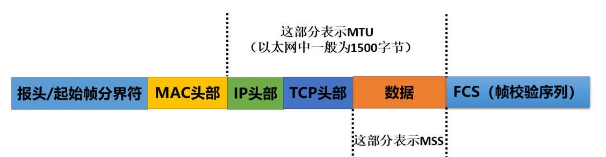
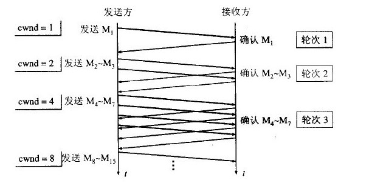
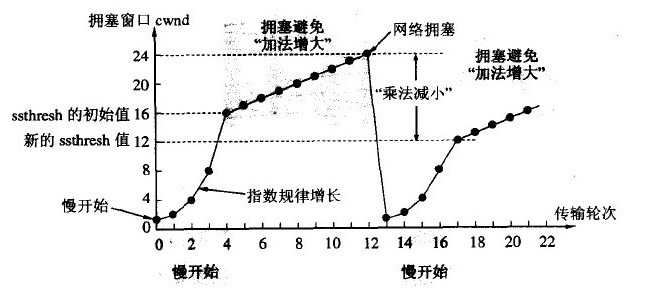
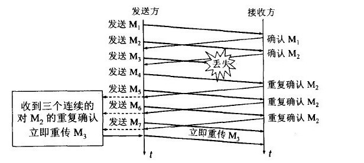
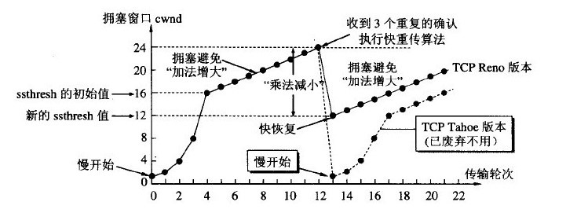

# 网络协议 <!-- omit in toc -->

- [OSI 七层协议模型](#osi-七层协议模型)
- [TCP/IP 协议模型](#tcpip-协议模型)
- [TCP和UDP协议的区别](#tcp和udp协议的区别)
- [一个网络数据包包括哪些](#一个网络数据包包括哪些)
- [TCP协议中数据包分片与重组](#tcp协议中数据包分片与重组)
  - [MTU & MSS](#mtu--mss)
- [TCP 协议的拥塞避免算法](#tcp-协议的拥塞避免算法)
  - [慢启动+拥塞避免](#慢启动拥塞避免)
  - [快重传+快恢复](#快重传快恢复)
- [参考](#参考)


## OSI 七层协议模型

1. 应用层：由用户自己规定，**规定各个应用之间消息传递的形式**，包括各机互访协议，分布式数据库协议等。常见的协议有
   1. 超文本传输协议```HTTP```
   2. 文件传输协议```FTP```
   3. 域名系统```DNS```
   4. 远程登录协议```Telnet```
   5. 简单邮件传输协议```SMTP```
2. 表示层：他对来自应用层的命令和数据进行解释，对各种语法赋予相应的含义，并按照一定的格式传送给会话层
   1. 表示层的基本作用就是对数据格式进行编译，对收到或发出的数据根据应用层的特征进行处理，如处理为文字、图片、音频、视频、文档等，还可以对压缩文件进行解压缩、对加密文件进行解密等。
   2. 只有在表示层将数据处理完成后，才能将转格式编译后的数据呈现在应用程序中，让用户能够看懂。
   3. 常见协议有
      1. 相机压缩格式```JPEG```
      2. 影音压缩及传输的规格标准```MPEG```
      3. 基于拉丁字母的一套电脑编码系统```ASCII```
3. 会话层：是在发送方和接收方之间进行通信时创建、维持、之后终止或断开连接的地方，与电话通话有点相似
4. 传输层：负责将来自会话层的肖习传递给网络，常见的传输层协议有
   1. 传输控制协议```TCP```
   2. 用户数据报协议```UDP```
5. 网络层：规定通信网内的路由选择等方式，建立用户间的信息报传输设施。即网络层提供路由和寻址的功能，使两终端系统能够互连且决定最佳路径，并具有一定的拥塞控制和流量控制的能力
   1. 网际协议```IP```
   2. 互联网控制消息协议```ICMP```
   3. 地址解析协议```ARP```
6. 数据链路层：通过各种控制协议，将有差错的物理信道变为无差错的、能可靠传输数据帧的数据链路
   1. 多路访问控制协议```MAC```
7. 物理层：利用传输介质为数据链路层提供物理连接，实现比特流的透明传输


记忆七层协议很好办，首先想要传输东西，肯定要规定两个应用之间的传输和响应格式，这就是**应用层**负责的事情；接下来需要规定传输的格式，此乃**表示层**所负责的事情；然后通过**会话层**建立会话；后用**传输层**将数据包发送到**网络层**；然后通过**数据链路层**来传输，最终依赖于**物理层**

## TCP/IP 协议模型

TCP/IP 是一系列网络协议的总称，是网络通信的基本骨架。TCP/IP协议模型在OSI七层模型的基础上，通过合并的方式，简化为**四层**，分别为：应用层，传输层，网络层，链路层

通常应用程序都在应用层，当各个应用之间通信的时候
* 传输的TCP模块负责给HTTP数据添加TCP头部信息
* 网络层的IP模块负责给HTTP数据添加IP头部信息
* 链路层添加以太网首部等信息，并且通过电信号传输数据包
* 然后数据包依次经过对方的链路层，网络层，传输层，应用层，最终实现数据的通信

## TCP和UDP协议的区别

1. TCP协议进行数据通信前需要三次握手建立连接，UDP协议不需要建立连接即可发送数据
2. TCP有确认机制，丢包可以重发，保证数据的正确性；UDP不保证正确性，只是单纯的发送数据包
3. TCP协议可能会对大数据包进行拆分，并且在接收方进行重组数据包操作；UDP协议是面向报文的，不会进行分片和重组，所以需要注意传输报文的大小
4. 网络包中的TCP头部最小为20个字节，UDP头部最小只有8个字节

注：**丢包重传机制**

SACK（Selective ACK），SACK是TCP选项，它使得接收方能告诉发送方哪些报文段丢失，哪些报文段重传了，哪些报文段已经提前收到等信息，根据这些信息TCP就可以只重传那些真正丢失的报文段

UDP协议由于传输不需要建立连接，资源消耗较小，常用在**视频或者语音传输**中，**域名解析服务DNS**都使用了UDP协议

## 一个网络数据包包括哪些

在TCP协议中，要发送的数据经过TCP模块添加TCP头部；IP模块添加IP头部和MAC头部；然后在最前面加上报头/起始帧分节符以及末尾加如FCS（帧校验序列）.


## TCP协议中数据包分片与重组

1. 发送方
   1. 将数据包分为多个TCP头部+数据包的组合，TCP头部中存着不同的数据序号
   2. 之后将多个组合交由IP模块，**统一添加IP头部和MAC头部**，IP头部的**ID号**设为统一的
2. 接收方
   1. IP模块具有分片重组的功能，如果接收到的包是经过分片的，那么IP模块会将它们还原成原始的包
   2. 分片的包会在**IP头部**的标志字段中进行标记，当收到分片的包的时候，IP模块会将其暂时存在内部的内存空间中
   3. 然后等待IP头部中**具有相同ID的包**全部到达
   4. 此外，IP头部还有一个**分片偏移量**的字段，他表示当前分片在整个包中所处的位置。
   5. 依据这些信息，最终可以将数据包还原成原始数据包

### MTU & MSS

MTU 即为 Maxitum Transmission Unit 最大传输单元

MSS 即为 Maxitum Segment Size 最大分段大小



## TCP 协议的拥塞避免算法

计算机网络中的带宽、交换结点中的缓存和处理机等，都是网络的资源。在某段时间，若对网络中某一资源的需求超过了该资源所能提供的可用部分，网络的性能就会变坏。这种情况就叫做拥塞。

拥塞控制就是防止过多的数据注入网络中，这样可以使网络中的路由器或链路不致过载。

### 慢启动+拥塞避免

发送方维持一个叫做拥塞窗口cwnd（congestion window）的状态变量。拥塞窗口的大小取决于网络的拥塞程度，并且动态地在变化。发送方让自己的发送窗口等于拥塞窗口，另外考虑到接受方的接收能力，发送窗口可能小于拥塞窗口。

慢开始算法的思路就是，不要一开始就发送大量的数据，先探测一下网络的拥塞程度，也就是说由小到大逐渐增加拥塞窗口的大小。

这里用报文段的个数的拥塞窗口大小举例说明慢开始算法，实时拥塞窗口大小是以字节为单位的。如下图：



当然收到单个确认但此确认多个数据报的时候就加相应的数值。所以一次传输轮次之后拥塞窗口就加倍。这就是乘法增长，和后面的拥塞避免算法的加法增长比较。

为了防止cwnd增长过大引起网络拥塞，还需设置一个慢开始门限ssthresh状态变量。ssthresh的用法如下：

* 当cwnd<ssthresh时，使用慢开始算法。
* 当cwnd>ssthresh时，改用拥塞避免算法。
* 当cwnd=ssthresh时，慢开始与拥塞避免算法任意。

拥塞避免算法让拥塞窗口缓慢增长，即每经过一个往返时间RTT就把发送方的拥塞窗口cwnd加1，而不是加倍。这样拥塞窗口按线性规律缓慢增长。

无论是在慢开始阶段还是在拥塞避免阶段，只要发送方判断网络出现拥塞（其根据就是没有收到确认，虽然没有收到确认可能是其他原因的分组丢失，但是因为无法判定，所以都当做拥塞来处理），就把慢开始门限设置为出现拥塞时的发送窗口大小的一半。然后把拥塞窗口设置为1，执行慢开始算法。如下图：



> 再次提醒这里只是为了讨论方便而将拥塞窗口大小的单位改为数据报的个数，实际上应当是字节。

### 快重传+快恢复

快重传要求接收方在收到一个失序的报文段后就立即发出重复确认（为的是使发送方及早知道有报文段没有到达对方）而不要等到自己发送数据时捎带确认。快重传算法规定，发送方只要一连收到三个重复确认就应当立即重传对方尚未收到的报文段，而不必继续等待设置的重传计时器时间到期。如下图：



快重传配合使用的还有快恢复算法，有以下两个要点:

①当发送方连续收到三个重复确认时，就执行“乘法减小”算法，把ssthresh门限减半。但是接下去并不执行慢开始算法。

②考虑到如果网络出现拥塞的话就不会收到好几个重复的确认，所以发送方现在认为网络可能没有出现拥塞。所以此时不执行慢开始算法，而是将cwnd设置为ssthresh的大小，然后执行拥塞避免算法。如下图：



## 参考

* [OSI七层模型与TCP/IP五层模型](https://zhuanlan.zhihu.com/p/37384429)
* [OSI七层模型的学习-会话层、表示层和应用层](https://www.jianshu.com/p/801e650850b7)
* [TCP的拥塞控制](https://blog.csdn.net/sicofield/article/details/9708383)