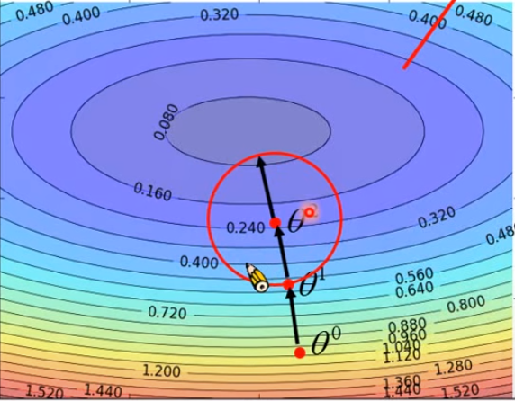
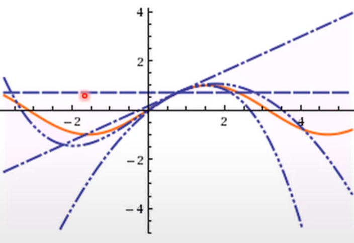
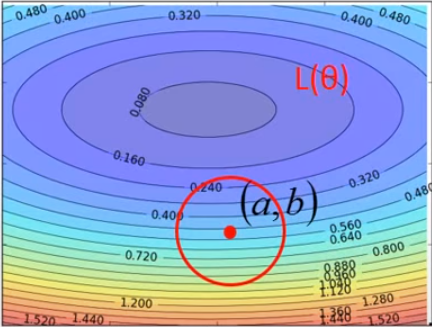
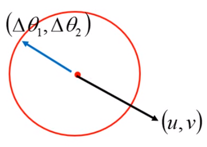

# Why Gradient Descent Work<!-- omit in toc -->

🔥 Warning of Math 🔥

Reference from [Hung-yi Lee](http://speech.ee.ntu.edu.tw/~tlkagk/courses_ML20.html)

- [The problem we want to optimize](#the-problem-we-want-to-optimize)
- [Formal Derivation](#formal-derivation)
- [How to find the point with the smallest loss value nearby](#how-to-find-the-point-with-the-smallest-loss-value-nearby)
  - [Taylor Series](#taylor-series)
  - [Multivariable Taylor Series](#multivariable-taylor-series)
  - [Pf the Gradient Descent](#pf-the-gradient-descent)

## The problem we want to optimize

**Loss Function**
* This function describes how fitness the model is with the data.
* We want to gain the parameters by solving this
  * $\theta^*=\arg{\underset{\theta}{min}}L(\theta)$

## Formal Derivation

**Suppose that $\theta$ has two variables $\{\theta_1,\theta_2\}$**

And the loss function has such contour map

A intuitive method to find the lowest point is:
* Draw a circle with randomly picked point $\{\theta_1^0,\theta_2^0\}$ as searching range
* find the $\{\theta_1^1,\theta_2^1\}$ that can make the loss function to be minium.
* Repeat this process until finding the lowest point

## How to find the point with the smallest loss value nearby

### Taylor Series

**Taylor Series**
* Taylor Series: Let $h(x)$ be any function infinitely differentiable around $x=x_0$
* $h(x)=\sum_{k=0}^{\infty}\frac{h^{(k)}(x_0)}{k!}(x-x_0)^k$
* Here $k$ means how many time the differentiable is.

**Property**

* The origin form is this
  * $h(x)=\sum_{k=0}^{\infty}\frac{h^{(k)}(x_0)}{k!}(x-x_0)^k$
* That is:
  * $h(x)=h(x_0)+h'(x_0)(x-x_0)+\frac{h''(x_0)}{2!}(x-x_0)^2+...$
* And when $x$ is close to $x_0$ (Very important)
  * $h(x)\approx h(x_0)+h'(x_0)(x-x_0)$

**Pf**

E.g. Taylor series for $h(x)=\sin(x)$ around $x_0=\frac{\pi}{4}$

$\sin(x)=\frac{1}{\sqrt{2}}+\frac{x-\frac{\pi}{4}}{\sqrt{2}}-\frac{(x-\frac{\pi}{4})^2}{6\sqrt{2}}+....$

And we can easily find that without the following Taylor series, the function is not likely to be the $\sin(x)$

However, in the $x=x_0$, we don't have to include too much Taylor series in order to get the approximate result.

### Multivariable Taylor Series

When $(x,y)$ is close to $(x_0,y_0)$

$h(x,y)\approx h(x_0,y_0)+\frac{\partial h(x_0,y_0)}{\partial x}(x-x_0)+\frac{\partial h(x_0,y_0)}{\partial y}(x-y_0)$

### Pf the Gradient Descent

* So here the idea, based on the Taylor Series, if the red circle is small enough
  * That is mean we are close to $(a,b)$
* In the red circle we have
  * $L(\theta)\approx L(a,b)+\frac{\partial L(a,b)}{\partial \theta_1}(\theta_1-a)+\frac{\partial L(a,b)}{\partial \theta_2}(\theta_2-b)$
* Then let's make some easier replacements. These are constant.
  * $s=L(a,b)$
  * $u=\frac{\partial L(a,b)}{\partial \theta_1}$
  * $v=\frac{\partial L(a,b)}{\partial \theta_2}$
* So we got 
  * $L(\theta)\approx s+u(\theta_1-a)+v(\theta_2-b)$
* So the problem will be "Find the $(\theta_1,\theta_2)$ that makes the $L$ to be minium"
* Moreover, let's make one more replacement
  * $\Delta \theta_1=(\theta_1-a)$
  * $\Delta \theta_2=(\theta_2-b)$
* Then we got
  * $L(\theta)\approx s+u\Delta \theta_1+v\Delta \theta_2$
* We can take $u\Delta \theta_1+v\Delta \theta_2$ as vector inner product of $(u,v)$ and $(\Delta \theta_1，\Delta \theta_2)$
* And it's very easy to find the $(\Delta \theta_1，\Delta \theta_2)$ to minimize the $L$

    

* So the $\Delta \theta_1，\Delta \theta_2=-\eta(u,v)$
* Then we got
  * $\theta_1，\theta_2=(a,b) -\eta(u,v)$
* Then let's replace $(u,v)$
  * $\theta_1，\theta_2=(a,b) -\eta(\frac{\partial L(a,b)}{\partial \theta_1},\frac{\partial L(a,b)}{\partial \theta_2})$
* WOW! We got the gradient descent form!!
* And we can easily find the $\eta$ is the learning rate we talk about in the machine learning.
* So this is how gradient descent comes from
* And the learning rate must be small enough in order to make an good appromixation by using Taylor Series.

And here we only consider the easy form about Taylor Series. Can we take the following form into this method? The answer is yes, and that will be Newton's method. However, this kind of method will have much more time cost if you want to do a deep learning. So Gradient Descent is more popular method to learning the parameters.